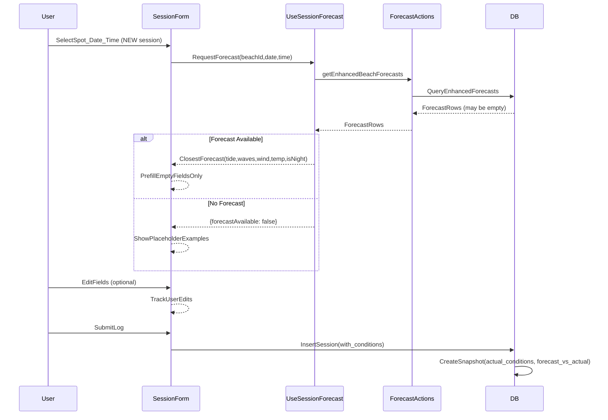

# Auto-Forecast Pulling (P1) - Yes (no night recommendations)

## Scope
- Logging (completed) sessions only.
- Auto-pull and auto-fill **waves + wind + water temp + tide** once a user has selected **spot + date/time**.
- Users can override any field; we only prefill when the field is empty.
- **NEW sessions only** - editing existing sessions does NOT trigger auto-prefill.
- Guardrail: **Never present night-time as recommended**. If the user logs a night session, we still show auto-filled forecast/tide as neutral "data at time of session".

---

## Tech-Lead Review Findings (2025-01-06)

### Critical Bug (Must Fix First)

**ConditionsSection does not bind to formState** - The component uses local `useState` for condition fields (`waveHeight`, `windSpeed`, `windDirection`, `waterTemp`, `vibeNotes`, `forecastAccuracy`) but these values are **never propagated back** to `formState` via `updateField()`. Only the rating fields (`waveQuality`, `crowdLevel`, `parkingEase`) correctly use `updateField()`.

**Impact:** Data entered in the Conditions section is currently lost on submission.

### Database Schema Status

| Column | `sessions` Table | Status |
|--------|------------------|--------|
| `wave_height_ft` | EXISTS | Ready |
| `wind_speed_mph` | EXISTS | Ready |
| `wind_direction` | EXISTS | Ready |
| `water_temp` | EXISTS | Ready |
| `forecast_accuracy` | EXISTS | Ready |
| `tide_height_ft` | MISSING | **Needs migration** |
| `tide_status` | MISSING | **Needs migration** |

**`enhanced_forecasts` has tide data:**
- `tide_status` (TEXT)
- `tide_height` (TEXT)
- `next_tide_time`, `next_tide_type`, `next_tide_height` (TEXT)

### Code Gaps Identified

1. **`use-session-forecast.ts`** - Missing tide fields in `SessionForecastData` interface
2. **`use-session-form.ts`** - Missing tide fields in `SessionFormState`
3. **`forecast-snapshot-utils.ts`** - `actualConditions` missing: `wave_height_ft`, `wind_speed_mph`, `wind_direction`, `forecast_accuracy`, tide fields
4. **`GET /api/sessions/[id]`** - Doesn't return `session_forecast_snapshots`
5. **Night detection** - `isNightHour()` exists in `timezone-utils.ts` but not used in session forms

---

## Edge Case Decisions

### 1. No Historical Forecast Available
**Scenario:** User logs a session from weeks ago where no forecast data exists.

**Decision:** Show placeholder example values with clear "No forecast data available" messaging. User fills out manually.

```tsx
// Example UI state
{
  forecastAvailable: false,
  placeholderText: "No forecast data for this date",
  fields: {
    waveHeight: { value: null, placeholder: "e.g., 3-4 ft" },
    windSpeed: { value: null, placeholder: "e.g., 10 mph" },
    // ...
  }
}
```

### 2. Partial Forecast Data (Some Fields Null)
**Scenario:** Forecast exists but some fields are null (e.g., tide data missing).

**Decision:** Show example placeholders for null fields only. Prefill available data.

```tsx
// Example: tide_height is null but wave_height exists
{
  waveHeight: { value: 4.5, source: "forecast" },
  tideHeight: { value: null, placeholder: "e.g., 2.1 ft", source: "manual" }
}
```

### 3. Editing Existing Sessions
**Scenario:** User edits a previously logged session.

**Decision:** **NO auto-prefill on edit.** Preserve user's existing values. Only new session creation triggers auto-prefill.

### 4. User Data vs Forecast Data Conflicts
**Scenario:** User overrides prefilled forecast value with their own observation.

**Decision:** Store user's value in `sessions` table. Record the diff in `actual_conditions`:

```json
{
  "actual_conditions": {
    "wave_height_ft": 5.0,
    "wind_speed_mph": 12,
    "tide_height_ft": 2.3,
    // ... other user-entered values
  },
  "forecast_vs_actual": {
    "wave_height_ft": { "forecast": 3.5, "actual": 5.0, "diff": 1.5 },
    "wind_speed_mph": { "forecast": 8, "actual": 12, "diff": 4 }
    // Only fields where user changed the value
  }
}
```

---

## Files

### Must Fix First
- [x] [`components/session-forms/ConditionsSection.tsx`](components/session-forms/ConditionsSection.tsx) – **FIX BUG:** bind local state to `formState` via `updateField()`

### Database
- [ ] `supabase/migrations/YYYYMMDDHHMMSS_add_tide_fields_to_sessions.sql` – add `tide_height_ft` (DECIMAL) and `tide_status` (TEXT)

### Hooks
- [ ] [`hooks/use-session-forecast.ts`](hooks/use-session-forecast.ts) – extend to return tide fields + `isNightSession` flag
- [ ] [`hooks/use-session-form.ts`](hooks/use-session-form.ts) – add tide fields to `SessionFormState`

### Components
- [ ] [`components/session-forms/ConditionsSection.tsx`](components/session-forms/ConditionsSection.tsx) – implement auto-prefill with placeholder examples
- [ ] [`components/session-detail-view.tsx`](components/session-detail-view.tsx) – render forecast snapshot with forecast vs actual comparison

### Actions & Utils
- [ ] [`actions/session-actions.ts`](actions/session-actions.ts) – persist new condition fields
- [ ] [`lib/utils/forecast-snapshot-utils.ts`](lib/utils/forecast-snapshot-utils.ts) – include all fields + `forecast_vs_actual` diff

### API
- [ ] [`app/api/sessions/[id]/route.ts`](app/api/sessions/[id]/route.ts) – include `session_forecast_snapshots` in GET

### Docs
- [ ] [`CHANGELOG.md`](CHANGELOG.md) – note the behavior change

---

## Implementation Steps

### Phase 0: Fix Critical Bug
1. **Fix ConditionsSection data binding**
   - Replace local `useState` with `formState` values for all condition fields
   - Ensure `updateField()` is called on every input change
   - Verify data persists on form submission

### Phase 1: Database & Types
2. **Create migration for tide columns**
   ```sql
   ALTER TABLE sessions
   ADD COLUMN tide_height_ft DECIMAL(4,2),
   ADD COLUMN tide_status TEXT;
   ```

3. **Extend SessionFormState**
   - Add `tideHeight: number | null` and `tideStatus: string | null`
   - Update default values

4. **Extend useSessionForecast**
   - Add tide fields to `SessionForecastData` interface
   - Add `isNightSession` boolean using `isNightHour()` from timezone-utils
   - Return `forecastAvailable: boolean` flag

### Phase 2: Auto-Prefill Logic
5. **Implement prefill state machine in ConditionsSection**
   ```
   States: empty → prefilled → user-edited
   Transitions:
     - on forecast load (new session only): empty → prefilled
     - on user input: prefilled → user-edited
     - on beach/time change: reset to empty, trigger new prefill
   ```

6. **Handle missing/partial data**
   - Show placeholder examples for unavailable fields
   - Display "No forecast data available" when appropriate
   - Track which fields were prefilled vs manual entry

### Phase 3: Persistence & Snapshots
7. **Update createLoggedSession**
   - Map all new fields from `SessionFormState` to insert payload
   - Include `tide_height_ft`, `tide_status`

8. **Update forecast-snapshot-utils**
   - Include all condition fields in `actual_conditions`
   - Calculate and store `forecast_vs_actual` diff for changed fields

### Phase 4: Display
9. **Update GET /api/sessions/[id]**
   - Join `session_forecast_snapshots` table
   - Return latest snapshot with session data

10. **Update session-detail-view**
    - Display forecast snapshot as "Conditions at time of session"
    - Show forecast vs actual comparison when diffs exist
    - Use neutral copy (no "recommended" language)

### Phase 5: Testing & Docs
11. **Unit tests**
    - `use-session-forecast`: tide field parsing, night detection, closest-time selection
    - `forecast-snapshot-utils`: diff calculation
    - Auto-prefill behavior edge cases

12. **E2E tests**
    - Verify auto-prefill after selecting beach + date/time
    - Verify user edits are preserved
    - Verify data persists to database
    - Verify no prefill on edit mode
    - Verify placeholder display when no forecast

13. **Update CHANGELOG.md**

---

## Testing Plan

### Unit Tests
| Test | File | Coverage |
|------|------|----------|
| Tide field parsing | `use-session-forecast.test.ts` | Parse tide_height, tide_status from enhanced_forecasts |
| Night detection | `use-session-forecast.test.ts` | isNightSession flag accuracy |
| Closest-time selection | `use-session-forecast.test.ts` | Correct forecast selection logic |
| Diff calculation | `forecast-snapshot-utils.test.ts` | forecast_vs_actual diff accuracy |
| Prefill behavior | `ConditionsSection.test.tsx` | State machine transitions |

### E2E Tests
| Test | File | Scenario |
|------|------|----------|
| Auto-prefill on new session | `session-wizard.spec.ts` | Select beach + time → verify fields populated |
| User edits preserved | `session-wizard.spec.ts` | Prefill → edit → submit → verify user value stored |
| No prefill on edit | `session-wizard.spec.ts` | Edit existing session → verify no auto-prefill |
| Missing forecast | `session-wizard.spec.ts` | Log old session → verify placeholders shown |
| Data persistence | `session-wizard.spec.ts` | Submit → fetch → verify all fields saved |

### API Tests
| Test | File | Endpoint |
|------|------|----------|
| Snapshot retrieval | `sessions-api.test.ts` | GET /api/sessions/[id] returns snapshot |
| Snapshot structure | `sessions-api.test.ts` | Verify forecast_vs_actual in response |

---

## Data Flow



---

## Execution Order

```
Phase 0 (BLOCKING):
  └── fix-conditions-binding (must complete before anything else)

Phase 1 (Parallel, max 2):
  ├── db-migration
  └── extend-forecast-hook + extend-form-state

Phase 2 (Sequential, depends on Phase 0 + 1):
  └── conditions-prefill

Phase 3 (Sequential, depends on Phase 2):
  ├── persist-session
  └── update-snapshot-utils

Phase 4 (Parallel, max 2):
  ├── api-snapshot
  └── session-detail-view

Phase 5 (Parallel, max 2):
  ├── tests-unit
  └── tests-e2e

Phase 6 (Final):
  └── changelog + code-review
```

---

## Agent Assignments

| Task | Agent | Notes |
|------|-------|-------|
| fix-conditions-binding | `react-nextjs-expert` | Critical bug fix |
| db-migration | `supabase-db-expert` | Add tide columns |
| extend-forecast-hook | `react-nextjs-expert` | Add tide + isNightSession |
| extend-form-state | `react-nextjs-expert` | Update types |
| conditions-prefill | `react-nextjs-expert` | State machine + placeholders |
| update-snapshot-utils | `nextjs-developer` | Diff calculation |
| persist-session | `nextjs-developer` | Session actions |
| api-snapshot | `api-designer` | API route changes |
| session-detail-view | `react-nextjs-expert` | UI rendering |
| tests-unit | `test-automator` | Unit test coverage |
| tests-e2e | `test-automator` | E2E test coverage |
| code-review | `code-reviewer` | Final review |
