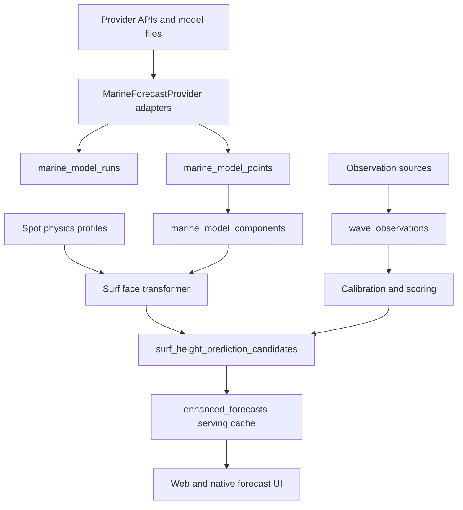

# Quiver Worldwide Wave Face Height Forecast Plan

Date: 2026-06-28
Status: planning artifact
Scope: Quiver web forecast architecture, global source strategy, and wave face height prediction implementation plan

## Decision Summary

Quiver should not scale worldwide by replacing the current forecast path with a single vendor API. The durable architecture is:

1. Keep `enhanced_forecasts` as the app's fast serving cache.
2. Add a normalized model-run/source layer underneath it.
3. Add versioned spot physics profiles for worldwide spots.
4. Add an observation truth hierarchy before training or promoting new face-height models.
5. Use Open-Meteo Marine for the global MVP, with strict US no-regression gates.
6. Build the calibrated pro system as an ensemble/calibration layer over direct model data, commercial vendor comparison feeds, and observation networks.

Claude improve and Hermes critique both converged on the same structural warning: split "global forecast platform" from "calibrated face-height model." The platform can ship in shadow with replay parity. The prediction model should only promote where Quiver has enough truth data.

## Current Architecture Audit

Quiver already has strong pieces:

- `EnhancedForecastService` fetches wave, tide, weather, CDIP, IOOS, and CO-OPS data in parallel before combining rows in `ForecastBuilder` ([lib/services/enhanced-forecast-service.ts:160](/Users/stevenchandler/Desktop/dev/quiver/lib/services/enhanced-forecast-service.ts:160)).
- `ForecastBuilder` computes display wave height once, captures provenance, applies optional beach offsets, and snapshots telemetry into `ml_predictions_log` ([lib/services/forecast/forecast-builder.ts:601](/Users/stevenchandler/Desktop/dev/quiver/lib/services/forecast/forecast-builder.ts:601)).
- `enhanced_forecasts.wave_height` is intentionally the transformed surf face-height display value, not raw offshore significant wave height ([lib/services/forecast/forecast-builder.ts:826](/Users/stevenchandler/Desktop/dev/quiver/lib/services/forecast/forecast-builder.ts:826)).
- `NOAAWaveWatchService` already merges NOAA near-term data and Open-Meteo extended data, with Open-Meteo appended beyond NOAA range ([lib/services/noaa-wavewatch/noaa-wavewatch-service.ts:122](/Users/stevenchandler/Desktop/dev/quiver/lib/services/noaa-wavewatch/noaa-wavewatch-service.ts:122)).
- The Open-Meteo fetcher already requests combined wave, primary swell, wind wave, secondary swell, and tertiary swell fields ([lib/services/noaa-wavewatch/api-client.ts:208](/Users/stevenchandler/Desktop/dev/quiver/lib/services/noaa-wavewatch/api-client.ts:208)).
- The face-height transformer correctly gates calibrated CDIP shoaling to CDIP/approved anchors and applies deepwater decay only to model sources ([lib/utils/wave-height-transformer.ts:416](/Users/stevenchandler/Desktop/dev/quiver/lib/utils/wave-height-transformer.ts:416)).
- Storage already upserts `enhanced_forecasts` by `(beach_id, forecast_at)` and cleans old serving rows ([lib/services/forecast/storage-service.ts:103](/Users/stevenchandler/Desktop/dev/quiver/lib/services/forecast/storage-service.ts:103)).

The main architectural gaps:

- `marine_forecasts` is scalar and source-limited to `open-meteo`, `cdip`, and `ndbc`, with no model run identity, lead time, grid metadata, or swell partitions ([supabase/migrations/20250808000100_create_forecast_tables.sql:6](/Users/stevenchandler/Desktop/dev/quiver/supabase/migrations/20250808000100_create_forecast_tables.sql:6)).
- `enhanced_forecasts` is UI-first and text-heavy, with `raw_forecast` carrying much of the analytics burden ([supabase/migrations/20250815093000_create_enhanced_forecasts.sql:14](/Users/stevenchandler/Desktop/dev/quiver/supabase/migrations/20250815093000_create_enhanced_forecasts.sql:14)).
- `forecast_at` is canonical now, but future global model storage must distinguish model run time, forecast valid time, and Quiver issue/materialization time ([supabase/migrations/20260214183146_add_forecast_at_column.sql:10](/Users/stevenchandler/Desktop/dev/quiver/supabase/migrations/20260214183146_add_forecast_at_column.sql:10)).
- `ml_predictions_log` began as a simple ML audit table and is now doing too much: display telemetry, Open-Meteo sidecars, offset evaluation, v5 shadow, and future truth pairing ([supabase/migrations/20260113200100_create_ml_predictions_log.sql:5](/Users/stevenchandler/Desktop/dev/quiver/supabase/migrations/20260113200100_create_ml_predictions_log.sql:5)).
- CDIP is high-quality but explicitly California-oriented in the current service architecture ([lib/services/cdip/ARCHITECTURE.md:5](/Users/stevenchandler/Desktop/dev/quiver/lib/services/cdip/ARCHITECTURE.md:5)).

## Target Architecture

The provider layer normalizes vendor/model outputs. The prediction layer converts model components plus spot physics into Quiver surf face-height candidates. `enhanced_forecasts` remains the public app contract until all consumers are migrated.

## Data Model

Add these tables in phases. Use `lat` and `lon`; do not introduce new `lng` fields. Keep `forecast_at` as the valid-time convention.

### `marine_model_runs`

Purpose: immutable source/model run metadata.

Fields:

- `id uuid primary key`
- `provider text not null`
- `model text not null`
- `model_run_at timestamptz`
- `fetched_at timestamptz not null default now()`
- `forecast_horizon_hours int`
- `source_url text`
- `license_tier text`
- `raw_payload_ref text`
- `status text not null`
- `error_message text`

Indexes:

- `(provider, model, model_run_at desc)`
- `(fetched_at desc)`

Retention:

- Keep high-resolution raw run payloads 30 to 45 days for MVP.
- Keep normalized points/components 90 days for replay and pairing.
- Archive aggregate scores long-term.

### `marine_model_points`

Purpose: normalized forecast values at a grid coordinate and forecast valid time.

Fields:

- `id uuid primary key`
- `run_id uuid references marine_model_runs(id)`
- `provider text not null`
- `model text not null`
- `lat numeric not null`
- `lon numeric not null`
- `grid_id text`
- `forecast_at timestamptz not null`
- `lead_hours int`
- `wave_height_m numeric`
- `wave_period_s numeric`
- `wave_direction_deg numeric`
- `wind_speed_ms numeric`
- `wind_direction_deg numeric`
- `data_quality text`
- `created_at timestamptz not null default now()`

Indexes:

- `(provider, model, forecast_at, lat, lon)`
- `(run_id, forecast_at)`

Do not store a derived "primary swell" field here. Store components and derive dominant swell in code so the dominant-swell invariant stays centralized.

### `marine_model_components`

Purpose: one row per wave component per point.

Fields:

- `id uuid primary key`
- `point_id uuid references marine_model_points(id)`
- `component_type text not null`
- `component_rank int`
- `height_m numeric`
- `period_s numeric`
- `peak_period_s numeric`
- `direction_deg numeric`
- `spread_deg numeric`
- `is_missing boolean not null default false`

Allowed `component_type` values:

- `combined`
- `primary_swell`
- `secondary_swell`
- `tertiary_swell`
- `wind_wave`

### `spot_physics_profiles`

Purpose: versioned worldwide break physics and exposure metadata.

Fields:

- `id uuid primary key`
- `beach_id uuid not null references beaches(id)`
- `profile_version text not null`
- `effective_at timestamptz not null`
- `retired_at timestamptz`
- `shore_normal_deg numeric`
- `offshore_bearing_deg numeric`
- `swell_window_center_deg numeric`
- `swell_window_halfwidth_deg numeric`
- `exposure_class text`
- `break_type text`
- `bottom_type text`
- `shelf_slope text`
- `nearshore_depth_m numeric`
- `bathymetry_quality text`
- `source text not null`
- `confidence_score int not null default 50`

### `spot_observation_sources`

Purpose: map beaches to observation feeds and truth candidates.

Fields:

- `id uuid primary key`
- `beach_id uuid not null references beaches(id)`
- `source_type text not null`
- `source_id text not null`
- `provider text not null`
- `lat numeric`
- `lon numeric`
- `distance_km numeric`
- `bearing_deg numeric`
- `station_depth_m numeric`
- `quality_score int`
- `active boolean not null default true`
- `metadata jsonb not null default '{}'::jsonb`

Allowed `source_type` examples:

- `cdip`
- `ndbc`
- `ioos`
- `coops`
- `sofar_spotter`
- `camera_ai`
- `trusted_reporter`
- `session_report`
- `manual_review`

### `wave_observations`

Purpose: truth hierarchy, not just model telemetry.

Fields:

- `id uuid primary key`
- `beach_id uuid not null references beaches(id)`
- `source_id uuid references spot_observation_sources(id)`
- `observed_at timestamptz not null`
- `height_m numeric`
- `face_height_m numeric`
- `period_s numeric`
- `direction_deg numeric`
- `source_type text not null`
- `confidence_score int not null`
- `review_status text not null default 'unreviewed'`
- `metadata jsonb not null default '{}'::jsonb`

Important rule: weak user/session reports can become candidates, but should not directly overwrite model truth. Promote them only through review, weighting, or aggregation.

### `surf_height_prediction_candidates`

Purpose: immutable issue-time candidate predictions.

Fields:

- `id uuid primary key`
- `beach_id uuid not null references beaches(id)`
- `forecast_at timestamptz not null`
- `issued_at timestamptz not null default now()`
- `model_run_id uuid references marine_model_runs(id)`
- `point_id uuid references marine_model_points(id)`
- `prediction_source text not null`
- `prediction_version text not null`
- `face_height_m numeric`
- `face_height_low_m numeric`
- `face_height_high_m numeric`
- `set_height_m numeric`
- `confidence_score int`
- `calibration_tier text not null`
- `provenance jsonb not null default '{}'::jsonb`

Allowed `prediction_source` examples:

- `face-hs-transformer-v1`
- `regional-prior-v1`
- `beach-offset-v1`
- `v5-shadow`
- `pro-ensemble-v1`
- `human-reviewed`

### `forecast_model_scores`

Purpose: promotion and monitoring scores by model/source/region/lead bucket.

Fields:

- `id uuid primary key`
- `provider text not null`
- `model text not null`
- `prediction_version text not null`
- `region text`
- `beach_id uuid references beaches(id)`
- `lead_bucket text not null`
- `direction_bucket text`
- `height_bucket text`
- `sample_count int not null`
- `mae_m numeric`
- `bias_m numeric`
- `false_good_rate numeric`
- `false_bad_rate numeric`
- `computed_at timestamptz not null default now()`

## API And Data Vendor Comparison

Current source notes were verified against official docs/pages on 2026-06-28.

| Vendor/source | Best role | Strengths | Limits and diligence | Quiver recommendation |
| --- | --- | --- | --- | --- |
| [Open-Meteo Marine](https://open-meteo.com/en/docs/marine-weather-api) | Global MVP model API | Existing integration, hourly marine API, combined wave plus swell/wind-wave/secondary/tertiary fields, source model table includes global MFWAM/GFS/ECMWF-style products. | Free tier is non-commercial; commercial use needs paid customer endpoint/API key. Quality must be benchmarked per region and model. | Make it the first global provider outside NOAA/NWS coverage, but run 30-day NOAA/Open-Meteo deltas on current US spots before visible cutover. |
| [NOAA WAVEWATCH III / GFS Wave](https://polar.ncep.noaa.gov/waves/) | US and direct-model benchmark | Free/open operational wave model lineage, strong reference source, useful for direct pro ingestion. | Direct GRIB/tile ingestion is heavier than API calls; NWS grid path is US-focused. | Keep for US near-term and pro shadow ingestion. Do not base worldwide API architecture on `api.weather.gov`. |
| [NOAA NWPS](https://polar.ncep.noaa.gov/nwps/) | Nearshore physics reference | NOAA describes NWPS as high-resolution nearshore guidance using SWAN nested from WAVEWATCH III for US coastal WFOs. | US coastal office focus, not a worldwide product feed. | Use as a benchmark for priority US nearshore transforms, not as the global source. |
| [CDIP](https://cdip.ucsd.edu/) | Observation truth and nearshore validation | CDIP specializes in wave measurement, swell modeling/forecasting, and coastal environment data. Current Quiver CDIP code is already mature. | California-heavy coverage; cannot power worldwide. | Keep as top-tier truth source and nowcast anchor where available. |
| [Copernicus Marine GLOBAL_ANALYSISFORECAST_WAV_001_027](https://data.marine.copernicus.eu/product/GLOBAL_ANALYSISFORECAST_WAV_001_027/description) | Calibrated pro source | Official product describes 1/12 degree global wave analysis/forecast, 10-day forecasts, 3-hourly integrated wave, wind wave, primary swell, secondary swell fields. | Requires heavier data access, storage, and NetCDF/Zarr/ARCO ingestion patterns; licensing and redistribution must be reviewed. | Use as the first direct-model pro candidate after the provider abstraction and normalized storage exist. |
| [Stormglass](https://stormglass.io/marine-weather/) | Commercial comparison/fallback | Global marine weather API, wave/swell/secondary swell/wind-wave fields, paid request tiers and enterprise plans. | Cost, request limits, and derivative consumer-product terms need legal review. Vendor aggregation can obscure source model identity. | Use as a paid comparison/fallback candidate, not the foundation. |
| [Tomorrow.io Maritime](https://docs.tomorrow.io/reference/maritime.md) | Commercial comparison/fallback | Maritime docs expose significant wave, wind-wave, primary/secondary/tertiary swell fields with forecast windows. | Forecast horizon appears shorter for maritime fields than Quiver's 10-12 day product; terms and cost need review. | Evaluate after Open-Meteo and Copernicus. Good fallback candidate if SLA and licensing fit. |
| [Sofar Spotter](https://www.sofarocean.com/products/spotter) | Observation network/truth | Spotter provides wave, wind, temperature, real-time dashboard, and REST API; deployable globally via satellite. | Hardware/network cost; coverage is only where deployed or partnered. | Treat as premium truth infrastructure for sparse/high-value regions, not baseline forecast supply. |

Global MVP should optimize for coverage, cost, and compatibility. Calibrated pro should optimize for repeatable model identity, observation pairing, and local transform quality.

## Implementation Plan

### Phase 0 - Acceptance Criteria And Diligence

Goal: define the contract before building new ingestion.

Tasks:

1. Define global MVP acceptance:
   - US current forecast quality does not regress.
   - Forecast horizon: 10 days minimum, 12 days if source supports it.
   - Active spot coverage p95 staleness under target.
   - Source and confidence visible for uncalibrated global spots.
   - No global spot claims "calibrated" without truth-backed promotion.
2. Define pro acceptance:
   - Per-region/provider/model MAE and bias tracked by lead bucket.
   - Shadow candidate beats current display and raw Open-Meteo in eligible cells.
   - Protected cells cannot regress even if global aggregate improves.
3. Complete vendor/legal diligence:
   - Open-Meteo commercial plan and caching rights.
   - Copernicus redistribution and operational use terms.
   - Stormglass/Tomorrow derivative consumer product rights.
   - Sofar data access terms for third-party product use.
4. Define cost ceilings:
   - API cost per active spot per day.
   - API cost per monthly active user.
   - Storage cost for model runs, points, and components.

Exit gate:

- Written provider choice for MVP and pro shadow.
- Approved retention policy.
- Rollback plan to current `enhanced_forecasts` path.

### Phase 1 - Provider Parity Harness

Goal: introduce provider abstraction without user-visible behavior changes.

Production changes:

1. Add `MarineForecastProvider` types under `lib/services/marine/providers/`.
2. Add adapters:
   - `OpenMeteoMarineProvider`
   - `NoaaNwsMarineProvider`
   - `CurrentWaveWatchAdapter` for compatibility with `WaveWatchForecast`
3. Keep `ForecastBuilder` consuming the existing shape for this phase.
4. Add a replay harness that runs current NOAA/Open-Meteo merge versus provider-normalized output for the top current forecast spots.

Validation:

- `yarn typecheck`
- Provider normalization unit tests.
- Replay delta report: current path versus provider path on top 50 US spots.
- `yarn regression:shoaling`
- No app UI or API contract changes.

Promotion gate:

- Face-height deltas within agreed tolerance for protected US spots.
- No source provenance loss in `raw_forecast.wave_height_provenance`.

### Phase 2 - Normalized Source Store

Goal: persist model-run identity and components for replay, scoring, and future pro ingestion.

Production changes:

1. Add migrations for:
   - `marine_model_runs`
   - `marine_model_points`
   - `marine_model_components`
2. Add a write path that stores normalized provider output in shadow.
3. Add retention cleanup by provider/model/run age.
4. Add storage cardinality metrics:
   - rows per run
   - components per point
   - bytes per provider/day
   - failed run count

Validation:

- Migration review against `forecast_at`, `lat`, `lon`, RLS, and view safety conventions.
- Unit tests for point/component normalization and missing-value semantics.
- Shadow ingestion dry run for current US spot set.
- Compare normalized data back to existing `wavePoint` inputs before serving usage.

Promotion gate:

- 14 days of shadow writes without quota, payload, or storage surprises.
- Provider outage fallback proven.

### Phase 3 - Serving Compatibility Layer

Goal: materialize the same `enhanced_forecasts` contract from normalized source data.

Production changes:

1. Add an adapter that converts `marine_model_points` plus components into the existing `WavePoint`/`WaveWatchData` shape.
2. Keep `ForecastBuilder` as the only display face-height writer.
3. Add `model_run_id`, `source_provider`, `source_model`, and `transform_version` to `raw_forecast` provenance.
4. Keep `enhanced_forecasts` public shape stable.
5. Keep `ml_predictions_log` snapshots, but stop adding unrelated vendor-specific columns there; use source tables for detailed partitions.

Validation:

- Replay current path versus normalized path.
- `yarn typecheck`
- `yarn test:unit` for touched service/transform code.
- `yarn regression:shoaling`
- Forecast QA live upstream trace on representative beaches.

Promotion gate:

- US no-regress on face-height MAE/bias.
- Match-score concordance gate if session matching consumes changed forecast inputs.
- Rollback switch returns to current source path without DB rollback.

### Phase 4 - Global MVP

Goal: ship worldwide forecast coverage with honest confidence tiers.

Production changes:

1. Use Open-Meteo Marine as primary outside NOAA/NWS coverage.
2. Add region onboarding checklist:
   - country/region/timezone
   - tide provider or tide unavailable behavior
   - coastline and shore-normal estimate
   - swell window defaults
   - break type and bottom type
   - available observation sources
   - confidence tier
3. Seed `spot_physics_profiles` for MVP regions with low-confidence defaults.
4. Add global tide strategy:
   - NOAA CO-OPS for US where available.
   - Open-Meteo or alternate global tide/ocean provider outside US, after licensing check.
5. Materialize global rows into `enhanced_forecasts` unchanged.
6. Surface confidence/source honesty for uncalibrated spots.

Validation:

- Global spot coverage by region and provider.
- Staleness p50/p95/p99.
- Synthetic fallback rate by region.
- Provider error rate and retry rate.
- Spot-level manual review for launch regions.

Promotion gate:

- No US regression.
- MVP regions meet coverage and staleness targets.
- Uncalibrated spots do not appear as calibrated or pro-quality.

### Phase 5 - Observation Truth Layer

Goal: collect enough truth to support calibrated face-height prediction.

Production changes:

1. Add `spot_observation_sources`.
2. Add `wave_observations`.
3. Ingest trusted observed sources:
   - CDIP/NDBC/IOOS where available.
   - Sofar/Spotter partner sources where licensed.
   - camera/manual/trusted reporter sources as candidates.
   - session reports only as weak candidates until reviewed or aggregated.
4. Pair observations to issue-time predictions by `beach_id`, `forecast_at`, `lead_hours`, and source/model.
5. Add data-quality weighting and review status.

Validation:

- Observation coverage map by region and beach.
- Pairing rate by lead bucket.
- Bias and MAE by source type.
- Weak-source rows cannot directly mutate model truth.

Promotion gate:

- At least 30 days of truth accumulation before training new face-height models.
- Minimum sample threshold by beach or regional archetype.

### Phase 6 - Calibrated Face-Height Models

Goal: improve wave face-height prediction where truth exists.

Production changes:

1. Add `surf_height_prediction_candidates`.
2. Generalize calibration registry beyond v5:
   - `prediction_version`
   - training window
   - holdout window
   - protected cells
   - rollback version
3. Train first models as regional priors, not per-beach overfits:
   - inputs: model components, period, direction, wind, tide, spot physics, lead hours
   - outputs: face-height distribution, not only one scalar
4. Promote per-beach coefficients only after sample thresholds.
5. Keep current transformer as baseline candidate.

Validation:

- Training MAE.
- 7-day and 30-day holdout MAE.
- Bias by region, source, lead bucket, height bucket, direction bucket.
- False-good and false-bad rates for surfable windows.
- Protected-cell no-regress gate.

Promotion gate:

- Candidate beats current display face height and raw model Hs in eligible cells.
- Candidate does not worsen protected beaches or sparse cells.
- UI consumer contract for height range/confidence is explicit.

### Phase 7 - Pro Forecast System

Goal: differentiated paid/pro forecast quality in priority regions.

Production changes:

1. Add direct Copernicus/ECMWF/GFS-Wave ingestion for repeatable model identity.
2. Add commercial provider comparison feeds where legal and cost-appropriate.
3. Add premium observation partnerships or Spotter deployments in sparse/high-value regions.
4. Add nearshore transform/surrogate model for priority breaks:
   - refraction/shelter features
   - bathymetry class
   - tide sensitivity
   - local wind/tide modifiers
5. Expose pro confidence, model agreement, and calibration status.

Validation:

- Model agreement and disagreement dashboard.
- Pro candidate versus MVP baseline by region.
- SLA and cost monitoring.
- Product truth labels audited in UI.

Promotion gate:

- Pro forecast materially beats MVP baseline where sold.
- Vendor terms allow displayed/derived output.
- Observation loop exists for every promoted pro region.

## Operational Scaling

Current beach-by-beach cron execution will not scale to worldwide coverage. The global architecture should fetch source data by region/grid/model run, then fan out to beaches.

Recommended worker shape:

1. Region scheduler selects active regions by user demand and staleness.
2. Provider fetcher requests model data once per grid cell/model run.
3. Normalizer writes runs, points, and components.
4. Materializer maps model points to beaches and writes `enhanced_forecasts`.
5. Scoring job pairs predictions with observations and updates model scores.

Sharding should be demand-aware, not uniform global tiling. Surf demand is power-law; high-demand regions deserve tighter cadence and pro truth, while long-tail regions can use lower cadence and lower confidence.

## Validation Gates

Required gates before visible global rollout:

- US no-regression: current protected beaches cannot worsen on face-height MAE or bias.
- Provider parity: 30-day NOAA/Open-Meteo delta report on current US spots.
- Replay regression: normalized path must match current `ForecastBuilder` output within tolerance before cutover.
- Forecast pipeline trace: live upstream validation for NOAA, Open-Meteo, CDIP, and at least one non-US region.
- Shoaling regression: `yarn regression:shoaling`.
- Unit tests: provider normalization, partition ordering, missing-value sentinels, transformer source gates.
- Storage gate: model-run storage stays under approved daily/monthly limits.
- Cost gate: vendor/API cost per active spot and per user stays under approved ceiling.
- Legal gate: caching, derived display, and commercial use rights confirmed.
- UI honesty gate: uncalibrated global spots show lower confidence/source transparency.

Required gates before calibrated pro rollout:

- Observation truth coverage for the promoted region.
- Minimum sample threshold by beach or regional archetype.
- 7-day and 30-day holdout improvement.
- Protected-cell no-regress.
- False-good and false-bad rates reviewed.
- Rollback to baseline transformer proven.

## Open Risks

- Global face-height truth is sparse. Most regions can launch with forecast coverage before they can launch with calibrated face-height claims.
- Open-Meteo source model shapes may differ enough from NOAA/NWS partitions that current calibration assumptions do not transfer.
- Vendor terms may limit caching, redistribution, or consumer derivative products.
- Normalized source storage can grow quickly without retention and partitioning discipline.
- Spot physics defaults can create false precision. Every generated profile needs confidence and source metadata.
- `ml_predictions_log` should not absorb every new feature. It should remain issue-time telemetry while normalized source, observation, and candidate tables carry the new system.

## Immediate Next Implementation Tickets

1. Add provider parity plan and tests.
   - Files: `lib/services/marine/providers/*`, `lib/services/noaa-wavewatch/*`, forecast replay scripts.
   - Gate: current US path output parity.
2. Add source store migration plan.
   - Files: new Supabase migration for model runs, points, components.
   - Gate: RLS, `forecast_at`, `lat`/`lon`, retention, storage estimate.
3. Add shadow normalized write path.
   - Files: enhanced forecast service/provider orchestration.
   - Gate: 14-day shadow stability.
4. Add global MVP onboarding checklist.
   - Files: planning docs and beach metadata tooling.
   - Gate: first non-US cohort produces complete rows with honest confidence.
5. Add observation truth schema.
   - Files: Supabase migration, source adapters.
   - Gate: weak reports cannot directly promote model truth.
6. Add calibrated candidate table and promotion harness.
   - Files: forecast calibration service, scoring jobs, model score reports.
   - Gate: holdout improvement and protected-cell no-regress.
