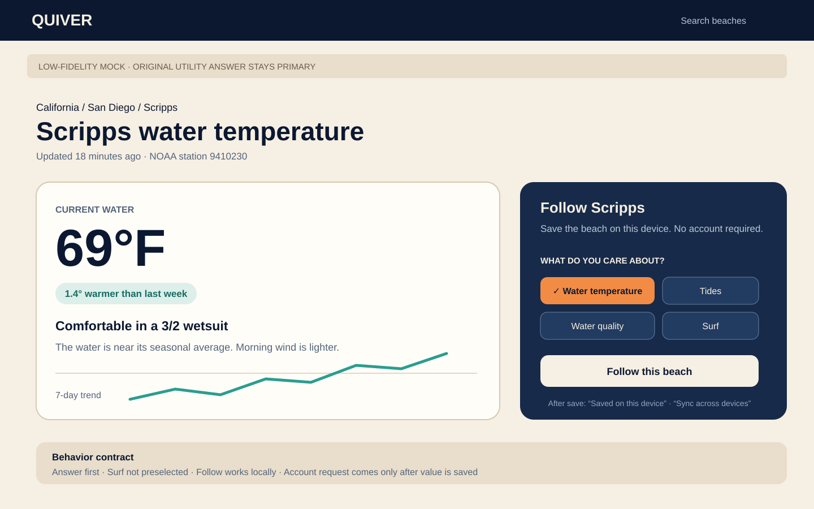
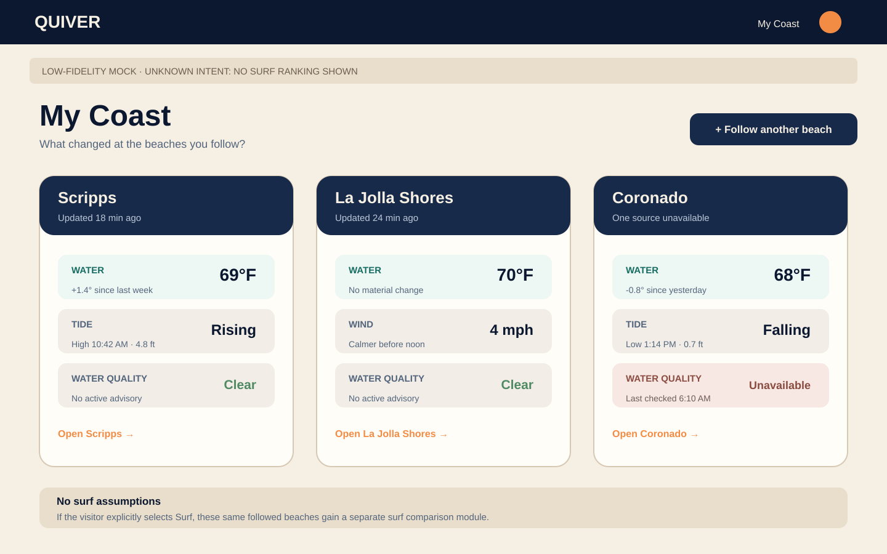
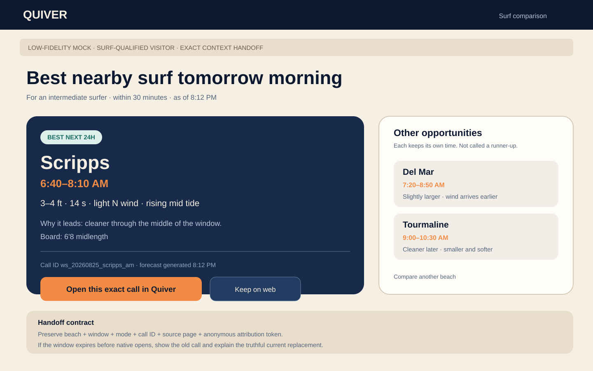
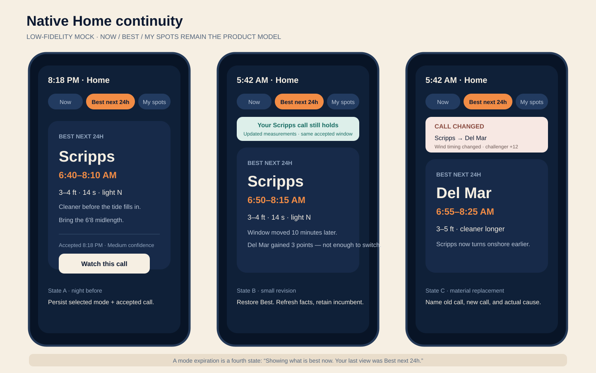
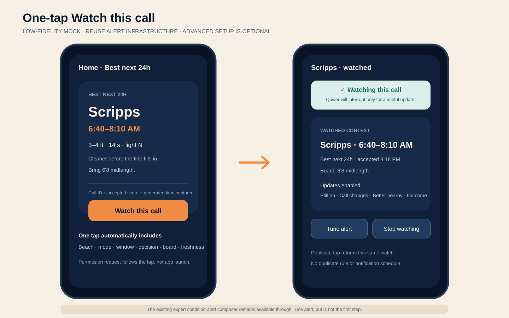
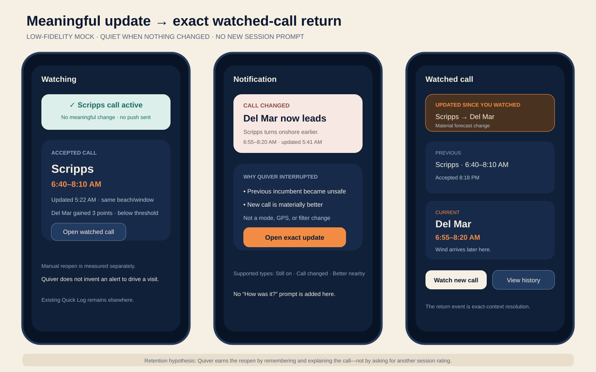

# Phase 20.1: Web And Native Mocks

**Status:** Low-fidelity product contract — not final visual design  
**Date:** 2026-08-24  
**Corrected:** Existing one-tap sessions are baseline behavior, not the Phase 20.1 retention bet  
**Purpose:** Make the intended cross-surface loop concrete before implementation and prevent the phase from collapsing into generic CTAs, another alert composer, another session prompt, or an invented planning state machine.

## How to use these mocks

These SVGs lock **hierarchy, states, language, and handoff continuity**, not pixels. Downstream implementation may adapt layout to existing Quiver components and responsive constraints, but it must preserve the behavioral contracts called out below.

Every implementation plan that touches a mocked surface must:

1. Read this file and `20.1-INFLIGHT-AUDIT.md` first.
2. Reuse the shipping design system and existing components before creating new primitives.
3. Capture implementation screenshots at the same state represented in the mock.
4. Record intentional deviations with a product reason, not merely an engineering convenience.
5. Keep the original utility answer visible before ownership, signup, notification, or app-install actions.
6. Preserve existing quick log/session behavior without presenting it as a new Phase 20.1 surface or success metric.

## Mock inventory

### 1. Web utility page → Follow this beach



**Proves:**

- A water-temperature visitor gets the current temperature and useful context first.
- `Follow this beach` is a secondary ownership action, not an app-install wall.
- Topic selection defaults to the utility topic that caused the visit; Surf is opt-in, not assumed.
- The first follow can succeed locally without an account.
- Sign-in/sync is offered only after value is saved.

**Required copy semantics:**

- Primary answer: current value, freshness/source, trend, and practical implication.
- Ownership action: `Follow this beach`.
- Follow confirmation: `Saved on this device` or equivalent truthful local-state language.
- Sync ask: `Sync across devices` only after the local follow succeeds.

### 2. Web My Coast for broad coastal intent



**Proves:**

- My Coast is a return destination for followed beaches, not a generic content feed.
- Unknown/non-surf visitors see water temperature, tide, water quality, wind, and changes relevant to their selected topics.
- Each beach card answers `What changed since my last visit?`.
- Surf rankings are absent when surf intent is unknown.
- The page remains useful with partial data or one unavailable source.

**Required state variants:**

- one followed beach;
- several followed beaches;
- source unavailable for one topic;
- anonymous local-only state;
- signed-in synced state;
- explicit Surf intent, which adds surf-specific comparison without replacing general utility.

### 3. Surf-qualified web comparison → exact native handoff



**Proves:**

- Surf qualification follows explicit/high-intent behavior, not a single water-temperature view.
- The web page makes a specific comparison with one beach/window leading and alternatives retaining their own times.
- The CTA is `Open this exact call in Quiver`, not a generic `Download app`.
- The handoff preview names the beach, window, source mode, and generated/freshness context that native must resolve.
- If the old window is no longer valid, native explains the current replacement instead of pretending the stale call still exists.

**Required labels:**

- `Other opportunities`, unless candidates are true same-window runner-ups.
- `As of <forecast time>` or equivalent freshness context for broad best-of-horizon claims.
- One visible canonical web URL and one app handoff action; no duplicate noisy URLs.

### 4. Native Home continuity across return states



**Proves:**

- The selected `Now`, `Best`, or `My spots` question survives a relevant remount or expires explicitly.
- A retained Best recommendation shows updated measurements without changing the accepted beach/window for a sub-margin revision.
- A material replacement names the previous call and the real cause.
- A deliberate mode expiration says `Showing what is best now`; it is not mislabeled as a forecast shift.
- Startup refinement can remain provisional/cached without displaying a settled hero that silently swaps seconds later.

**Required change causes:**

- mode restored;
- mode expired to Now;
- forecast materially changed;
- incumbent invalid;
- location changed;
- candidate set changed;
- user changed filters;
- startup context refined.

### 5. Native one-tap Watch this call



**Proves:**

- Watching is attached to the recommendation already on Home/Beach Detail.
- One tap captures known beach, mode, window, decision identity, board, and freshness context.
- Notification permission is requested only after the user expresses intent.
- Advanced condition editing is optional and visually secondary.
- Duplicate taps are idempotent and show the existing watched state rather than creating duplicate rules.

**Primary action:** `Watch this call`  
**Secondary action:** `Tune alert` or equivalent advanced path  
**Not allowed:** forcing the full condition-alert composer before a watch exists.

### 6. Meaningful update → exact watched-call return



**Proves:**

- Quiver does not manufacture engagement when nothing decision-relevant changed.
- Supported interruptions are `Still on`, `Call changed`, and `Better nearby`.
- A notification or watched-call history row opens the exact prior/current context.
- The surfer can understand what changed, what did not, and why Quiver interrupted them.
- Manual return to an active watched call is measurable separately from notification-driven return.
- Existing quick log remains available elsewhere but is not inserted into this return path as a new prompt.

**Required states:**

- no meaningful change: watch remains active, no push sent;
- still on: updated facts, same accepted call;
- material change: previous and current beach/window plus cause;
- better nearby: current call remains viable but a materially stronger alternative exists;
- expired/ended watch: archived status with no automatic session prompt;
- notification denied: in-app watched history remains useful.

# Cross-surface flow

```text
Anonymous utility visitor
  1. Receives the answer.
  2. Follows a beach and selected topics locally.
  3. Returns to My Coast for defensible changes.

Surf-qualified visitor
  1. Compares a real surf opportunity.
  2. Opens the exact beach/window in native.
  3. Native resolves exact or truthful current context.
  4. User watches the call in one tap.
  5. Quiver remains quiet unless a decision-relevant update exists.
  6. User reopens the exact watched context from push or watched history.
  7. Quiver measures whether that useful return improves mature retention.
```

Existing quick log/session logging remains an optional independent action and does not close or define the Phase 20.1 loop.

# Responsive and accessibility contract

## Web

- Preserve the original answer above or alongside the follow action at 360, 390, 412, tablet, and desktop widths.
- Follow-topic choices use text labels and accessible checkbox/switch semantics; color is not the only state indicator.
- My Coast cards retain readable beach, topic, value, freshness, and change labels under dynamic text/browser zoom.
- App handoff remains one clear action with a normal canonical-web fallback.

## Native

- `Now`, `Best`, and `My spots` remain readable at supported dynamic-type sizes.
- Change notices expose previous and current beach/window in accessible text.
- Watch state uses label/icon/state, not color alone.
- Watched-history rows announce status, freshness, beach/window, and whether a material change occurred.
- Reduced motion keeps every state understandable without transition animation.

# Analytics hooks represented by the mocks

The visual action names do not dictate final event names, but implementation must cover:

```text
beach_follow_started
beach_follow_saved_local
beach_follow_sync_started
beach_follow_sync_completed
follow_topic_changed
visitor_intent_selected
surf_intent_qualified
my_coast_viewed
my_coast_beach_opened
exact_call_handoff_started
exact_call_handoff_resolved
home_mode_restored
home_mode_expired
home_recommendation_changed
watched_call_created
watched_call_already_exists
watched_call_update_eligible
watched_call_update_suppressed
watched_call_update_delivered
watched_call_update_opened
watched_call_manual_reopened
watched_call_context_resolved
```

Names must be reconciled with the canonical event taxonomy in Plan 20.1-02; this list is a measurement requirement, not permission to create parallel events.

Existing `home_quick_log_tapped`, `session_log_rating_set`, `session_prefill_shown`, and `session_log_submit` remain historical/secondary metrics and should not be renamed as new Phase 20.1 events.

# Visual validation matrix

| Mock | Web/native evidence required | Core assertion |
|---|---|---|
| 01 | Utility page screenshot before/after follow | Answer remains primary; local follow succeeds without account. |
| 02 | My Coast screenshots for unknown and explicit-surf intent | Surf UI is conditional; change/freshness is visible. |
| 03 | Browser → universal link/App Store fallback → native capture | Exact context or truthful replacement is preserved. |
| 04 | Night Best → cold morning return; small and material refresh fixtures | Question and recommendation changes are never silent. |
| 05 | Home and Beach Detail watched/unwatched states | One tap creates an idempotent watch; advanced setup is optional. |
| 06 | No-change, delivered update, push reopen, manual reopen, expired watch | Quiver earns return through useful decision context, not another session prompt. |

# Non-goals reflected in the mocks

- No generic beach mode inside native.
- No Planning / Decision / Execution state machine.
- No daily streak or generic engagement prompt.
- No full social feed.
- No new recommendation engine.
- No mandatory account before the first web follow.
- No new one-tap outcome, learning receipt, session reminder, or session-history path.
- No requirement that watched users log a session.
- No localization or worldwide rollout in this phase.

---

*These mocks are implementation constraints for Phase 20.1, not production artwork or App Store creative.*
