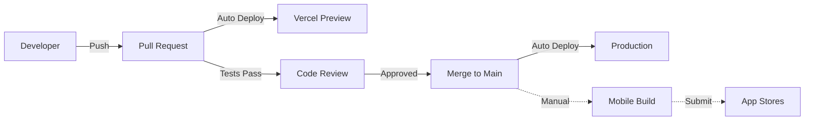

# Quiver 🏄‍♂️

> **Community-driven surf tracking platform** — Track sessions, find perfect waves, and connect with surfers worldwide.

[](https://nextjs.org/)
[](https://www.typescriptlang.org/)
[](https://supabase.com/)
[](LICENSE)

---

## 🌊 Overview

Quiver is a full-stack surf tracking application that combines session logging, multi-source forecasting, and social features to create the ultimate surf companion app.

**Key Features:**
- 📱 **Mobile-First**: Native iOS and Android apps (Capacitor)
- 🌐 **Web Platform**: Full-featured web application
- 🔮 **Smart Forecasting**: Multi-source forecast aggregation (NOAA, NDBC, CDIP)
- 📊 **Session Tracking**: Log sessions with photos, ratings, and conditions
- 🏆 **Gamification**: XP system, badges, and leaderboards
- 👥 **Social Features**: Follow surfers, like sessions, comment
- 🗺️ **Beach Discovery**: Searchable database of surf spots worldwide
- ⚡ **Real-time Updates**: Live activity feeds via WebSocket subscriptions

---

## 🚀 Quick Start

### Prerequisites

- Node.js 20+ (LTS recommended)
- npm or yarn
- Supabase CLI (`npm install -g supabase`)

### Installation

```bash
# Clone repository
git clone https://github.com/your-org/quiver.git
cd quiver

# Install dependencies
npm install

# Set up environment variables
cp .env.example .env.local
# Edit .env.local with your Supabase credentials

# Start Supabase locally
supabase start

# Run database migrations
supabase db reset

# Start development server
npm run dev
```

Visit [http://localhost:3000](http://localhost:3000) to see the app.

---

## 📚 Documentation

### Architecture & Design

| Document | Description |
|----------|-------------|
| **[System Architecture Guide](docs/architecture/SYSTEM_ARCHITECTURE.md)** | Complete system overview, design decisions, and architecture principles |
| **[API Documentation](docs/architecture/API_DOCUMENTATION.md)** | Complete REST API reference with examples |
| **[ARCHITECTURE.md](ARCHITECTURE.md)** | Top-level index to all architecture documentation |

### Architecture Diagrams

| Diagram | Purpose |
|---------|---------|
| **[System Context](docs/diagrams/system-context.md)** | High-level ecosystem view with external dependencies |
| **[Container Architecture](docs/diagrams/container-architecture.md)** | Technology containers and their interactions |
| **[Database Schema (ERD)](docs/diagrams/database-schema.md)** | Complete database design with 40+ tables |
| **[Authentication Flow](docs/diagrams/auth-flow.md)** | User authentication and authorization architecture |
| **[Session Creation Flow](docs/diagrams/session-creation-flow.md)** | End-to-end session creation with 11 steps |
| **[Deployment Architecture](docs/diagrams/deployment.md)** | Production infrastructure and CI/CD pipeline |
| **[API Request Lifecycle](docs/diagrams/api-request-flow.md)** | Complete API request processing flow |

### Development Guides

| Guide | Description |
|-------|-------------|
| **[CLAUDE.md](docs/CLAUDE.md)** | AI-assisted development guide and coding standards |
| **[TROUBLESHOOTING.md](docs/TROUBLESHOOTING.md)** | Common development issues and solutions |
| **[MOBILE_LOCAL_DEV.md](docs/MOBILE_LOCAL_DEV.md)** | Mobile development with local tunnels |

---

## 🛠️ Technology Stack

### Frontend
- **Framework**: Next.js 14 (App Router, React Server Components)
- **Language**: TypeScript 5.6
- **Styling**: Tailwind CSS 3.4
- **UI Components**: Radix UI + shadcn/ui
- **Animations**: Framer Motion
- **Maps**: Google Maps + Mapbox

### Backend
- **API**: Next.js API Routes (serverless)
- **Database**: PostgreSQL 15 (via Supabase)
- **Authentication**: Supabase Auth (JWT-based)
- **Storage**: Supabase Storage (S3-compatible)
- **Real-time**: Supabase Realtime (WebSocket)

### Mobile
- **Framework**: Capacitor 7
- **Platforms**: iOS, Android
- **Native Features**: Camera, Geolocation, Push Notifications

### Infrastructure
- **Hosting**: Vercel (serverless functions + CDN)
- **Database**: Supabase (managed PostgreSQL)
- **Push Notifications**: Firebase Cloud Messaging
- **CI/CD**: GitHub Actions

### External APIs
- **NOAA APIs**: Wave forecasts, tides, wind
- **NDBC Buoys**: Real-time wave measurements
- **CDIP Stations**: Coastal wave data
- **Google Maps**: Geocoding, places
- **Mapbox**: Interactive mapping

---

## 💻 Development

### Directory Structure

```
quiver/
├── app/                    # Next.js App Router (pages, API routes)
├── components/             # React components (62 directories)
├── hooks/                  # Custom React hooks (48 hooks)
├── lib/                    # Utilities, services, helpers
├── types/                  # TypeScript type definitions
├── actions/                # Server actions (25 modules)
├── supabase/
│   └── migrations/         # Database migrations (166 files)
├── e2e/                    # Playwright E2E tests (19 test files)
├── __tests__/              # Jest unit tests (232 test files)
├── docs/
│   ├── architecture/       # Architecture documentation
│   └── diagrams/           # Mermaid architecture diagrams
└── public/                 # Static assets
```

### Available Scripts

```bash
# Development
npm run dev              # Start dev server (localhost:3000)
npm run build            # Build for production
npm start                # Start production server

# Testing
npm test                 # Run unit tests (Jest)
npm run test:watch       # Run tests in watch mode
npx playwright test      # Run E2E tests
npm run test:e2e         # Run E2E tests with UI

# Code Quality
npm run lint             # Run ESLint
npm run type-check       # TypeScript type checking
npm run format           # Format code with Prettier

# Database
supabase start           # Start local Supabase
supabase db reset        # Reset database with migrations
supabase db push         # Push migrations to remote
supabase db pull         # Pull schema from remote
supabase gen types typescript --project-id <id> > types/database.ts

# Mobile
npm run build:ios        # Build iOS app
npm run build:android    # Build Android app
npx cap sync             # Sync web assets to mobile
npx cap open ios         # Open in Xcode
npx cap open android     # Open in Android Studio
```

### Development Workflow

1. **Create a feature branch**
   ```bash
   git checkout -b feature/your-feature-name
   ```

2. **Make changes following established patterns**
   - Read relevant `ARCHITECTURE.md` files in each directory
   - Use `useDataFetcher` for data fetching
   - Use `withAuthenticatedAction` for server actions
   - Use centralized API utilities from `lib/api-utils.ts`

3. **Write tests**
   - Unit tests for utilities and hooks
   - Component tests for UI components
   - E2E tests for critical user flows

4. **Run tests and build**
   ```bash
   npm test
   npm run build
   npx playwright test
   ```

5. **Update CHANGELOG.md**
   - Add entry under `[Unreleased]` section

6. **Create Pull Request**
   - PR will trigger automated checks (lint, type-check, tests)
   - Preview deployment created automatically

---

## 🧪 Testing

### Test Coverage

- **Unit Tests**: 232 test files (95%+ coverage)
- **E2E Tests**: 19 Playwright test files
- **Total Tests**: 660+ comprehensive tests

### Running Tests

```bash
# Unit tests
npm test                          # Run all unit tests
npm test -- --watch              # Watch mode
npm test -- --coverage           # Coverage report

# E2E tests
npx playwright test              # Run all E2E tests
npx playwright test --headed     # With browser UI
npx playwright test --debug      # Debug mode
npx playwright test <file>       # Run specific test file

# Specific test patterns
npm test session                 # Unit tests matching "session"
npx playwright test --grep auth  # E2E tests matching "auth"
```

### Testing Principles

- **Never expect 500 errors** — Use appropriate status codes (400, 401, 403, 404)
- **Never use `test.skip()`** — Fix tests instead of skipping them
- **Test behavior, not implementation** — Focus on user-facing functionality
- **Use realistic test data** — Mirror production data patterns

---

## 🚢 Deployment

### Production Deployment

**Web Application:**
- Automatic deployment to Vercel on merge to `main`
- Preview deployments for all pull requests
- URL: [quiversurf.app](https://quiversurf.app)

**Mobile Apps:**
- Manual build and submission to app stores
- TestFlight (iOS) for beta testing
- Google Play internal/beta tracks for testing

### Deployment Workflow



### Environment Variables

Required environment variables (see `.env.example`):

```bash
# Supabase
NEXT_PUBLIC_SUPABASE_URL=
NEXT_PUBLIC_SUPABASE_ANON_KEY=
SUPABASE_SERVICE_ROLE_KEY=

# Firebase (Push Notifications)
FIREBASE_PROJECT_ID=
FIREBASE_CLIENT_EMAIL=
FIREBASE_PRIVATE_KEY=

# External APIs
GOOGLE_MAPS_API_KEY=
MAPBOX_ACCESS_TOKEN=

# App Config
NEXT_PUBLIC_APP_URL=
NODE_ENV=
```

---

## 🗄️ Database

### Supabase Setup

```bash
# Link to remote project
supabase link --project-ref vawdnbbgawichorsjiwe

# Pull latest schema
supabase db pull

# Reset local database
supabase db reset

# Apply migrations
supabase db push

# Generate TypeScript types
supabase gen types typescript --project-id vawdnbbgawichorsjiwe > types/database.ts
```

### Database Schema

- **40+ Tables**: Users, sessions, beaches, forecasts, social features
- **Row-Level Security**: Enabled on all tables
- **Geospatial**: PostGIS for location-based queries
- **Performance**: Comprehensive indexes on foreign keys and common queries

See [Database Schema Documentation](docs/diagrams/database-schema.md) for complete ERD.

---

## 🔐 Security

### Security Features

- ✅ **JWT Authentication** via Supabase Auth
- ✅ **Row-Level Security (RLS)** on all database tables
- ✅ **HTTPS/TLS 1.3** for all connections
- ✅ **HTTP-only cookies** for token storage (XSS protection)
- ✅ **SQL injection protection** via parameterized queries
- ✅ **Security headers** (CSP, HSTS, X-Frame-Options, etc.)
- ✅ **Encrypted storage** (AES-256 at rest)
- ✅ **Signed URLs** for file access (time-limited)

### Security Best Practices

- Never commit secrets (use `.env.local`)
- Always validate input on server-side
- Use `withAuthenticatedAction` for protected server actions
- Apply RLS policies to all new tables
- Keep dependencies updated (`npm audit`)

---

## 📱 Mobile Development

### Building Mobile Apps

**iOS:**
```bash
npm run build:ios
npx cap sync ios
npx cap open ios
# Build in Xcode: Product > Archive
```

**Android:**
```bash
npm run build:android
npx cap sync android
npx cap open android
# Build in Android Studio: Build > Generate Signed Bundle
```

### Testing on Device

```bash
# iOS Simulator
npx cap run ios

# Android Emulator
npx cap run android

# Physical device (requires USB connection)
npx cap run ios --target="<device-id>"
npx cap run android --target="<device-id>"
```

See [Mobile Development Guide](docs/MOBILE_LOCAL_DEV.md) for detailed instructions.

---

## 🤝 Contributing

### Development Standards

1. **Read Architecture Docs First**
   - Check `ARCHITECTURE.md` files in relevant directories
   - Follow established patterns (data fetching, server actions, API utilities)

2. **Code Style**
   - TypeScript-first with explicit types
   - Functional components with hooks
   - Early returns for guard clauses
   - Meaningful variable names

3. **Testing Requirements**
   - Add tests for new features
   - Maintain 95%+ test coverage
   - E2E tests for critical user flows

4. **Documentation**
   - Update `CHANGELOG.md` under `[Unreleased]`
   - Add JSDoc comments for public APIs
   - Update architecture docs if patterns change

### Pull Request Process

1. Create feature branch from `main`
2. Make changes following coding standards
3. Write/update tests
4. Run `npm test` and `npm run build`
5. Update `CHANGELOG.md`
6. Create PR with clear description
7. Address review feedback
8. Merge after approval and passing checks

### Commit Message Format

```
type(scope): Brief description

- Detailed change 1
- Detailed change 2

Refs: #issue-number
```

**Types:** `feat`, `fix`, `docs`, `style`, `refactor`, `test`, `chore`

---

## 📈 Performance

### Current Metrics

- **API Response Time (p50)**: <150ms
- **API Response Time (p95)**: <500ms
- **Lighthouse Score**: 90+
- **Test Coverage**: 95%+
- **Database Query Time**: <50ms (indexed queries)

### Performance Optimizations

- ✅ CDN caching (Vercel Edge Network)
- ✅ Database connection pooling (PgBouncer)
- ✅ Foreign key indexes (50-80% faster joins)
- ✅ Image optimization (Next.js Image)
- ✅ Code splitting (React.lazy)
- ✅ Service Worker caching (6-hour TTL)

---

## 📊 Monitoring

### Production Monitoring

- **Vercel Analytics**: Performance metrics, page views
- **Supabase Dashboard**: Database performance, API usage
- **GitHub Actions**: CI/CD pipeline status

### Key Metrics to Watch

- API error rate (<0.1% target)
- Database connection pool usage (<80%)
- CDN cache hit ratio (>80% target)
- User session duration
- Feature adoption rates

---

## 🐛 Troubleshooting

### Common Issues

**Build Errors:**
```bash
# Clear Next.js cache
rm -rf .next

# Reinstall dependencies
rm -rf node_modules package-lock.json
npm install
```

**Database Connection Issues:**
```bash
# Restart Supabase
supabase stop
supabase start

# Reset database
supabase db reset
```

**Type Errors:**
```bash
# Regenerate types
supabase gen types typescript --project-id <id> > types/database.ts

# Check for errors
npx tsc --noEmit
```

See [Troubleshooting Guide](docs/TROUBLESHOOTING.md) for more solutions.

---

## 📄 License

This project is licensed under the MIT License - see the [LICENSE](LICENSE) file for details.

---

## 🙏 Acknowledgments

- **Next.js** - React framework
- **Supabase** - Backend platform
- **Vercel** - Hosting and deployment
- **Radix UI** - Accessible component primitives
- **shadcn/ui** - Beautiful component library
- **NOAA** - Forecast data
- **All contributors** - Thank you! 🏄‍♂️

---

## 📞 Support

- **Documentation**: [docs/](docs/)
- **Issues**: [GitHub Issues](https://github.com/your-org/quiver/issues)
- **Discussions**: [GitHub Discussions](https://github.com/your-org/quiver/discussions)

---

**Built with ❤️ by surfers, for surfers** 🌊
