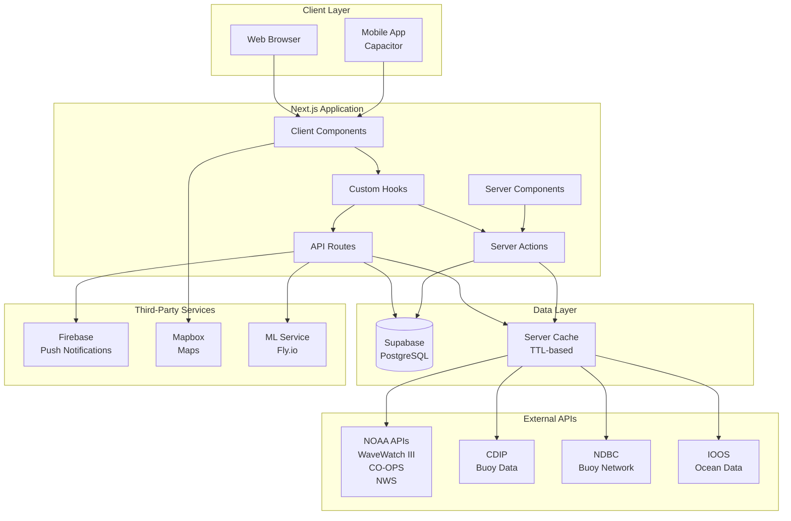
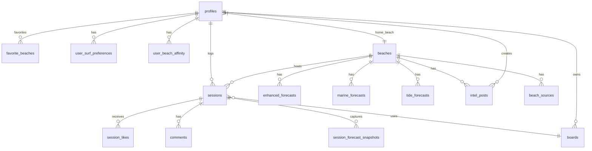
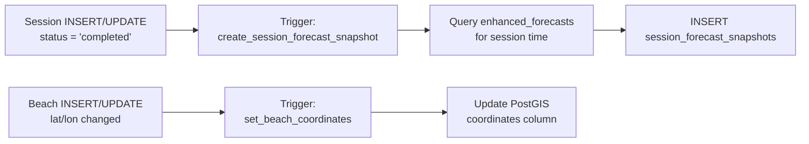
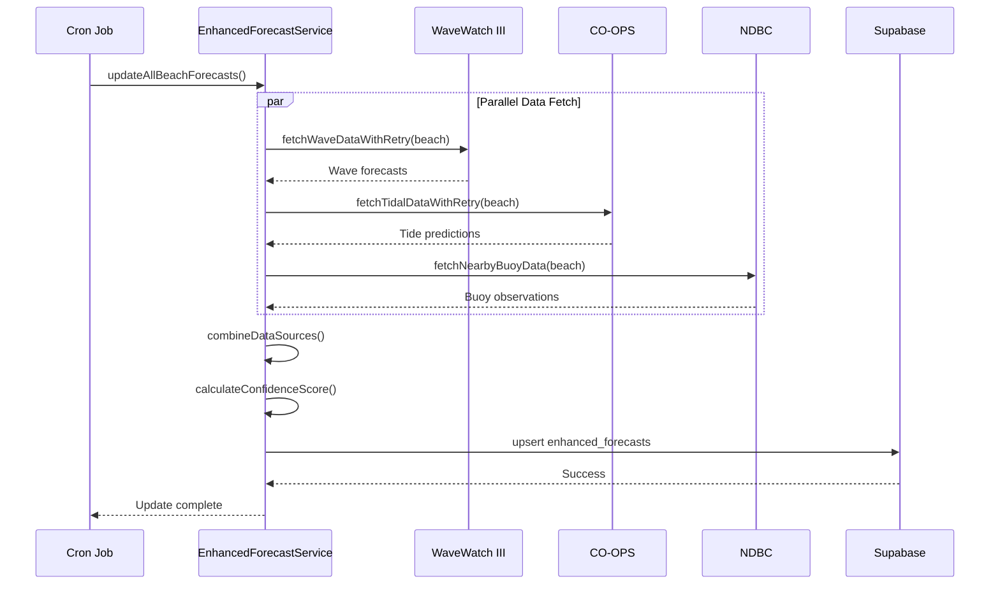
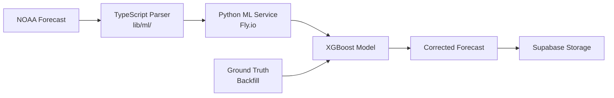
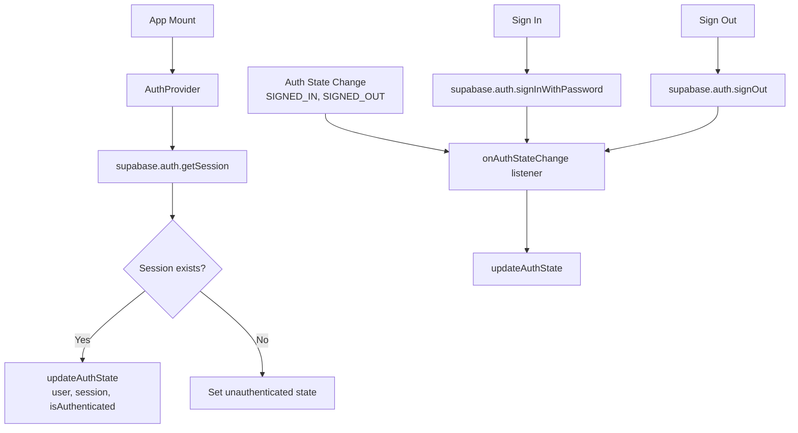
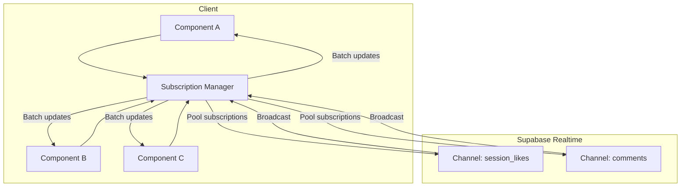
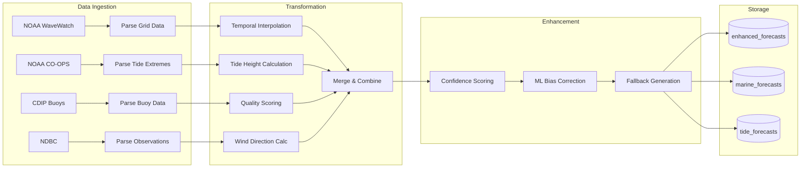

# Data Flows Documentation

**Purpose**: Comprehensive mapping of all data flows in the Quiver surfing application, including data sources, fetching patterns, API routes, database operations, and transformation pipelines.

**Last Updated**: January 2026

---

## Table of Contents

1. [Architecture Overview](#architecture-overview)
2. [Data Sources](#data-sources)
3. [Data Fetching Patterns](#data-fetching-patterns)
4. [API Routes](#api-routes)
5. [Database Flows](#database-flows)
6. [External Integrations](#external-integrations)
7. [State Management](#state-management)
8. [Real-time Data](#real-time-data)
9. [Data Transformation Pipeline](#data-transformation-pipeline)

---

## Architecture Overview

### High-Level System Diagram



### Data Flow Legend

| Symbol | Meaning |
|--------|---------|
| `→` | Synchronous request/response |
| `⇢` | Asynchronous/background flow |
| `↔` | Bidirectional real-time |
| `⟲` | Cached data flow |

---

## Data Sources

### 1. Supabase PostgreSQL (Primary Database)

**Connection**: `lib/supabase/client.ts`, `lib/supabase/server.ts`

| Table | Purpose | Key Fields |
|-------|---------|------------|
| `beaches` | Beach locations and metadata | `id`, `name`, `center_lat`, `center_lng` (legacy), `state`, `country` |
| `profiles` | User profiles and preferences | `id`, `home_beach_id`, `experience_level`, `surf_styles` |
| `sessions` | Surf session logs | `id`, `user_id`, `beach_id`, `arrival_time`, `rating`, `board_snapshot` |
| `enhanced_forecasts` | Processed surf forecasts | `beach_id`, `forecast_at`, `wave_height`, `data_source` |
| `marine_forecasts` | Raw marine data | `beach_id`, `ts`, `wave_height_m`, `wave_period_s` |
| `tide_forecasts` | Tide predictions | `beach_id`, `ts`, `tide_height_m` |
| `intel_posts` | Community intel | `id`, `beach_id`, `user_id`, `tag`, `expires_at` |
| `favorite_beaches` | User beach favorites | `user_id`, `beach_id`, `rank` |
| `user_surf_preferences` | Learned preferences | `user_id`, `preferred_wave_range`, `confidence` |
| `user_beach_affinity` | Beach familiarity scores | `user_id`, `beach_id`, `affinity_score` |
| `session_forecast_snapshots` | Historical forecast comparison | `session_id`, `forecast_snapshot`, `actual_conditions` |

### 2. NOAA APIs (Weather & Ocean Data)

**Services**: `lib/services/noaa-wavewatch-service.ts`, `lib/services/noaa-coops-service.ts`

| API | Endpoint | Data Type | Update Frequency |
|-----|----------|-----------|------------------|
| WaveWatch III | `https://polar.ncep.noaa.gov/waves` | Wave forecasts | 6 hours |
| CO-OPS | `https://api.tidesandcurrents.noaa.gov` | Tide predictions | Daily |
| NDBC | `https://www.ndbc.noaa.gov` | Buoy observations | Real-time |
| NWS | `https://api.weather.gov` | Wind data | Hourly |

### 3. CDIP (Coastal Data Information Program)

**Service**: `lib/services/cdip-service.ts`

```
Endpoint: https://thredds.cdip.ucsd.edu/thredds/dodsC/
Data: Real-time wave measurements from coastal buoys
Coverage: California, Pacific Northwest, Hawaii
Cache TTL: 30 minutes
```

### 4. IOOS (Integrated Ocean Observing System)

**Service**: `lib/services/ioos-service.ts`

```
Endpoint: https://erddap.sensors.ioos.us/erddap/
Data: Multi-source ocean observations
Integration: Supplementary wave/wind data
```

### 5. Firebase (Push Notifications)

**Service**: `lib/services/firebase-admin.ts`, `lib/services/push-notifications.ts`

```
Purpose: Mobile push notifications for:
- Forecast alerts (threshold-based)
- Social notifications (likes, comments, follows)
- Session invitations
```

### 6. Mapbox (Interactive Maps)

**Integration**: Client-side via `react-map-gl`

```
Features:
- Beach location rendering
- Cluster markers (via Supercluster)
- Geospatial search
- Offline map tiles (Capacitor)
```

### 7. ML Service (Forecast Bias Correction)

**Service**: `ml/` directory, hosted on Fly.io

```
Endpoint: https://quiver-ml.fly.dev
Model: XGBoost bias correction
Purpose: Improve NOAA wave height accuracy
Data Flow: NOAA Forecast → Parse (TS) → Correct (Python) → Store (Supabase)
```

---

## Data Fetching Patterns

### Pattern 1: `useDataFetcher` Hook (Universal Client-Side Fetching)

**Location**: `hooks/use-data-fetcher.ts`

```typescript
// Standard usage pattern
const fetchData = useCallback(async () => {
  return await someServerAction();
}, [dependencies]);

const { data, loading, error, refetch } = useDataFetcher(fetchData, {
  immediate: true,     // Fetch on mount
  skip: false,         // Conditional fetching
  onSuccess: (data) => {},
  onError: (error) => {},
});
```

**Key Features**:
- Automatic loading state management
- Error handling with user-friendly messages
- Skip functionality for conditional fetching
- Refetch capability for manual refresh

### Pattern 2: Server Actions with Authentication

**Location**: `lib/server-action-utils.ts`

```typescript
// Authenticated action wrapper
export const myAction = withAuthenticatedAction(
  async (userId: string, ...args) => {
    // userId is guaranteed to be valid
    const result = await performAction(userId, args);
    return { success: true, data: result };
  }
);
```

**Authentication Flow**:
```
Client Request → withAuthenticatedAction → Supabase Auth Check → Action Execution → Response
```

### Pattern 3: Cache-Backed Forecast Access

**Location**: `lib/utils/forecast-service-utils.ts`

```typescript
// CRITICAL: No on-demand API calls during user requests
const { forecasts, metadata } = await getFreshForecastFromCache(beachId, windowHours);

// Metadata includes staleness info:
// { cached: boolean, stale: boolean, missing: boolean, reason: string | null }
```

**Staleness Thresholds**:
| Source | Threshold | Reason |
|--------|-----------|--------|
| CDIP | 4 hours | Buoy cron doesn't reliably update every beach every cycle |
| NOAA_NWS | 12 hours | Enhanced forecasts regenerate daily |
| FALLBACK | 12 hours | Less critical data |

### Pattern 4: API Route Utilities

**Location**: `lib/api-utils.ts`

```typescript
// Standardized API responses
export async function POST(request: Request) {
  try {
    const result = await processRequest();
    return createSuccessResponse(result);
  } catch (error) {
    return handleApiError(error);
  }
}
```

### Pattern 5: Real-time Subscriptions

**Location**: `hooks/use-optimized-realtime.ts`

```typescript
// Subscription with batching and pooling
const unsubscribe = subscriptionManager.subscribe(
  'session_likes',
  [sessionId],
  (update) => {
    if (update.type === 'session_like') {
      setLikesCount(update.payload.likes_count);
    }
  }
);
```

---

## API Routes

### Authentication (`/api/auth/*`)

| Endpoint | Method | Purpose | Auth |
|----------|--------|---------|------|
| `/api/auth/[...supabase]` | GET/POST/DELETE | Core auth operations | None |
| `/api/auth/check-session` | GET | Validate session | None |
| `/api/auth/refresh-session` | POST | Token refresh | None |
| `/api/auth/email/update` | POST | Update email | User |

### Beaches (`/api/beaches/*`)

| Endpoint | Method | Purpose | Auth |
|----------|--------|---------|------|
| `/api/beaches` | GET/POST | List/Create beaches | Public/Admin |
| `/api/beaches/[id]` | GET/PATCH/DELETE | Beach CRUD | Public/Admin |
| `/api/beaches/[id]/favorite/toggle` | POST | Toggle favorite | User |
| `/api/beaches/[id]/sessions` | GET | Beach sessions | Public |
| `/api/beaches/[id]/sources` | GET | Forecast sources | Public |
| `/api/beaches/favorites` | GET | User favorites | User |
| `/api/beaches/featured` | GET | Featured beaches | Public |
| `/api/beaches/nearby` | GET | Geospatial search | Admin |
| `/api/beaches/search` | GET | Text search | Public |

### Forecasts (`/api/forecasts/*`)

| Endpoint | Method | Purpose | Auth |
|----------|--------|---------|------|
| `/api/forecasts/bulk` | GET | Batch forecasts | Public |
| `/api/forecasts/update` | POST/GET | Manual update | Admin |
| `/api/forecasts/update-enhanced` | POST/GET | Enhanced generation | Admin |

### Surf & Discovery (`/api/surf/*`)

| Endpoint | Method | Purpose | Auth |
|----------|--------|---------|------|
| `/api/surf` | GET | Primary forecast endpoint | Public |
| `/api/surf/discover` | GET | Beach discovery | User |
| `/api/surf/insights` | GET | Personalized insights | User |

### Sessions (`/api/sessions/*`)

| Endpoint | Method | Purpose | Auth |
|----------|--------|---------|------|
| `/api/sessions/[id]` | GET/PATCH/DELETE | Session CRUD | User |
| `/api/sessions/[id]/comments` | GET/POST | Session comments | User |
| `/api/sessions/[id]/likes/toggle` | POST | Like/unlike | User |
| `/api/sessions/[id]/photos` | GET/POST | Session photos | User |
| `/api/sessions/public` | GET | Public session feed | Public |

### Users (`/api/users/*`)

| Endpoint | Method | Purpose | Auth |
|----------|--------|---------|------|
| `/api/users/[id]/profile` | GET/PATCH | Profile CRUD | User |
| `/api/users/[id]/follow/toggle` | POST | Follow/unfollow | User |
| `/api/users/[id]/sessions` | GET | User sessions | Public |
| `/api/users/[id]/stats` | GET | User statistics | Public |
| `/api/users/search` | GET | User search | User |

### Cron Jobs (`/api/cron/*`)

| Endpoint | Method | Purpose | Schedule |
|----------|--------|---------|----------|
| `/api/cron/enhanced-forecast-sync` | POST/GET | NOAA data sync | Every 90 min |
| `/api/cron/enhanced-forecast-sync-cdip` | POST/GET | CDIP data sync | Every 2 hours |
| `/api/cron/sync-buoys` | GET | Buoy station sync | Daily |
| `/api/cron/update-buoy-conditions` | GET | Buoy conditions | Hourly |
| `/api/cron/daily-intel` | GET | Intel generation | Daily |
| `/api/cron/ml/correct-forecasts` | GET | ML bias correction | Every 6 hours |
| `/api/cron/ioos-sync` | GET | IOOS data sync | Every 2 hours |

### Community Intel (`/api/intel/*`)

| Endpoint | Method | Purpose | Auth |
|----------|--------|---------|------|
| `/api/intel` | GET/POST | Intel CRUD | User |
| `/api/intel/[id]/confirm` | POST/DELETE | Confirm intel | User |
| `/api/intel/[id]/report` | POST | Report intel | User |

### Board Recommendations

| Endpoint | Method | Purpose | Auth |
|----------|--------|---------|------|
| `/api/board-recommendations` | GET | Board recommendations | User |

---

## Database Flows

### Entity Relationship Diagram



### Row-Level Security (RLS) Patterns

**Pattern 1: Owner-Only Access**
```sql
-- Users can only access their own data
CREATE POLICY "select_own" ON public.sessions
  FOR SELECT USING ((select auth.uid()) = user_id);
```

**Pattern 2: Public Read, Owner Write**
```sql
-- Anyone can read, only owner can modify
CREATE POLICY "select_all" ON public.beaches
  FOR SELECT USING (true);

CREATE POLICY "update_own" ON public.beaches
  FOR UPDATE USING ((select auth.uid()) = owner_id);
```

**Pattern 3: Conditional Public Access**
```sql
-- Public sessions are visible to all
CREATE POLICY "select_public" ON public.sessions
  FOR SELECT USING (is_public = true OR (select auth.uid()) = user_id);
```

### Database Function (RPC) Flows

| Function | Purpose | Called From |
|----------|---------|-------------|
| `get_beaches_by_location_with_scores` | Location-based beach search with scoring | City pages |
| `get_nearby_intel_posts` | Geospatial intel search | Intel components |
| `get_best_times` | Top scoring time windows | Session planner |
| `prune_forecasts_retention` | Data cleanup (90 days raw, 14 days enhanced) | Daily cron |
| `create_session_forecast_snapshot` | Auto-capture forecast on session complete | Trigger |

### Trigger Flows



---

## External Integrations

### NOAA Integration Flow



### CDIP Integration Flow

**Service**: `lib/services/cdip-service.ts`

```
1. Find nearest CDIP station (50km radius)
2. Fetch raw CDIP data via THREDDS server
3. Transform to CDIPBuoyData format
4. Calculate data quality score (0-100)
5. Cache with 30-minute TTL
6. Store in enhanced_forecasts with data_source='CDIP'
```

### ML Bias Correction Flow



### Push Notification Flow

**Service**: `lib/services/push-notifications.ts`

```
1. Event triggers (forecast threshold, social action)
2. Query user notification preferences
3. Check rate limits and delivery history
4. Format notification payload
5. Send via Firebase Admin SDK
6. Log delivery in forecast_alert_deliveries
```

---

## State Management

### React Context Providers

| Context | Location | Purpose |
|---------|----------|---------|
| `AuthContext` | `context/auth-context.tsx` | Authentication state, user session |
| `ProfileContext` | `context/profile-context.tsx` | User profile data |
| `LocationContext` | `context/location-context.tsx` | Geolocation state |

### AuthContext Data Flow



### Client-Side Cache Strategy

**Location**: `hooks/use-cached-api.ts`

```typescript
// Location-aware cache keys
const cacheKey = createLocationCacheKey('beaches', latitude, longitude, 3);

// TTL-based expiration
const CACHE_TTL = {
  forecasts: 5 * 60 * 1000,    // 5 minutes
  beaches: 30 * 60 * 1000,     // 30 minutes
  profile: 10 * 60 * 1000,     // 10 minutes
};
```

### Server-Side Cache Strategy

**Location**: `lib/utils/forecast-service-utils.ts`

```
Cache Layers:
1. In-memory cache (per-request, serverless function lifetime)
2. Database cache (enhanced_forecasts table)
3. Staleness thresholds per data source

Cache Flow:
Request → Check in-memory → Check DB freshness → Return or mark stale
```

---

## Real-time Data

### Supabase Real-time Subscriptions

**Hook**: `hooks/use-optimized-realtime.ts`

| Channel | Events | Use Case |
|---------|--------|----------|
| `session_likes` | INSERT, DELETE | Like count updates |
| `user_follows` | INSERT, DELETE | Follower updates |
| `comments` | INSERT, UPDATE, DELETE | Comment threads |
| `intel_posts` | INSERT, UPDATE | New community intel |

### Subscription Architecture



### Subscription Optimization Features

1. **Connection Pooling**: Reuse channels across components
2. **Batched Updates**: Group updates to reduce re-renders
3. **Memory Leak Prevention**: Automatic cleanup on unmount
4. **Reconnection Handling**: Automatic retry with backoff

---

## Data Transformation Pipeline

### Forecast Processing Pipeline



### Coordinate Transformation

**Documentation**: `/docs/COORDINATE_CONVENTIONS.md`

```typescript
// Database → Component mapping (CRITICAL)
// Database fields: center_lat, center_lng (PostGIS legacy)
// Component props: latitude, longitude

<Component
  latitude={beach.center_lat}   // Map: center_lat → latitude
  longitude={beach.center_lng}  // Map: center_lng → longitude
/>
```

### Personalization Scoring Pipeline

**Location**: `lib/services/personalized-scoring-service.ts`

```
Input: Beach + Forecast + User Preferences

Scoring Components (0-100 total):
├── Base Score (algorithmic): 0-100
├── Onboarding wave size match: +10 pts
├── Onboarding break type match: +8 pts
├── Learned wave range match: +15 pts × confidence
├── Learned wind preferences: +10 pts × confidence
├── Learned tide preferences: +8 pts × confidence
└── Beach affinity bonus: +affinity_score × 0.15 (max 15)

Output: Capped at 100
```

### Similarity Insights Pipeline

**Location**: `lib/services/similarity-insights-service.ts`

```
Input: Current forecast conditions + User session history

Algorithm:
1. Query rated sessions (≥3 stars) from last 12 months
2. Bucket-based similarity scoring:
   - Wave height: 35% weight (buckets: 0-2, 2-4, 4-6, 6-8, 8+ ft)
   - Wave period: 25% weight (buckets: 0-8, 8-12, 12-16, 16+s)
   - Wind speed: 20% weight (buckets: 0-5, 5-10, 10-15, 15+ mph)
   - Wind direction: 10% weight (8 cardinal directions)
   - Tide height: 10% weight

3. Match filtering: Top 5 sessions above 60% similarity
4. Insight generation:
   - Match percent and quality label
   - Reason bullets (2-4)
   - Board tip if ≥60% used same board
   - Cross-spot explanation if >50% from other beaches

Output: PersonalizedInsights
```

---

## Data Flow Summary by Feature

### Home Screen Recommendation Flow

```
1. User opens app
2. AuthContext provides user session
3. useSurfDiscovery hook triggers
4. GET /api/surf/discover
5. SurfDiscoveryService.getRecommendation():
   a. Build candidate pool (home beach + favorites)
   b. getFreshForecastFromCache() per beach (no API calls)
   c. Select best window per beach (48 hours, sunset/time slot capped)
   d. PersonalizedScoringService.scoreBatch()
   e. Select best beach
   f. Generate summary and reasons
6. Return recommendation to client
7. Display PersonalizedForecastCard
```

### Session Logging Flow

```
1. User completes session form
2. Client calls createSession server action
3. withAuthenticatedAction validates user
4. INSERT session with board_snapshot
5. Trigger fires: create_session_forecast_snapshot
6. Query enhanced_forecasts for session time
7. INSERT session_forecast_snapshots
8. Revalidate profile page cache
9. Return success to client
10. Show toast notification
```

### Forecast Sync Flow (Background)

```
1. Vercel Cron triggers /api/cron/enhanced-forecast-sync
2. validateCronRequest() checks auth
3. Query beaches with lat/lon
4. For each beach (batch of 2):
   a. EnhancedForecastService.generateComprehensiveForecast()
   b. Promise.allSettled([wave, tide, weather, buoy, cdip])
   c. combineDataSources()
   d. calculateConfidenceScore()
   e. Upsert to enhanced_forecasts
5. Log results and return summary
```

---

## Related Documentation

| Document | Purpose |
|----------|---------|
| `/docs/ARCHITECTURE.md` | Top-level architecture index |
| `/app/api/ARCHITECTURE.md` | API routes architecture |
| `/lib/services/ARCHITECTURE.md` | Services and personalization |
| `/hooks/ARCHITECTURE.md` | Custom React hooks |
| `/supabase/ARCHITECTURE.md` | Database architecture and RLS |
| `/docs/diagrams/system-context.md` | System context diagram |
| `/docs/COORDINATE_CONVENTIONS.md` | Coordinate naming standards |

---

**Document Status**: Complete
**Last Updated**: January 2026
**Next Review**: After significant architecture changes
