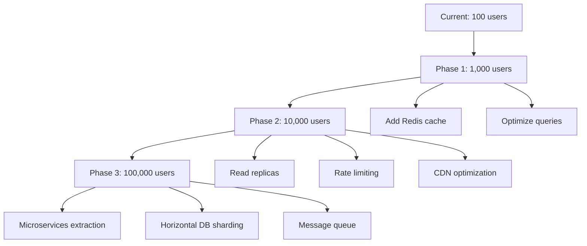

> Merged into [Quiver Architecture](../../ARCHITECTURE.md).

# Quiver System Architecture Guide

**Version**: 1.0
**Last Updated**: October 28, 2025
**Status**: Production

---

## Executive Summary

Quiver is a community-driven social surf tracking platform built with modern web technologies. The system enables surfers to log sessions, discover beaches, view forecasts, and connect with other surfers through a feature-rich mobile and web application.

### Key Characteristics

- **Architecture Style**: Monolithic-first with serverless deployment
- **Primary Stack**: Next.js 16, TypeScript, Supabase, Capacitor
- **Deployment**: Vercel (serverless) + Supabase (managed backend)
- **Scalability**: Ready for 10,000+ concurrent users
- **Security**: Enterprise-grade (JWT auth, RLS, HTTPS/TLS 1.3)
- **Performance**: <150ms median API response time

---

## Table of Contents

1. [System Overview](#system-overview)
2. [Architecture Principles](#architecture-principles)
3. [System Context](#system-context)
4. [Container Architecture](#container-architecture)
5. [Data Architecture](#data-architecture)
6. [Security Architecture](#security-architecture)
7. [Infrastructure & Deployment](#infrastructure--deployment)
8. [Key Design Decisions](#key-design-decisions)
9. [Scalability & Performance](#scalability--performance)
10. [Future Architecture Evolution](#future-architecture-evolution)

---

## System Overview

### What is Quiver?

Quiver is a mobile-first social platform for surfers that combines:

- **Session Logging**: Track surf sessions with photos, ratings, and conditions
- **Forecast Engine**: Multi-source surf forecasting (NOAA, NDBC, CDIP)
- **Beach Discovery**: Searchable database of surf spots with community reviews
- **Social Features**: Follow surfers, like sessions, comment, share
- **Gamification**: XP system, badges, leaderboards to drive engagement
- **Community Intel**: Real-time condition reports from local surfers

### Target Users

1. **Primary**: Recreational surfers (mobile app users)
2. **Secondary**: Surf travelers researching destinations (web users)
3. **Tertiary**: Surf shop owners and local communities (future business tier)

### Core Value Proposition

> "Track your sessions, find perfect waves, and connect with the surf community—all in one app."

---

## Architecture Principles

### Design Principles

1. **Mobile-First**: Primary experience is mobile app (iOS/Android via Capacitor)
2. **API-First**: Clean separation between frontend and backend via REST APIs
3. **Serverless by Default**: Leverage managed services to minimize operational overhead
4. **Security in Depth**: Multiple layers of security (auth, RLS, HTTPS, validation)
5. **Progressive Enhancement**: Core features work offline, enhanced features require connectivity
6. **Data-Driven**: Leverage data to improve forecasts and recommendations
7. **Community-Powered**: User-generated content enhances platform value

### Technical Principles

1. **TypeScript Everywhere**: End-to-end type safety
2. **Schema-First**: Database schema drives API and UI types
3. **Test Coverage**: 95%+ unit test coverage, E2E tests for critical flows
4. **Documentation as Code**: Architecture diagrams in Mermaid (version-controlled)
5. **Incremental Adoption**: Add features progressively without breaking changes
6. **Performance Budget**: <150ms p50, <500ms p95 API response times
7. **Accessibility**: WCAG 2.1 AA compliance for web app

---

## System Context

### High-Level Architecture

```
┌─────────────┐
│   Users     │
│  (Surfers)  │
└──────┬──────┘
       │
       ▼
┌─────────────────────────────────────────┐
│        Quiver Platform                   │
│  (Next.js + Supabase + Capacitor)       │
│                                          │
│  • Web App (Desktop/Mobile Browser)     │
│  • iOS App (Capacitor + Native)         │
│  • Android App (Capacitor + Native)     │
└───────────┬──────────────┬──────────────┘
            │              │
            ▼              ▼
    ┌────────────┐  ┌─────────────────┐
    │  Supabase  │  │  External APIs  │
    │  Platform  │  │  • NOAA         │
    │            │  │  • NDBC Buoys   │
    │  • Auth    │  │  • Google Maps  │
    │  • DB      │  │  • Firebase     │
    │  • Storage │  │                 │
    │  • Realtime│  │                 │
    └────────────┘  └─────────────────┘
```

**📊 Detailed Diagram**: [System Context Diagram](../../diagrams/system-context.md)

### External Dependencies

| Service | Purpose | Criticality | Fallback |
|---------|---------|-------------|----------|
| **Supabase** | Database, auth, storage | Critical | None (single point of failure) |
| **Vercel** | Hosting, serverless functions | Critical | Manual deployment to alternative |
| **NOAA APIs** | Forecast data | High | Cached data (6hr TTL) |
| **Firebase FCM** | Push notifications | Medium | Graceful degradation |
| **Google Maps** | Geocoding, maps | Medium | Mapbox fallback |
| **NDBC Buoys** | Real-time wave data | Low | NOAA forecast only |

---

## Container Architecture

### Application Containers

The Quiver platform consists of the following major containers:

#### 1. Web Application (Next.js)
- **Technology**: Next.js 16 with App Router
- **Hosting**: Vercel Edge Network (global CDN)
- **Features**:
  - Server-side rendering (SSR)
  - Static generation for marketing pages
  - Client-side interactivity (React 19)
  - Progressive Web App capabilities

#### 2. API Layer (Next.js API Routes)
- **Technology**: Next.js API Routes (serverless functions)
- **Endpoint Count**: ~32 route groups
- **Authentication**: JWT-based via middleware
- **Rate Limiting**: Future implementation (Upstash)

#### 3. Mobile Applications (Capacitor)
- **iOS App**: Capacitor + Native iOS SDK
- **Android App**: Capacitor + Native Android SDK
- **Native Features**: Camera, Geolocation, Push Notifications
- **Distribution**: App Store (iOS), Google Play (Android)

#### 4. Database (PostgreSQL)
- **Provider**: Supabase (managed PostgreSQL 15)
- **Extensions**: PostGIS (geospatial), pgcrypto
- **Tables**: 40+ core tables
- **Security**: Row-Level Security (RLS) on all tables

#### 5. Backend Services (Supabase)
- **Auth**: JWT-based authentication
- **Storage**: S3-compatible file storage with CDN
- **Realtime**: WebSocket-based subscriptions
- **Edge Functions**: Future consideration

**📊 Detailed Diagram**: [Container Architecture Diagram](../../diagrams/container-architecture.md)

---

## Data Architecture

### Database Design

The database is organized into the following domains:

1. **Core**: Users, sessions, beaches, boards
2. **Social**: Likes, comments, follows, activities
3. **Forecasting**: Forecasts, buoys, tides, marine data
4. **Community**: Reviews, intel posts, feedback
5. **Gamification**: XP, badges, leaderboards
6. **Media**: Photos, session attachments
7. **Admin**: Audit logs, system data

### Key Tables

| Domain | Tables | Primary Keys | Foreign Keys |
|--------|--------|--------------|--------------|
| **Core** | 4 | UUID | 8 |
| **Social** | 8 | UUID | 16 |
| **Forecasting** | 6 | UUID/Composite | 8 |
| **Community** | 4 | UUID | 6 |
| **Gamification** | 4 | UUID | 5 |
| **Total** | **40+** | **UUID** | **60+** |

### Data Flow Patterns

1. **Session Creation**: User → Form → Server Action → DB → XP → Activity Feed → Realtime → Followers
2. **Forecast Refresh**: Cron → API → NOAA → Transform → DB → Cache
3. **Social Interaction**: User → Like/Comment → DB → Activity → Realtime → Push Notification

**📊 Detailed Diagram**: [Database Schema (ERD)](../../diagrams/database-schema.md)

### Data Retention

| Data Type | Retention Period | Cleanup Strategy |
|-----------|-----------------|------------------|
| **Active Sessions** | Indefinite | User-controlled deletion |
| **Forecast Data** | 30 days | Automated cleanup job |
| **User Activities** | 90 days | Automated cleanup job |
| **Media Files** | Indefinite | User-controlled deletion |
| **Audit Logs** | 1 year | Automated archive + delete |
| **Analytics Events** | 6 months | Aggregated then deleted |

---

## Security Architecture

### Security Layers

Quiver implements defense-in-depth security with multiple layers:

```
1. Transport Security (TLS 1.3)
   ↓
2. CDN Protection (Vercel Edge)
   ↓
3. Application Middleware (Auth Check)
   ↓
4. API Route Protection (JWT Validation)
   ↓
5. Database Row-Level Security (RLS)
   ↓
6. Data Encryption (At Rest)
```

### Authentication & Authorization

**Authentication Methods**:
- Email + Password (bcrypt hashing)
- Magic Links (passwordless)
- OAuth (Google)

**Session Management**:
- JWT tokens (1-hour expiry)
- Refresh tokens (30-day expiry)
- HTTP-only cookies (XSS protection)
- Automatic token refresh

**Authorization**:
- Row-Level Security (RLS) policies on all tables
- User can only access own data (default)
- Public data readable by all (beaches, forecasts)
- Admin role for elevated access

**📊 Detailed Diagram**: [Authentication Flow](../../diagrams/auth-flow.md)

### Data Protection

| Protection Type | Implementation |
|----------------|----------------|
| **Encryption in Transit** | TLS 1.3 (all connections) |
| **Encryption at Rest** | AES-256 (database, storage) |
| **Password Hashing** | bcrypt with salt |
| **JWT Signing** | HMAC SHA-256 |
| **File Access** | Signed URLs (time-limited) |
| **Database Access** | RLS policies (row-level) |

### Security Headers

```typescript
{
  'X-Content-Type-Options': 'nosniff',
  'X-Frame-Options': 'DENY',
  'X-XSS-Protection': '1; mode=block',
  'Referrer-Policy': 'strict-origin-when-cross-origin',
  'Strict-Transport-Security': 'max-age=31536000',
  'Content-Security-Policy': 'default-src \'self\'; ...'  // Future
}
```

---

## Infrastructure & Deployment

### Production Environment

**Hosting Architecture**:
```
GitHub (Source)
  → GitHub Actions (CI/CD)
    → Vercel (Deploy)
      → Global CDN (270+ locations)
        → Users
```

### Environments

| Environment | Purpose | URL | Deployment Trigger |
|-------------|---------|-----|-------------------|
| **Production** | Live application | quiversurf.app | Merge to main |
| **Preview** | PR reviews | quiver-pr-*.vercel.app | PR creation/update |
| **Development** | Local development | localhost:3000 | Manual (local) |

### CI/CD Pipeline

1. **Pull Request**:
   - Linting (ESLint)
   - Type checking (TypeScript)
   - Unit tests (Jest)
   - Preview deployment (Vercel)

2. **Main Branch**:
   - All PR checks
   - E2E tests (Playwright)
   - Production deployment (Vercel)
   - Database migrations (Supabase)

3. **Mobile Release** (Manual):
   - Build iOS app (Xcode)
   - Build Android app (Gradle)
   - Submit to App Store / Google Play

**📊 Detailed Diagram**: [Deployment Architecture](../../diagrams/deployment.md)

### Infrastructure Costs

| Service | Plan | Monthly Cost |
|---------|------|--------------|
| Vercel | Pro | $20 |
| Supabase | Pro | $25 |
| Firebase | Free | $0 (scales with usage) |
| Domain | - | $1 |
| **Total** | | **~$46/month** |

**At scale (10,000 MAU)**: ~$55-110/month

---

## Key Design Decisions

### ADR-001: Next.js over React SPA

**Decision**: Use Next.js with App Router instead of React SPA

**Rationale**:
- Server-side rendering improves SEO
- API routes eliminate need for separate backend
- Better performance (Core Web Vitals)
- Code splitting out of the box

**Trade-offs**:
- More complex than SPA
- Server runtime required (Vercel functions)

**Status**: Accepted ✅

---

### ADR-002: Supabase over Custom Backend

**Decision**: Use Supabase as primary backend instead of building custom

**Rationale**:
- Rapid development (auth, DB, storage built-in)
- Managed infrastructure (no DevOps overhead)
- Real-time capabilities out of the box
- Cost-effective for early stage

**Trade-offs**:
- Vendor lock-in risk
- Less control over infrastructure
- Limited customization

**Status**: Accepted ✅ (with repository pattern for future migration)

---

### ADR-003: Capacitor over React Native

**Decision**: Use Capacitor to wrap web app instead of React Native

**Rationale**:
- 95% code reuse from web app
- Single codebase for web + iOS + Android
- Faster development and iteration
- Easier maintenance

**Trade-offs**:
- Slightly lower performance than native
- Limited access to latest native features
- WebView overhead

**Status**: Accepted ✅

---

### ADR-004: Multi-Source Forecasting

**Decision**: Aggregate forecasts from NOAA, NDBC, CDIP instead of single source

**Rationale**:
- More comprehensive coverage
- Redundancy if one source fails
- Ability to compare and validate data
- Better accuracy through ensemble approach

**Trade-offs**:
- More complex data pipeline
- Higher API request volume
- Data synchronization challenges

**Status**: Accepted ✅

---

### ADR-005: Monorepo Structure

**Decision**: Keep web, mobile, and API in single repository

**Rationale**:
- Shared TypeScript types
- Easier refactoring across boundaries
- Simplified deployment pipeline
- Better code discoverability

**Trade-offs**:
- Larger repository size
- Potential for tighter coupling
- More complex build configuration

**Status**: Accepted ✅

---

## Scalability & Performance

### Current Capacity

| Metric | Current | Target (10K users) | Bottleneck |
|--------|---------|-------------------|------------|
| **Concurrent Users** | 100 | 10,000 | Realtime connections |
| **API Requests/sec** | 10 | 1,000 | Database connections |
| **Database Size** | 500MB | 50GB | Storage cost |
| **File Storage** | 1GB | 100GB | Bandwidth cost |
| **Response Time (p50)** | 120ms | <150ms | Database queries |

### Performance Optimizations

1. **Database**:
   - Foreign key indexes (50-80% faster joins)
   - Geospatial indexes (PostGIS)
   - Partial indexes for active data
   - RLS optimization (avoid InitPlan overhead)

2. **API**:
   - CDN caching (5min TTL for public data)
   - Connection pooling (PgBouncer)
   - Query result caching
   - Lazy loading for media

3. **Frontend**:
   - Code splitting (React.lazy)
   - Image optimization (Next.js Image)
   - Service Worker caching
   - Resource hints (prefetch, preconnect)

### Scaling Strategy



**Phase 1 (1,000 users)**: Optimize existing architecture
**Phase 2 (10,000 users)**: Add caching and read replicas
**Phase 3 (100,000 users)**: Consider microservices for high-load domains

---

## Future Architecture Evolution

### Roadmap

#### Q1 2026: Performance & Reliability
- [ ] Implement Redis cache layer
- [ ] Add database read replicas
- [ ] Implement rate limiting (Upstash)
- [ ] Add comprehensive monitoring (Datadog)
- [ ] Set up error tracking (Sentry)

#### Q2 2026: Advanced Features
- [ ] Machine learning forecast enhancement
- [ ] Real-time collaboration features
- [ ] Advanced analytics dashboard
- [ ] Custom push notification preferences
- [ ] Offline-first mobile experience

#### Q3 2026: Platform Evolution
- [ ] Extract forecast service (microservice)
- [ ] Implement event-driven architecture
- [ ] Add GraphQL API option
- [ ] Multi-region deployment
- [ ] Advanced personalization engine

#### Q4 2026: Scale & Monetization
- [ ] Subscription tier (premium features)
- [ ] Business API for surf shops
- [ ] Mobile SDK for third-party apps
- [ ] Data export capabilities
- [ ] Advanced privacy controls (GDPR)

### Migration Path from Monolith

If needed, future microservices extraction:

```
Current Monolith
    ↓
1. Extract Forecast Service
    ↓
2. Extract Social Service
    ↓
3. Extract Gamification Service
    ↓
Microservices Architecture
```

**Repository Pattern** already implemented makes this feasible.

---

## Monitoring & Observability

### Metrics to Track

1. **Application Metrics**:
   - API response times (p50, p95, p99)
   - Error rates by endpoint
   - User session duration
   - Feature adoption rates

2. **Infrastructure Metrics**:
   - Database connection pool usage
   - Function cold start frequency
   - CDN cache hit ratio
   - Storage usage growth

3. **Business Metrics**:
   - Daily/Monthly Active Users (DAU/MAU)
   - Session creation rate
   - Social engagement (likes, comments)
   - User retention (D1, D7, D30)

### Alerting Strategy

| Alert | Threshold | Action |
|-------|-----------|--------|
| API Error Rate | >1% | Page on-call engineer |
| Response Time p95 | >500ms | Investigate performance |
| Database Connections | >80% | Scale connection pool |
| Storage Usage | >80% | Upgrade plan |
| Failed Deployments | Any | Rollback deployment |

---

## Architecture Documentation Index

### Diagrams

1. [System Context Diagram](../../diagrams/system-context.md) - High-level ecosystem view
2. [Container Architecture](../../diagrams/container-architecture.md) - Technology containers
3. [Database Schema (ERD)](../../diagrams/database-schema.md) - Complete database design
4. [Authentication Flow](../../diagrams/auth-flow.md) - Auth/authz architecture
5. [Session Creation Flow](../../diagrams/session-creation-flow.md) - End-to-end user flow
6. [Deployment Architecture](../../diagrams/deployment.md) - Infrastructure & CI/CD
7. [API Request Lifecycle](../../diagrams/api-request-flow.md) - Request processing

### Guides

1. [API Documentation](../../architecture/API_DOCUMENTATION.md) - Complete API reference
2. [Security Guide](../../architecture/API_SECURITY.md) - Security best practices
3. [Database Schema Documentation](../../architecture/DATABASE_SCHEMA.md) - Detailed schema reference

---

## Conclusion

Quiver's architecture is designed for rapid iteration while maintaining production-grade quality. The serverless, monolithic-first approach enables a small team to deliver a feature-rich platform with minimal operational overhead.

Key architectural strengths:
- ✅ Modern, scalable technology stack
- ✅ Comprehensive security (JWT + RLS)
- ✅ Excellent developer experience (TypeScript, hot reload)
- ✅ Low operational costs (~$46/month)
- ✅ Ready to scale to 10,000+ users

Next steps:
- Add Redis caching for performance
- Implement repository pattern fully (reduce Supabase coupling)
- Add comprehensive monitoring and alerting
- Consider microservices extraction at 100K+ users

---

**Document Version**: 1.0
**Last Reviewed**: October 28, 2025
**Next Review**: January 28, 2026
**Maintained By**: Quiver Engineering Team

For questions or updates, please create an issue in the GitHub repository.
