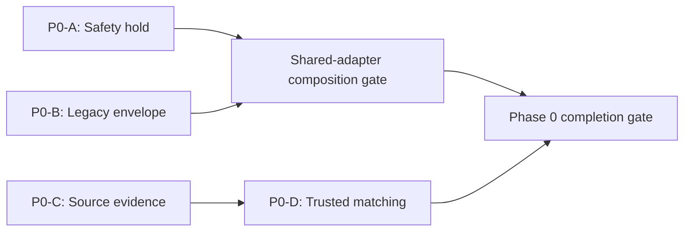

# Forecast Decision Program Phase 0 Implementation Plan

> **For agentic workers:** REQUIRED SUB-SKILL: Use superpowers:subagent-driven-development (recommended) or superpowers:executing-plans to implement this plan task-by-task. Steps use checkbox (`- [ ]`) syntax for tracking.

**Goal:** Deliver the first safe, measurable foundation for one authoritative session-decision engine without changing Quiver's objective forecast heights or prematurely promoting a new source policy.

**Architecture:** Phase 0 is four independently flaggable releases rather than one pull request. P0-A closes the immediate recommendation-safety gap; P0-B exposes every current recommendation authority and rendered divergence; P0-C restores immutable source evidence and extracts the current source policy; P0-D fixes observation lineage and produces trustworthy, promotion-blocked comparisons. P0-A and P0-B remain operationally flag-independent, but their shared authority adapters have a fixed composition order and combined release gate. P0-D depends on P0-C identities.

**Tech Stack:** Quiver Next.js/TypeScript/PostgreSQL/Supabase/Jest/Playwright, Quiver Native React Native/Expo/TypeScript/Jest/Maestro, Seaside Python 3.11/FastAPI/APScheduler/pytest, Node.js 22 and Yarn 1 for Quiver.

## Global Constraints

- The approved parent architecture is `docs/archive/superpowers/specs/2026-07-17-canonical-session-decision-engine-design.md`.
- The approved source subdesign is `docs/archive/superpowers/specs/2026-07-16-forecast-source-handoff-shadow-design.md`.
- Direct implementation, production database mutation, deployment, flag activation, and commits each require the authorization stated in the relevant workstream; approval of these plan documents alone does not authorize them.
- Objective wave height, swell partitions, wind, tide, water conditions, forecast browsing, and physical source serving remain unchanged throughout Phase 0.
- The only permitted user-visible decision change is P0-A returning explicit none or a separately validated protected alternative under an active audited hold.
- Do not introduce a low-confidence label or confidence-derived client behavior.
- QA-only and scraped forecaster evidence may alert and support operator review; it has zero automatic effect on forecasts, event state, recommendation eligibility, or ranking.
- The first P0-A automatic policy accepts only fresh official safety context. No serving-model trigger is approved for launch; adding one requires a new versioned trigger policy, focused tests, and separate implementation and release approval.
- Beginner, intermediate, and unknown-skill contexts are conservative P0-A cohorts. Unknown skill never receives a positive protected alternative.
- No client, cached result, alert, email, surf-call path, or local ranker may manufacture a positive recommendation when server policy returns explicit none.
- Hold, attribution, issuance-revision, candidate, and observation-lineage records are append-only, versioned where applicable, idempotent, service-controlled, and privacy-reviewed. Attribution deletion occurs only through its approved dependency-closure retention or explicit erasure functions. Operational source-capture manifests may make one guarded `started` → terminal transition through their finalization RPC; they are never rewritten afterward.
- Preserve unrelated dirty worktree changes; stage only task-owned files; do not commit unless separately authorized.
- A passing P0-C or P0-D report never authorizes a serving source change.

---

## Workstream Plans

| Workstream | Plan | First releasable outcome | Dependency |
|---|---|---|---|
| P0-A | [Major-Event Recommendation Hold](./2026-07-17-phase-0a-major-event-recommendation-hold.md) | Audited server-side hold prevents unsafe positive recommendations | None |
| P0-B | [Legacy Decision Envelope and Attribution](./2026-07-17-phase-0b-legacy-decision-envelope-attribution.md) | Current server-selected versus rendered decisions become measurable | P0-A composition contract for shared adapters; non-overlapping schema and tooling may proceed independently |
| P0-C | [Forecast Evidence and Source Policy](./2026-07-17-phase-0c-forecast-evidence-source-policy.md) | Fresh immutable GFS/source evidence with legacy serving unchanged | None |
| P0-D | [Observation Matching and Source Scoring](./2026-07-17-phase-0d-observation-matching-source-scoring.md) | Nearest-time lineage and trustworthy identical-row reports | P0-C schema and identities |



P0-A is the first operational release. P0-B's non-overlapping schema, contracts, dashboard, and reconciliation tooling may be implemented in parallel with P0-A, as may P0-C. P0-B changes to any authority adapter also touched by P0-A must land after P0-A's adapter contract or in one coordinated integration branch, with the combined flag/failure matrix passing before release. P0-D implementation may begin with its pure matcher and tests, but its shared schema and live source-candidate path cannot land before P0-C's immutable identities.

## Migration Order

The planned Quiver migrations are ordered and non-overlapping:

1. `supabase/migrations/20260717170000_create_regional_recommendation_holds.sql`
2. `supabase/migrations/20260717171000_create_legacy_decision_envelopes.sql`
3. `supabase/migrations/20260717172000_create_forecast_source_evidence.sql`
4. `supabase/migrations/20260717173000_create_forecast_observation_matches.sql`

Each migration receives its own PLAN → APPROVAL → local validation → explicit production-apply approval. Applying one does not approve the next. Migrations are retained during flag rollback; policy state is cancelled or superseded by new append-only records.

## Flag Ownership

| Workstream | Flags | Default | Rollback invariant |
|---|---|---|---|
| P0-A | `MAJOR_EVENT_HOLD_MODE=off|shadow|enforce`, `MAJOR_EVENT_HOLD_AUTOMATION_ENABLED=false` | off / false | Disabling automation never cancels an active hold; cancellation is an audited transition |
| P0-B | `LEGACY_DECISION_ENVELOPE_WRITE_ENABLED`, `LEGACY_DECISION_EVENT_WRITE_ENABLED`, `LEGACY_DECISION_RETENTION_ENABLED`, authority allowlists | false / false / false | Disabling attribution writes cannot alter recommendation selection or rendering; write rollback leaves an already-enabled retention job active |
| P0-C | `FORECAST_SOURCE_REVISION_CAPTURE_ENABLED`, `GFS_WAVE_SHADOW_CAPTURE_ENABLED`, `FORECAST_SOURCE_POLICY_SHADOW_ENABLED`, `FORECAST_SOURCE_POLICY_MODE=legacy_72h` | false / false / false / legacy_72h | Capture rollback cannot change display forecast serving |
| P0-D | `OBSERVATION_MATCHER_V2_MODE=off|compare`, `SOURCE_POLICY_EVALUATION_ENABLED=false` | off / false | Report and matcher rollback cannot promote or change source serving |

No Phase 0 safety or evidence flag is `NEXT_PUBLIC_`. Server policy remains authoritative.

---

### Task 1: Approve and Execute P0-A as the First Operational Release

**Files:**
- Plan: `docs/archive/superpowers/plans/2026-07-17-phase-0a-major-event-recommendation-hold.md`
- Spec: `docs/archive/superpowers/specs/2026-07-17-canonical-session-decision-engine-design.md`

**Interfaces:**
- Consumes: operator authorization, official safety context, user safety cohort, recommendation candidates, and surface identity.
- Produces: append-only hold policy and `RecommendationAvailability` enforced across server, web, native, cache, alert, and message paths.

- [ ] **Step 1: Review P0-A's exact surface inventory and accept no undocumented positive authority**

Expected evidence: discovery, Surf Call, Week Scout, map scoring, scored forecasts, daily intel, coach picks, intent forecasts, Session Intelligence, regional calls, legacy V1, notification worker, direct-send emails, OG/share routes, native cached fallbacks, and native local rankers are each covered by an adapter or recorded as a release blocker.

- [ ] **Step 2: Approve the P0-A implementation separately**

Expected result: authorization identifies whether code changes, local commits, the migration, deployment, and production flag changes are approved independently.

- [ ] **Step 3: Execute P0-A's TDD and local verification tasks**

Expected result: all P0-A unit, API, notification, Playwright, native Jest, Maestro, and previous-compatible-build smoke gates pass before a hold is activated.

- [ ] **Step 4: Release manual control before automation**

Expected result: control plane in shadow, all sanitizers and cache defenses deployed, native release available, a scoped manual canary exercised, then enforcement enabled. The current major event uses a manual audited hold because Quiver does not yet have a complete hurricane-swell detector.

- [ ] **Step 5: Exercise cancellation and emergency rollback**

Expected result: an append-only cancellation restores ordinary recommendations; automation-off leaves active records intact; emergency `off` changes no forecast data and is used only after active-hold state is understood.

### Task 2: Instrument P0-B Without Changing Decisions

**Files:**
- Plan: `docs/archive/superpowers/plans/2026-07-17-phase-0b-legacy-decision-envelope-attribution.md`

**Interfaces:**
- Consumes: every legacy authority's full evaluated server slate and each surface's actual rendered candidate/order.
- Produces: immutable envelope, candidate membership, generated/shown/opened/session-link events, divergence classifications, coverage dashboard, and privacy map.

- [ ] **Step 1: Freeze the authority inventory**

Expected result: every live authority and client reranker has an adapter, an owner, and a rollout order. Dormant code is documented but not activated.

- [ ] **Step 2: Approve and validate the append-only schema**

Expected result: transactionally persisted generation envelope plus candidate rows; actor, membership, session, and cross-envelope validation; no raw coordinates, exact availability/travel values, profile snapshots, notes, full safety evidence, or unrestricted user context.

- [ ] **Step 3: Roll out generation capture before rendered events**

Expected result: dark schema/dashboard, then discovery generation from 1% to 100%, then web and native rendered lifecycle events, followed by Week Scout, Surf Call, Session Intelligence, public rankings, and message selectors.

At shared P0-A adapter boundaries, land instrumentation only after the hold contract is present (or in the same coordinated integration branch) and run the combined matrix for both flags alone, both together, P0-B persistence timeout, and P0-A fail-closed error. A held response exposes no selected candidate ID, candidate map, or pre-hold payload.

- [ ] **Step 4: Meet attribution coverage**

Expected result: at least 99% enabled generation persistence, at least 95% tracking-eligible rendered recommendations with valid envelope/candidate IDs, at least 95% recommendation-originated sessions with a valid session-link event, and 100% accepted lifecycle candidates membership-valid.

- [ ] **Step 5: Exercise write-disable rollback**

Expected result: event endpoints safely no-op, recommendations remain byte-for-byte behaviorally unchanged, existing impression/session-context dual-write remains available, and immutable data stays queryable.

### Task 3: Restore P0-C Evidence With Serving Isolated

**Files:**
- Plan: `docs/archive/superpowers/plans/2026-07-17-phase-0c-forecast-evidence-source-policy.md`
- Spec: `docs/archive/superpowers/specs/2026-07-16-forecast-source-handoff-shadow-design.md`

**Interfaces:**
- Consumes: NOAA/NWS, Open-Meteo, pinned GFS-Wave, provider issue identity when available, retrieval payloads, and an injected source-policy anchor.
- Produces: guarded capture-run manifests, immutable run/beach attempts, issuance revisions, candidate evidence, monitors, and exact `legacy-72h.v1` characterization.

- [ ] **Step 1: Land the double-latched append-only capture path**

Expected result: deployment with both capture flags false performs zero new writes; enabling only one flag still performs zero writes; enabling both writes fresh, nonzero, exact-revision candidates only to the evidence schema, no more than once per beach per six hours.

- [ ] **Step 2: Prove corrections create revisions instead of rewrites**

Expected result: unchanged retrieval is idempotent across runs through a new attempt link; provider payload change or parser change creates a superseding immutable revision; stable unknown-cycle stream identity never includes a capture-run ID and cannot count as an independent cycle.

- [ ] **Step 3: Extract and characterize the pure legacy policy**

Expected result: an injected anchor reproduces NOAA at or before 72 hours, Open-Meteo after 72 hours, NOAA fallback when Open-Meteo is absent, and Open-Meteo extension beyond NOAA. Pinned GFS remains capture-only.

- [ ] **Step 4: Verify display-path isolation**

Expected result: zero P0-C writes to `enhanced_forecasts`, `corrected_forecasts`, or any display-serving table; representative forecast outputs are unchanged.

- [ ] **Step 5: Exercise capture rollback**

Expected result: disabling `FORECAST_SOURCE_REVISION_CAPTURE_ENABLED` stops new revisions while legacy source serving and P0-A remain unchanged.

### Task 4: Establish P0-D Trustworthy Measurement

**Files:**
- Plan: `docs/archive/superpowers/plans/2026-07-17-phase-0d-observation-matching-source-scoring.md`

**Interfaces:**
- Consumes: P0-C exact source candidates, immutable raw observation evidence rows, target-specific station-resolution snapshots, and successful ingestion watermarks.
- Produces: deterministic nearest-time lineage, atomic same-snapshot V1/V2 comparisons, and a source-policy report that remains blocked when either forecast lineage or the reviewed event registry is incomplete.

- [ ] **Step 1: Prove the pure matcher on fixed issue-time fixtures**

Expected result: minimum absolute millisecond delta wins; a tie chooses earlier; submillisecond inputs fail closed; values outside 2 hours or stations outside 25 km remain descriptive but scoring-ineligible; neither `matched` nor `no_observation` is finalized before 24-hour maturity or without a successful ingestion watermark covering the full ±12-hour retrieval window.

- [ ] **Step 2: Dual-run in compare-only mode**

Expected result: `compare` preserves legacy writes while atomically capturing V1/V2 outcomes from one frozen input snapshot; at least 500 matured comparisons contain zero orphaned halves, zero non-nearest V2 selections, and no unresolved transport/incomplete-watermark result converted to a terminal sentinel.

- [ ] **Step 3: Match exact P0-C revisions**

Expected result: every eligible source row references its positive `ok` candidate/revision, exact target value, station-resolution ID/source/tier/target distance/as-of, observation revision/source record/payload/QC, signed/absolute millisecond delta, input snapshot, tolerance, maturity, matcher, and resolver versions; bounded keyset pagination clears the matured backlog.

- [ ] **Step 4: Produce frozen identical-row reports**

Expected result: canonical comparison-unit IDs; deterministic two-way issue-cycle and station/region product-weight bootstrap; absolute-AND-relative primary improvement plus positive lower confidence bound; absolute-OR-relative protected rejection; unknown cycles excluded from independence counts; empty/unreviewed event registry and missing legacy baseline issuance lineage remain explicit blockers; output never says `go`.

- [ ] **Step 5: Exercise compare-to-off rollback**

Expected result: no source serving changes, no historical rewrite, and append-only evidence retained.

---

## Integrated Verification Gate

- [ ] **Quiver local gates**

```bash
cd /Users/stevenchandler/Desktop/dev/quiver
yarn typecheck
yarn lint
yarn lint:tests
yarn test:unit --runInBand
```

Expected: all commands PASS on Node.js 22 after the focused workstream tests pass.

- [ ] **Native local gates**

```bash
cd /Users/stevenchandler/Desktop/dev/quiver-native
npm run typecheck
npm run lint
npm test -- --runInBand
```

Expected: all three commands PASS after the focused P0-A/P0-B native tests pass.

- [ ] **Seaside local gates**

```bash
cd /Users/stevenchandler/Desktop/dev/seaside
python -m pytest tests/ -v --tb=short
```

Expected: PASS after focused P0-D tests pass.

- [ ] **Web and native user-flow gates**

Run the exact Playwright, Jest, Maestro, and prior-compatible-native-build commands specified in P0-A and P0-B. Expected: held cohorts see physical forecasts but no positive recommendation; cancellation restores recommendations; rendered envelope IDs match actual candidates; no client can turn explicit none into a positive.

- [ ] **Representative live read-only trace**

Expected: P0-C evidence is fresh and nonzero; P0-D lineages select nearest observations; P0-B coverage and divergence are reportable; P0-A audit state is resolvable. A live network/upstream blocker must be reported as a blocker, not replaced by fixture success.

## Phase 0 Completion Gate

Phase 0 is complete only when:

- active holds prevent exposed positive recommendations for affected beginner, intermediate, and unknown-skill contexts across every covered surface;
- unknown skill cannot receive a protected positive, and every protected alternative has explicit allowlist plus approved deterministic safety validation;
- hold-state resolution failure cannot manufacture a positive;
- QA-only evidence has zero automatic effect on forecasts or recommendations;
- displayed physical heights and physical source serving remain unchanged;
- old online native clients, fresh native clients, web caches, APIs, alerts, emails, surf-call paths, OG/share paths, and local rankers cannot bypass an active hold after their next successful server decision request;
- at least 99% of enabled legacy generations persist, at least 95% of tracking-eligible rendered recommendations carry valid envelope/candidate IDs, at least 95% of recommendation-originated sessions link validly, and 100% of accepted lifecycle candidates are membership-valid;
- P0-B attempt telemetry is reconciled, retention is enabled after privacy approval, and dependency-closure plus account/session-erasure fixtures pass;
- cross-surface selected-versus-rendered divergence is measurable by surface, authority, platform, and version;
- GFS-Wave capture is fresh for its six-hour cadence, nonzero, immutable, storage-bounded to the approved 90-day campaign, and isolated from serving;
- `legacy-72h.v1` is exactly characterized with an injected planning anchor;
- observation matching passes millisecond fixtures, completeness-watermark checks, atomic comparison tests, backlog-capacity checks, and its compare-mode live gate;
- promotion metrics use only matured, identical, scoring-eligible rows with both exact forecast revisions and approved cycle/station lineage; the real Phase 0 report excludes the unlineaged legacy baseline and reports that blocker rather than manufacturing readiness;
- each workstream's rollback has been exercised independently;
- no low-confidence label or confidence-derived client behavior exists.

## Known Phase 0 Limits

- Quiver currently has no authoritative beach exposure classification. P0-A therefore defaults to explicit none; protected alternatives require an explicit approved allowlist and complete safety inputs.
- Quiver currently has no complete automatic tropical/hurricane-swell detector. The current event is controlled manually; narrow automation may use only fresh official NWS safety context.
- An already-installed old native client that is fully offline can render a previously cached result. P0-A therefore requires an OTA/build that clears and gates positive caches before enforcement. Server enforcement protects an old client after its next successful decision request; if absolute cross-version prevention is required, a separately approved minimum-version policy is a release gate.
- The GFS proxy may omit provider cycle identity. Such rows remain useful for retrieval coverage but cannot satisfy independent-cycle gates.
- The current NOAA/Open-Meteo serving path lacks immutable issuance lineage. P0-D can report descriptive paired error from legacy prediction rows, but real promotion metrics remain blocked until a separately approved baseline-capture workstream exists.
- The Phase 0 event-case registry intentionally starts empty and collection-required. Event-segment gates remain blocked until a separately reviewed, hash-validated registry contains enough adjudicated cases.
- Phase 0 measures legacy inconsistency; it does not yet eliminate all competing rankers. Their removal occurs during canonical-engine surface migration.
- Offshore observation accuracy does not certify breaking-face projection or personalized session quality. Those are separate Phase 2 and Phase 3 gates.

## Final Approval Boundaries

- Approving this index approves the sequencing and review gates, not implementation.
- Each workstream requires its own implementation authorization.
- Each production migration requires an explicit apply approval after local review.
- Each deployment and production flag transition requires an explicit release approval.
- No Phase 0 result authorizes a new source-serving policy or canonical-engine cutover.
