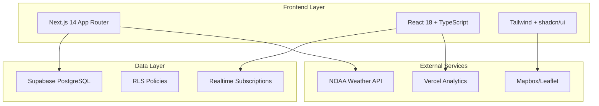
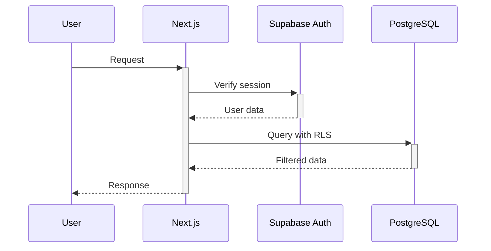

# System Architecture - Quiver Social Surf Platform

## High-Level Architecture



## Core Architecture Patterns

### 1. Next.js App Router Structure
```
app/
├── (routes)/              # Route groups
│   ├── auth/             # Authentication pages
│   ├── forecast/         # Weather forecasts
│   ├── discover/         # Beach discovery
│   └── admin/           # Admin interface
├── api/                 # API routes
└── globals.css         # Global styles
```

**Pattern Compliance**: ✅ Good - Clean route organization following App Router conventions

### 2. Data Fetching Architecture

**Current Pattern** (Established):
```typescript
// Consistent pattern using useDataFetcher hook
const fetchBeaches = useCallback(async () => {
  return await getBeachesAction();
}, []);

const { data, loading, error, refetch } = useDataFetcher(fetchBeaches);
```

**Issues Identified**:
- Ad-hoc Supabase client calls in 200+ locations
- Mixed patterns between server actions and direct DB calls
- No centralized data access layer

### 3. Component Architecture

**Current Structure**:
```
components/
├── ui/                  # shadcn/ui components (224 files)
├── forecast/           # Forecast-specific components
├── journal/            # Session logging components
├── beach/             # Beach-related components
└── shared/            # Cross-cutting components
```

**Client/Server Boundary**:
- 219 "use client" directives found
- Heavy client-side component usage
- Opportunities for RSC optimization

### 4. State Management Patterns

**Current Approach**:
- React Context for auth state
- Custom hooks for data fetching (`useDataFetcher`)
- Supabase realtime subscriptions
- Local component state

**Consolidation Opportunities**:
- Standardize subscription cleanup patterns
- Centralize cache invalidation logic
- Reduce context provider nesting

## Module Boundaries and Dependencies

### Frontend Modules
| Module | Purpose | Dependencies | Status |
|--------|---------|--------------|--------|
| `app/` | Next.js routes | React, Supabase | ✅ Good |
| `components/` | Reusable UI | Radix, Tailwind | 🚨 Sprawl |
| `hooks/` | React logic | Supabase client | ✅ Good |
| `lib/` | Utilities/services | External APIs | 🚨 Sprawl |
| `actions/` | Server actions | Supabase server | ✅ Good |

### Data Flow Patterns

1. **Client → Server Actions → Database**
   - Pattern: `Button.onClick → serverAction → withAuthenticatedAction → Supabase`
   - Status: ✅ Well-established

2. **Client → API Routes → External Services**
   - Pattern: `fetch(/api/forecast) → NOAA API → processed data`
   - Status: ✅ Working well

3. **Realtime Subscriptions**
   - Pattern: `useEffect → supabase.channel → state updates`
   - Status: ⚠️ Needs cleanup standardization

## Critical Architecture Issues

### 1. Data Access Sprawl 🚨
```typescript
// Found in 50+ files - inconsistent patterns
const supabase = createClient()
const { data } = await supabase.from('beaches').select('*')

// vs established pattern
const beaches = await getBeachesAction()
```

### 2. Bundle Size Unknowns 📊
- No baseline bundle analysis
- Heavy dependency on Radix UI components
- Potential for tree-shaking optimization

### 3. Type System Inconsistencies 🔧
- Missing exports in `types/intel.ts`
- Unused variables in strict mode
- Database types may be stale

## Proposed Target Architecture

### Enhanced Data Layer
```typescript
// lib/data/client.ts - Unified client data access
export const dataClient = {
  beaches: {
    getAll: () => getBeachesAction(),
    getById: (id: string) => getBeachAction(id),
    // ... other beach operations
  },
  sessions: {
    // ... session operations
  }
}
```

### Feature Module Structure
```
features/
├── beaches/
│   ├── components/
│   ├── hooks/
│   ├── actions/
│   └── types.ts
├── sessions/
└── forecast/
```

## Performance Characteristics

### Current Metrics (Estimated)
- **Routes**: 25 app routes
- **Components**: 224 React components
- **Client Components**: 219 with "use client"
- **Bundle Size**: Unknown (needs measurement)

### Server/Client Split
- **Server-First**: Authentication, data fetching
- **Client-Heavy**: Interactive components, maps, charts
- **Opportunity**: Convert display components to RSC

## Security Architecture

### Authentication Flow


### RLS Policy Pattern
```sql
-- Established pattern for all tables
CREATE POLICY "Users can CRUD their own data" 
ON profiles FOR ALL 
TO authenticated 
USING (auth.uid() = user_id);
```

**Status**: ✅ Comprehensive RLS implementation

## Integration Points

### External Services
1. **NOAA APIs** - Weather/wave forecasting
2. **Mapbox** - Map rendering and geocoding
3. **Vercel** - Analytics and deployment
4. **Supabase** - Database, auth, storage, realtime

### Internal Service Communication
- Server Actions for mutations
- API routes for external data
- Realtime channels for live updates
- Static generation for public pages

## Consolidation Priorities

1. **🔥 High**: Data access standardization
2. **🔥 High**: Bundle analysis and optimization
3. **📊 Medium**: RSC conversion opportunities
4. **📊 Medium**: Feature module organization
5. **🔧 Low**: Type system cleanup

---
*Analysis based on codebase inspection and established patterns*
*Recommendations align with existing architecture documentation*