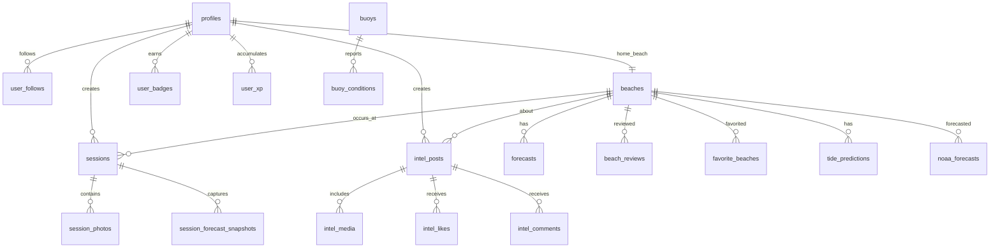

# Data Model - Database Schema & RLS

## Database Overview

**Platform**: Supabase PostgreSQL  
**Schema Management**: SQL migrations in `supabase/migrations/`  
**Type Generation**: Auto-generated TypeScript types in `types/database.ts`  
**Security**: Row Level Security (RLS) on all tables  

## Entity Relationship Overview



## Core Tables Analysis

### User Management
```sql
-- profiles: Extended user data beyond auth.users
CREATE TABLE profiles (
  id uuid PRIMARY KEY REFERENCES auth.users,
  username text UNIQUE,
  full_name text,
  avatar_url text,
  bio text,
  home_beach_id uuid REFERENCES beaches(id),
  is_mock boolean DEFAULT false,  -- For demo data
  created_at timestamp DEFAULT now()
);
```

**RLS Policy**: Users can CRUD their own profile
**Key Relationships**: 
- `home_beach_id` → beaches (FK with view helper)
- Extended by auth.users (Supabase Auth)

### Social Features
```sql
-- user_follows: Social graph
CREATE TABLE user_follows (
  follower_id uuid REFERENCES profiles(id),
  followed_id uuid REFERENCES profiles(id),
  created_at timestamp DEFAULT now(),
  PRIMARY KEY (follower_id, followed_id)
);

-- activity_feed: Activity tracking
CREATE TABLE activity_feed (
  id uuid PRIMARY KEY DEFAULT gen_random_uuid(),
  user_id uuid REFERENCES profiles(id),
  activity_type text NOT NULL,
  activity_data jsonb,
  created_at timestamp DEFAULT now()
);
```

**RLS Policies**: 
- Users can follow/unfollow freely
- Activity feeds filtered by privacy settings

### Core Domain: Beaches & Sessions
```sql
-- beaches: Surf spot locations
CREATE TABLE beaches (
  id uuid PRIMARY KEY DEFAULT gen_random_uuid(),
  name text NOT NULL,
  location point NOT NULL,  -- PostGIS geometry
  county text,
  state text DEFAULT 'CA',
  nearest_buoy_id text,
  noaa_station_id text,
  created_at timestamp DEFAULT now()
);

-- sessions: Surf session logs  
CREATE TABLE sessions (
  id uuid PRIMARY KEY DEFAULT gen_random_uuid(),
  user_id uuid REFERENCES profiles(id),
  beach_id uuid REFERENCES beaches(id),
  session_date date NOT NULL,
  rating integer CHECK (rating >= 1 AND rating <= 10),
  notes text,
  wave_height_ft numeric(4,2),
  session_privacy text DEFAULT 'public',
  created_at timestamp DEFAULT now()
);
```

**Performance Notes**:
- Beaches table uses PostGIS for location queries
- Sessions indexed on user_id, beach_id, session_date

### Forecast & Environmental Data
```sql
-- noaa_forecasts: Weather predictions
CREATE TABLE noaa_forecasts (
  id uuid PRIMARY KEY DEFAULT gen_random_uuid(),
  beach_id uuid REFERENCES beaches(id),
  forecast_time timestamp NOT NULL,
  wave_height_ft numeric(4,2),
  wave_period_s numeric(4,2),
  wind_speed_kt numeric(4,1),
  confidence_score integer,
  data_source text DEFAULT 'noaa'
);

-- buoys: Wave measurement stations
CREATE TABLE buoys (
  id text PRIMARY KEY,  -- NOAA buoy ID
  name text NOT NULL,
  location point,
  status text DEFAULT 'active',
  last_reading timestamp
);

-- tide_predictions: NOAA tide data
CREATE TABLE tide_predictions (
  id uuid PRIMARY KEY DEFAULT gen_random_uuid(),
  beach_id uuid REFERENCES beaches(id),
  prediction_time timestamp NOT NULL,
  height_ft numeric(4,2),
  tide_type text  -- 'high', 'low'
);
```

**Data Freshness Strategy**: 
- Forecasts expire after 24 hours
- Buoy data updates every 30 minutes
- Anti-stale-data: fail fast instead of serving old forecasts

### Gamification System
```sql
-- user_xp: Experience points
CREATE TABLE user_xp (
  id uuid PRIMARY KEY DEFAULT gen_random_uuid(),
  user_id uuid REFERENCES profiles(id),
  category text NOT NULL,  -- 'sessions', 'social', 'content'
  points integer DEFAULT 0,
  total_sessions integer DEFAULT 0,
  total_posts integer DEFAULT 0
);

-- badge_definitions: Available badges
CREATE TABLE badge_definitions (
  badge_slug text PRIMARY KEY,
  name text NOT NULL,
  description text,
  category text,
  icon text,
  xp_reward integer DEFAULT 0
);

-- user_badges: Earned badges
CREATE TABLE user_badges (
  id uuid PRIMARY KEY DEFAULT gen_random_uuid(),
  user_id uuid REFERENCES profiles(id),
  badge_slug text REFERENCES badge_definitions(badge_slug),
  earned_at timestamp DEFAULT now()
);
```

**XP Categories**: Sessions, Social interactions, Content creation

### Content & Media
```sql
-- intel_posts: User-generated content
CREATE TABLE intel_posts (
  id uuid PRIMARY KEY DEFAULT gen_random_uuid(),
  user_id uuid REFERENCES profiles(id),
  beach_id uuid REFERENCES beaches(id),
  title text NOT NULL,
  content text,
  post_type text DEFAULT 'report',
  privacy text DEFAULT 'public',
  created_at timestamp DEFAULT now()
);

-- session_photos: Session image uploads
CREATE TABLE session_photos (
  id uuid PRIMARY KEY DEFAULT gen_random_uuid(),
  session_id uuid REFERENCES sessions(id),
  photo_url text NOT NULL,
  caption text,
  upload_order integer,
  created_at timestamp DEFAULT now()
);
```

**Storage Integration**: Photos stored in Supabase Storage with RLS

## Views & Computed Data

### Performance Views
```sql
-- profiles_with_home_beach: Convenience join
CREATE VIEW profiles_with_home_beach AS
SELECT p.*, b.name as home_beach_name
FROM profiles p
LEFT JOIN beaches b ON b.id = p.home_beach_id;
```

**Usage**: Reduces repetitive joins in profile queries

### Materialized Views (Future)
- Beach popularity rankings
- User activity summaries  
- Forecast accuracy metrics

## RLS Security Patterns

### Standard User Data Pattern
```sql
-- Applied to: profiles, sessions, intel_posts, user_xp
CREATE POLICY "Users can CRUD their own data" ON table_name
FOR ALL TO authenticated
USING (auth.uid() = user_id);
```

### Public Read, Authenticated Write
```sql
-- Applied to: beaches, forecasts, buoys
CREATE POLICY "Public read access" ON table_name
FOR SELECT TO public USING (true);

CREATE POLICY "Authenticated users can insert" ON table_name  
FOR INSERT TO authenticated WITH CHECK (true);
```

### Social Data Patterns
```sql
-- Follows: Users can follow anyone, see their own follows
CREATE POLICY "Users can manage their follows" ON user_follows
FOR ALL TO authenticated
USING (auth.uid() = follower_id);

-- Activity feeds: See own activity + followed users' public activity
-- More complex policy based on privacy settings
```

## Performance Considerations

### Indexes
```sql
-- Critical indexes for performance
CREATE INDEX idx_sessions_user_beach_date 
ON sessions(user_id, beach_id, session_date);

CREATE INDEX idx_forecasts_beach_time 
ON noaa_forecasts(beach_id, forecast_time) 
WHERE forecast_time > NOW() - INTERVAL '48 hours';

-- PostGIS spatial indexes
CREATE INDEX idx_beaches_location ON beaches USING GIST(location);
```

### Query Optimization Patterns
- RLS policies use `(SELECT auth.uid())` to avoid InitPlan overhead
- Forecasts filtered by date to avoid full table scans
- Beach searches use PostGIS for efficient location queries

## Data Integrity & Constraints

### Check Constraints
```sql
ALTER TABLE sessions 
ADD CONSTRAINT valid_rating CHECK (rating >= 1 AND rating <= 10);

ALTER TABLE beach_reviews 
ADD CONSTRAINT valid_ratings CHECK (
  overall_rating >= 1 AND overall_rating <= 5 AND
  wave_quality_rating >= 1 AND wave_quality_rating <= 5
);
```

### Foreign Key Cascade Behavior
- User deletion: CASCADE on user-owned content
- Beach deletion: RESTRICT if has sessions
- Session deletion: CASCADE on photos/snapshots

## Migration Safety

### Recent Critical Migrations
- `20250903090000`: Added profiles_with_home_beach view
- `20250902090000`: Fixed profiles.home_beach_id FK
- `20250829040000`: Avatar storage policies
- `20250828000000`: Complete gamification system

### Migration Patterns
```sql
-- Always use IF NOT EXISTS for safety
CREATE TABLE IF NOT EXISTS new_table (...);

-- Add columns with defaults to avoid locks
ALTER TABLE existing_table ADD COLUMN new_col text DEFAULT '';

-- Create indexes concurrently in production
CREATE INDEX CONCURRENTLY idx_name ON table(column);
```

## Type Safety & Code Generation

### Database Types
- Auto-generated from schema: `types/database.ts`
- Updated via: `npx supabase gen types typescript`
- 600+ lines of TypeScript interfaces

### Known Type Issues
- `types/intel.ts` references missing exports
- Some views not reflected in generated types
- Enum types need manual synchronization

## Data Volume & Scaling

### Current Scale (Estimated)
- **Beaches**: ~500 California surf spots
- **Users**: 0 active (demo data only)
- **Sessions**: Demo data only
- **Forecasts**: 7-day rolling window per beach

### Scaling Considerations  
- Forecast data grows linearly with beaches × time
- Session data grows with user activity
- Buoy data high frequency but small payload
- Media storage separate from database

---

## Summary

**Total Tables**: ~25 core tables + auth schema  
**Security**: ✅ Comprehensive RLS on all tables  
**Performance**: ✅ Key indexes, spatial queries optimized  
**Type Safety**: ⚠️ Some missing exports need fixing  
**Migration Strategy**: ✅ Safe, incremental patterns  
**Scaling**: 🟢 Ready for growth phase

**Architecture Quality**: High - well-normalized, secure, performant