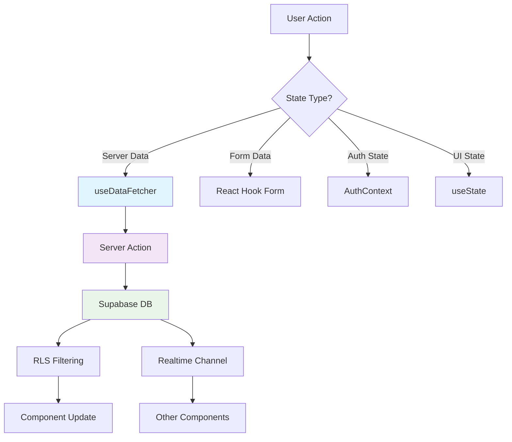

# State Management Analysis

## Current State Management Patterns

**Approach**: React-centric with custom hooks and Supabase realtime  
**Philosophy**: Server state dominant, minimal client state  
**Complexity**: Medium - Well-organized but scattered patterns  

## State Categories & Patterns

### 1. Authentication State
**Pattern**: React Context + Supabase Auth  
**Location**: `context/AuthContext.tsx`  
**Usage**: Global authentication state  

```typescript
// Current pattern - working well
const AuthProvider = ({ children }) => {
  const [user, setUser] = useState(null);
  const [loading, setLoading] = useState(true);
  
  useEffect(() => {
    const { data: { subscription } } = supabase.auth.onAuthStateChange(
      (event, session) => {
        setUser(session?.user ?? null);
        setLoading(false);
      }
    );
    return () => subscription.unsubscribe();
  }, []);
  
  return (
    <AuthContext.Provider value={{ user, loading }}>
      {children}
    </AuthContext.Provider>
  );
};
```

**Status**: ✅ Well implemented, no changes needed

### 2. Server State (Data Fetching)
**Pattern**: `useDataFetcher` hook with memoized fetchers  
**Location**: `hooks/use-data-fetcher.ts`  
**Usage**: All server data operations  

```typescript
// Standard pattern across codebase
const fetchBeaches = useCallback(async () => {
  return await getBeachesAction();
}, []);

const { data, loading, error, refetch } = useDataFetcher(fetchBeaches);
```

**Strengths**:
- ✅ Consistent loading states
- ✅ Error handling standardized
- ✅ Proper dependency tracking
- ✅ Manual refetch capabilities

**Issues**:
- ⚠️ No caching between components
- ⚠️ Duplicate network requests possible
- ⚠️ No optimistic updates built-in

### 3. Realtime State (Supabase Subscriptions)  
**Pattern**: Component-level subscriptions with cleanup  
**Usage**: Social feeds, notifications, live data  

```typescript
// Common subscription pattern
useEffect(() => {
  const channel = supabase
    .channel('session-updates')
    .on('postgres_changes', 
      { event: '*', schema: 'public', table: 'sessions' },
      (payload) => {
        // Update local state
        refetch();
      }
    )
    .subscribe();
    
  return () => supabase.removeChannel(channel);
}, [refetch]);
```

**Issues Identified**:
- 🚨 Inconsistent subscription cleanup patterns
- ⚠️ Some subscriptions not properly unsubscribed
- ⚠️ Race conditions between subscription and initial data load

### 4. Form State
**Pattern**: React Hook Form + Zod validation  
**Location**: Various form components  
**Usage**: All user input forms  

```typescript
// Standard form pattern
const formSchema = z.object({
  beach_id: z.string().uuid(),
  rating: z.number().min(1).max(10),
  notes: z.string().optional()
});

const form = useForm({
  resolver: zodResolver(formSchema),
  defaultValues: { rating: 5, notes: '' }
});
```

**Status**: ✅ Excellent - consistent, validated, type-safe

### 5. UI State (Local Component State)
**Pattern**: useState for component-specific state  
**Usage**: Modals, toggles, temporary UI state  
**Status**: ✅ Appropriate usage, no issues

## State Flow Analysis

### Data Flow Patterns



### Critical State Flows

1. **Session Creation Flow**:
   ```
   Form Submit → Validation → Server Action → Database → 
   Realtime Update → UI Refresh → Navigation
   ```

2. **Social Follow Flow**:
   ```
   Button Click → Optimistic Update → Server Action → 
   Database → Realtime → Activity Feed Update
   ```

3. **Beach Discovery Flow**:
   ```
   Search Input → Debounced Action → API Call → 
   Map Update → List Update → Cache Update
   ```

## State Management Issues

### 1. Cache Inconsistency 🚨
**Problem**: No shared cache between components
```typescript
// Component A loads beaches
const { data: beaches } = useDataFetcher(fetchBeaches);

// Component B loads same beaches - duplicate request
const { data: beachList } = useDataFetcher(fetchBeaches);
```

**Impact**: 
- Unnecessary network requests
- Inconsistent loading states
- Poor user experience

### 2. Subscription Management 🚨  
**Problem**: Inconsistent cleanup patterns
```typescript
// ❌ Bad pattern (found in some components)
useEffect(() => {
  const subscription = supabase.channel('updates').subscribe();
  // Missing cleanup!
}, []);

// ✅ Good pattern (should be universal)
useEffect(() => {
  const channel = supabase.channel('updates').subscribe();
  return () => supabase.removeChannel(channel);
}, []);
```

### 3. Race Conditions ⚠️
**Problem**: Subscription updates arriving before initial data load
```typescript
// Race condition: subscription might fire before data loads
useEffect(() => {
  fetchInitialData();
  subscribeToUpdates(); // May update before initial data arrives
}, []);
```

### 4. State Update Cascades ⚠️
**Problem**: One state change triggering multiple re-renders
```typescript
// Profile update triggers multiple re-fetches
updateProfile(data) → Profile refetch → 
                    → Activity feed refetch →
                    → Home beach update →
                    → Navigation state change
```

## Consolidation Opportunities

### 1. Unified Data Client (High Priority)
**Current**: Direct useDataFetcher usage everywhere  
**Proposed**: Centralized data client with built-in caching

```typescript
// lib/state/data-client.ts
export const dataClient = createDataClient({
  cache: new Map(),
  subscriptions: new Set(),
  
  beaches: {
    getAll: async (filters) => {
      const key = `beaches:${JSON.stringify(filters)}`;
      if (cache.has(key)) return cache.get(key);
      
      const data = await getBeachesAction(filters);
      cache.set(key, data);
      return data;
    }
  }
});
```

**Benefits**:
- Eliminates duplicate requests
- Consistent caching strategy  
- Centralized subscription management
- Type-safe data access

### 2. Subscription Hook Standardization (Medium Priority)
```typescript
// hooks/use-realtime-subscription.ts
export const useRealtimeSubscription = <T>(
  tableName: string,
  callback: (payload: T) => void,
  filters?: Record<string, any>
) => {
  useEffect(() => {
    const channel = supabase
      .channel(`${tableName}-changes`)
      .on('postgres_changes', 
        { event: '*', schema: 'public', table: tableName, filter: filters },
        callback
      )
      .subscribe();
      
    return () => supabase.removeChannel(channel);
  }, [tableName, callback, filters]);
};
```

### 3. State Invalidation Patterns (Medium Priority)
```typescript
// lib/state/invalidation.ts
export const stateInvalidation = {
  // When user updates profile, invalidate related caches
  profileUpdate: () => {
    dataClient.invalidate(['profile', 'activity-feed', 'user-sessions']);
  },
  
  // When session is created, update multiple caches
  sessionCreate: (beachId: string, userId: string) => {
    dataClient.invalidate([
      `sessions:${userId}`, 
      `beach-activity:${beachId}`,
      'activity-feed'
    ]);
  }
};
```

## Proposed State Architecture

### Enhanced Data Layer
```typescript
// lib/state/enhanced-data-client.ts
export class EnhancedDataClient {
  private cache = new Map();
  private subscriptions = new Map();
  
  async get<T>(key: string, fetcher: () => Promise<T>): Promise<T> {
    // Check cache first
    if (this.cache.has(key)) {
      return this.cache.get(key);
    }
    
    // Fetch and cache
    const data = await fetcher();
    this.cache.set(key, data);
    
    // Set up subscription if needed
    this.setupSubscription(key);
    
    return data;
  }
  
  invalidate(keys: string[] | string) {
    const keyArray = Array.isArray(keys) ? keys : [keys];
    keyArray.forEach(key => this.cache.delete(key));
  }
  
  private setupSubscription(key: string) {
    // Auto-setup realtime subscriptions based on data key
  }
}
```

### Optimistic Updates Pattern
```typescript
// hooks/use-optimistic-mutation.ts
export const useOptimisticMutation = <TData, TVariables>(
  mutationFn: (variables: TVariables) => Promise<TData>,
  updateFn: (oldData: TData, variables: TVariables) => TData
) => {
  return useMutation({
    mutationFn,
    onMutate: async (variables) => {
      // Cancel outgoing refetches
      await queryClient.cancelQueries();
      
      // Snapshot previous value
      const previousData = queryClient.getQueryData(queryKey);
      
      // Optimistically update
      queryClient.setQueryData(queryKey, (old) => updateFn(old, variables));
      
      return { previousData };
    },
    onError: (err, variables, context) => {
      // Rollback on error
      queryClient.setQueryData(queryKey, context.previousData);
    }
  });
};
```

## Migration Strategy

### Phase 1: Foundation (Week 1)
1. **Create enhanced data client**: Basic caching and subscription management
2. **Standardize subscription hooks**: Replace ad-hoc subscription patterns
3. **Fix subscription cleanup**: Audit and fix all subscription leaks

### Phase 2: Cache Integration (Week 2)
1. **Migrate high-traffic components**: Beach discovery, session lists
2. **Add cache invalidation**: Profile updates, session creation
3. **Implement optimistic updates**: Follow/unfollow, session creation

### Phase 3: Performance Optimization (Week 3)
1. **Eliminate duplicate requests**: Component-level deduplication
2. **Add prefetching**: Predictive data loading
3. **Optimize subscription patterns**: Reduce subscription count

### Phase 4: Advanced Features (Week 4)
1. **Background sync**: Offline capability foundation
2. **State persistence**: Critical state survives page refresh
3. **Performance monitoring**: State update performance tracking

## Risk Assessment

### Low Risk Changes
- ✅ Subscription hook standardization
- ✅ Cache addition (additive, doesn't break existing)
- ✅ Optimistic update patterns (opt-in)

### Medium Risk Changes  
- ⚠️ Data client migration (changes import patterns)
- ⚠️ Cache invalidation (could cause stale data if wrong)

### High Risk Changes
- 🚨 None - all changes are additive or have fallbacks

## Success Metrics

### Performance Improvements
- **Network Requests**: Reduce duplicate requests by 40%+
- **Loading States**: Faster perceived performance with caching
- **Subscription Efficiency**: Reduce active subscriptions by 30%

### Developer Experience
- **Consistent Patterns**: Single way to fetch data, handle subscriptions
- **Type Safety**: End-to-end type safety for all state operations  
- **Debugging**: Better dev tools for state inspection

### User Experience  
- **Faster Navigation**: Cached data loads instantly
- **Real-time Updates**: More responsive live features
- **Offline Resilience**: Better handling of network issues

---

## Summary

**Current State**: Good foundation with scattered patterns  
**Target State**: Unified, cached, type-safe state management  
**Migration Complexity**: Medium - mostly additive changes  
**Timeline**: 4 weeks with existing development bandwidth  
**ROI**: High - better performance, developer experience, and user experience