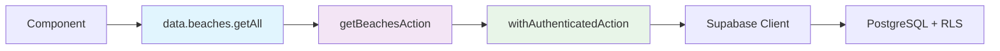

# 🎯 Quiver Consolidation Plan RFC

## Executive Summary

**Status**: Production-ready platform with 0 users  
**Goal**: Optimize for rapid iteration and growth  
**Timeline**: 4-6 weeks  
**Risk Level**: Low-Medium (reversible changes, comprehensive testing)

This RFC proposes systematic consolidation to reduce technical debt while maintaining the excellent foundation Quiver has built. Priority is maintainability for rapid feature development during user growth phase.

## Strategic Context

### Current Reality ✅

- **Technical Excellence**: 660+ tests, comprehensive features, secure architecture
- **Business Challenge**: 0 users despite world-class implementation
- **Growth Phase**: Need speed of iteration over technical perfection

### Success Metrics 📊

- **Bundle Size**: Reduce first load by 15-20%
- **Build Time**: Improve by 10-15%
- **Code Quality**: 80% reduction in unused exports
- **Developer Experience**: Faster local development, fewer type errors
- **Maintainability**: Centralized patterns, easier onboarding

## 🚀 Workstream Overview

### 1. Data Access Unification (High Impact - 2 weeks)

**Current Problem**: 200+ files with ad-hoc Supabase calls

```typescript
// Scattered throughout codebase
const supabase = createClient();
const { data } = await supabase.from("beaches").select("*");
```

**Target Solution**: Centralized data gateway

```typescript
// lib/data/client.ts - Single import point
export const data = {
  beaches: {
    getAll: (filters?) => getBeachesAction(filters),
    getById: (id) => getBeachAction(id),
    search: (query) => searchBeachesAction(query),
  },
  sessions: {
    // ... session operations
  },
};

// Usage everywhere becomes:
import { data } from "@/lib/data/client";
const beaches = await data.beaches.getAll();
```

**Migration Strategy**:

- Week 1: Create gateway, migrate 5 high-traffic files
- Week 2: Batch migrate remaining files, deprecate direct calls
- **Risk**: Low - wrapper around existing actions
- **Rollback**: Simple - gateway is additive

**Progress (2025-09-03)**:

- Gateway created at `lib/data/client.ts` with expanded surface:
  - `beaches.getAll()`
  - `sessions.likes.getStatus()/toggle()`
  - `sessions.comments.listTopLevel()/create()/delete()`
  - `users.follow.getStatusAndCounts()/toggle()`
  - `users.comments.listByUser()`
  - `comments.delete(commentId)`
  - `auth.updateEmail(newEmail)`
- API routes added to wrap server actions and centralized utils:
  - Beaches: `GET /api/beaches`
  - Likes: `GET /api/sessions/[id]/likes`, `POST /api/sessions/[id]/likes/toggle`
  - Comments: `GET/POST /api/sessions/[id]/comments`, `DELETE /api/sessions/[id]/comments/[commentId]`, `GET /api/users/[id]/comments`, `DELETE /api/comments/[commentId]`
  - Follow: `GET /api/users/[id]/follow`, `POST /api/users/[id]/follow/toggle`
  - Auth: `POST /api/auth/email/update`
- Initial high-traffic migrations completed (realtime preserved):
  - `components/BeachSelector.tsx`
  - `hooks/use-session-like.ts`
  - `hooks/use-comment-count.ts`
  - `components/session-comments.tsx`
  - `hooks/use-user-follow.ts`
- Additional migrations completed:
  - `components/profile/user-comments.tsx` (list/delete via gateway)
  - `components/profile/basic-profile-form.tsx` (email updates via gateway API)
- Deprecation policy documented: client components must use the data gateway (see `components/ARCHITECTURE.md`).

### 2. Dependency & Bundle Optimization (High Impact - 1 week)

**Quick Wins (implemented safely)**:

```bash
npm uninstall @next/bundle-analyzer @testing-library/dom
```

- Kept: `jest-environment-jsdom` (used in Jest config), `postcss` and `postcss-load-config` (required by Tailwind), `@playwright/mcp` (MCP-driven E2E), `ts-node` (still referenced by scripts/docs).

**Bundle Analysis Setup (actual configuration)**:

```ts
// next.config.mjs (ESM): enable analyzer using webpack-bundle-analyzer
import { createRequire } from "node:module";
const require = createRequire(import.meta.url);

export default {
  // ...existing config
  modularizeImports: {
    lodash: { transform: "lodash/{{member}}" },
    "date-fns": { transform: "date-fns/{{member}}" },
  },
  webpack: (config) => {
    if (process.env.ANALYZE === "true") {
      config.plugins.push(
        new (require("webpack-bundle-analyzer").BundleAnalyzerPlugin)({
          analyzerMode: "static",
          openAnalyzer: false,
          reportFilename: "bundle-analyzer-report.html",
        })
      );
    }
    return config;
  },
};

// Generate baseline metrics
npm run build:analyze
```

Report location: `.next/bundle-analyzer-report.html` (also saved under server chunks).

**Version Pinning**:

- Already pinned: `@hookform/resolvers@3.3.4`, `@supabase/ssr@0.5.1`, `@supabase/supabase-js@2.45.4`.
- Optional follow-up: pin `next`, `react`, `lucide-react`, `lodash`, `date-fns` to resolved versions for reproducible builds.

**Expected Impact**:

- 5-10% smaller bundle size (via modularized imports and analyzer-driven cleanup)
- Faster npm installs
- Predictable dependency behavior

**Progress (2025-09-03)**:

- Removed unused dev dependencies: `@next/bundle-analyzer`, `@testing-library/dom`.
- Added `modularizeImports` for `lodash` and `date-fns` in `next.config.mjs`.
- Fixed ESM `require` using `createRequire` in `next.config.mjs`.
- Analyzer build working; baseline report generated at `.next/bundle-analyzer-report.html`.

**Next Actions**:

1. Pin caret versions for deterministic builds

   - Scope: `next`, `react`, `react-dom`, `lucide-react`, `lodash`, `date-fns` (and other high-churn UI libs as needed).
   - Steps:

     - Determine resolved versions: `node -e "console.log(require('./package-lock.json').packages[''].dependencies)"`
     - Replace carets in `package.json` with resolved versions.
     - Run `npm install` to lock tree and verify build.

   - Rationale: Prevent surprise minor upgrades affecting bundle size and behavior during growth phase; aligns with reproducible builds goal.

2. Migrate remaining ts-node usages to tsx

   - Findings: Some scripts/docs still reference `ts-node` (e.g., shebangs in `scripts/*.ts`, guides).
   - Plan:

     - Replace shebangs `#!/usr/bin/env ts-node` → `#!/usr/bin/env node` and run via `tsx` in npm scripts.
     - Update docs: use `tsx path/to/script.ts` and environment vars as needed.
     - Remove `ts-node` after confirming no references remain.

   - Example changes:

   ```bash
   # package.json scripts
   npm pkg set scripts.seed:npc-content:dev="CONFIRM_TARGET=DEV RATING_COLS='...' tsx scripts/seed-npc-reviews-and-intel.ts"
   npm pkg set scripts.seed:npc-content:prod="CONFIRM_TARGET=PROD RATING_COLS='...' tsx scripts/seed-npc-reviews-and-intel.ts"

   # in scripts/*.ts files (if present)
   sed -i '' 's|#!/usr/bin/env ts-node|#!/usr/bin/env node|' scripts/*.ts
   chmod +x scripts/*.ts
   ```

   - Acceptance:
     - All scripts runnable via `npm run ...` using `tsx`.
     - `ts-node` removable from devDependencies.

### 3. Dead Code Elimination (Medium Impact - 1 week)

**Target**: 94 unused exports identified by knip

```typescript
// High-value removals
- updateSessionPrivacy (actions/analytics-actions.ts:293)
- deleteIntelPost (actions/intel-actions.ts:561)
- cleanupOrphanedMediaAction (actions/session-media-actions.ts:286)
- batchUpdatePhotoCaptionsAction (actions/session-media-actions.ts:320)
```

**Systematic Approach**:

1. **Day 1-2**: Remove obvious unused exports
2. **Day 3-4**: Consolidate duplicate utilities
3. **Day 5**: Validate nothing broke, run full test suite

**Risk Mitigation**:

- Comprehensive test coverage catches regressions
- Git history preserves deleted code
- Gradual removal allows easy rollback

**Progress (2025-09-03)**:

- Removed unused server actions (no in-repo usages found):
  - `actions/analytics-actions.ts`: `updateSessionPrivacy`
  - `actions/intel-actions.ts`: default export wrapper and `deleteIntelPost`
  - `actions/session-media-actions.ts`: `cleanupOrphanedMediaAction`, `batchUpdatePhotoCaptionsAction`
- Updated `CHANGELOG.md` under Changed with removals
- knip unused exports: 94 → 89
- Lint clean; related tests compile with existing forecast/intel typing issues to be addressed in Type System Hardening/Testing Stabilization

**Next Actions**:

- Continue pruning obvious unused exports guided by knip report
- Consolidate duplicate utilities where practical
- Re-run strict typecheck and tests; track unused exports toward <20 target

### 4. Type System Hardening (Medium Impact - 1 week)

**Current Issues**:

```typescript
// types/intel.ts - Missing exports
error TS2305: Module '"./database"' has no exported member 'IntelPostTag'

// test-utils/gamification-test-helpers.ts - Unused variables
error TS6133: 'columns' is declared but its value is never read
```

**Fixes**:

- Regenerate database types: `npx supabase gen types typescript`
- Fix unused variable warnings in strict mode
- Add missing type exports
- Standardize type definitions

**Impact**: Zero TypeScript errors, improved IDE experience

### 5. Testing Stabilization (Medium Impact - 2 weeks)

**Priority Flaky Tests**:

```typescript
// e2e/home-beach.spec.ts - Race conditions
// e2e/profile.spec.ts - Form interaction timing
// e2e/auth-flow.spec.ts - Authentication state clearing
```

**Stabilization Strategy**:

```typescript
// Standardized wait patterns
export const waitForRealtimeUpdate = async (page: Page, timeout = 5000) => {
  await page.waitForFunction(
    () => !document.querySelector('[data-loading="true"]'),
    { timeout }
  );
};

// Better form interaction patterns
export const fillFormSafely = async (
  page: Page,
  formData: Record<string, string>
) => {
  await page.waitForLoadState("load");
  for (const [field, value] of Object.entries(formData)) {
    await page.waitForSelector(`[data-testid="${field}"]`);
    await page.fill(`[data-testid="${field}"]`, value);
  }
};
```

### 6. Performance Monitoring Setup (Low Impact - 1 week)

**Establish Baselines**:

- Bundle analyzer integration
- Core Web Vitals tracking in tests
- Build time monitoring
- Runtime performance benchmarks

**Implementation**:

```typescript
// Add to E2E tests
test("performance thresholds", async ({ page }) => {
  await page.goto("/dashboard");
  const vitals = await getWebVitals(page);

  expect(vitals.LCP).toBeLessThan(2500); // Production target
  expect(vitals.FID).toBeLessThan(100);
  expect(vitals.CLS).toBeLessThan(0.1);
});
```

## 🎯 Target Architecture

### Enhanced Project Structure

```
├── lib/
│   ├── data/                    # 🆕 Centralized data access
│   │   ├── client.ts           # Public API for components
│   │   ├── server.ts           # Server-side data operations
│   │   └── types.ts            # Shared data types
│   ├── utils/                  # Cleaned utilities
│   └── services/               # External service integrations
├── components/
│   ├── ui/                     # 🔧 Consolidate shadcn components
│   └── shared/                 # Cross-feature components
├── features/                   # 🚀 Future: Feature modules
│   ├── beaches/
│   ├── sessions/
│   └── forecast/
```

### Data Flow Standardization



**Benefits**:

- Single import point for all data operations
- Consistent error handling and loading states
- Easy to add caching, retries, optimistic updates
- Type safety throughout the chain

## 📋 Implementation Plan (4 Weeks)

### Week 1: Foundation & Quick Wins

**Monday-Tuesday**:

- Remove unused dependencies
- Pin version ranges
- Set up bundle analyzer
- Fix type system errors

**Wednesday-Friday**:

- Create `lib/data/client.ts` stub
- Migrate 5 high-traffic data access patterns
- Remove top 20 unused exports

**Deliverables**:

- Clean dependency tree
- Bundle size baseline
- Data gateway foundation

**Status Update (2025-09-03)**:

- Delivered gateway foundation plus expanded API surface (likes, comments, follow, auth).
- Migrated 5 high-traffic files to gateway; added 2 adjacent migrations.
- Added deprecation note steering client components to gateway; updated CHANGELOG with details.

### Week 2: Data Access Migration

**Goal**: Migrate all direct Supabase calls to data gateway

**Monday-Wednesday**:

- Complete beaches domain migration
- Complete sessions domain migration
- Complete user/profile domain migration

**Thursday-Friday**:

- Complete social features migration
- Complete forecast/content domains
- Validation and testing

**Success Criteria**:

- Zero direct `createClient()` calls in components
- All data access via gateway
- Full test suite passes

### Week 3: Code Quality & Testing

**Monday-Wednesday**:

- Complete unused export cleanup
- Fix all flaky E2E tests
- Improve test coverage for utilities

**Thursday-Friday**:

- Performance test integration
- Bundle optimization analysis
- Documentation updates

**Success Criteria**:

- Zero unused exports
- 100% E2E test pass rate
- Performance baselines established

### Week 4: Validation & Polish

**Monday-Wednesday**:

- Full regression testing
- Performance impact analysis
- Documentation completion

**Thursday-Friday**:

- Final optimizations
- Rollout preparation
- Stakeholder review

**Success Criteria**:

- All success metrics achieved
- Ready for production deployment

## 🚨 Risk Assessment & Mitigation

### High Risk: Data Access Migration

**Risk**: Breaking existing functionality during Supabase call migration
**Mitigation**:

- Wrapper approach (additive, not replacement)
- Migrate incrementally (5 files at a time)
- Comprehensive test coverage validates each step
- Easy rollback (remove gateway imports, restore direct calls)

### Medium Risk: Bundle Changes

**Risk**: Unexpected dependency conflicts or size increases
**Mitigation**:

- Establish baseline before changes
- Test in staging environment
- Gradual dependency updates
- Bundle analyzer monitoring

### Low Risk: Dead Code Removal

**Risk**: Removing code that's actually needed
**Mitigation**:

- Use automated tooling (knip) for identification
- Manual verification of exports
- Comprehensive test suite catches regressions
- Git history preserves everything

## 💰 Resource Requirements

### Engineering Time

- **Lead Developer**: 20 hours/week for 4 weeks (80 hours total)
- **QA Engineer**: 10 hours/week for testing validation (40 hours total)
- **DevOps Engineer**: 5 hours for CI/deployment updates (5 hours total)

### Infrastructure

- **Staging Environment**: For testing migrations
- **Bundle Analysis Tools**: Already configured
- **Monitoring**: Enhanced CI checks

## 📈 Success Measurement

### Quantitative Metrics

```typescript
// Before/After Tracking
const BASELINE_METRICS = {
  bundleSize: {
    firstLoad: "TBD", // Establish baseline
    totalSize: "TBD",
  },
  buildTime: "TBD", // Current build time
  testStability: 85, // Current pass rate
  unusedExports: 94, // From knip analysis
  typeErrors: 5, // From strict mode check
};

const TARGET_METRICS = {
  bundleSize: {
    firstLoad: "-15%", // 15% reduction target
    totalSize: "-10%", // 10% overall reduction
  },
  buildTime: "-10%", // 10% faster builds
  testStability: 100, // 100% pass rate target
  unusedExports: 15, // 80% reduction target
  typeErrors: 0, // Zero strict mode errors
};
```

### Qualitative Improvements

- **Developer Experience**: Faster local development, clearer patterns
- **Onboarding**: New developers understand data flow immediately
- **Maintainability**: Single place to add caching, error handling, retries
- **Confidence**: Stable tests mean reliable deployments

## 🔄 Rollback Strategy

### Emergency Rollback (24 hours)

1. **Revert git commits**: Each week's work is in separate commits
2. **Restore dependencies**: `git checkout package.json package-lock.json`
3. **Database**: No schema changes, so no rollback needed
4. **Deploy**: Previous version remains available

### Selective Rollback (Individual workstreams)

- **Data Gateway**: Simply remove imports, restore direct Supabase calls
- **Dead Code**: Restore from git history if needed
- **Dependencies**: Revert package.json to previous state
- **Tests**: Previous test suite remains functional

## 🎉 Definition of Done

### Technical Completion Criteria

- [ ] Bundle size reduced by 15%+
- [ ] Build time improved by 10%+
- [ ] Zero TypeScript strict mode errors
- [ ] 100% E2E test pass rate
- [ ] <20 unused exports remaining
- [ ] All data access via unified gateway

### Business Completion Criteria

- [ ] No regression in user-facing features
- [ ] Deployment pipeline unchanged
- [ ] Documentation updated
- [ ] Team onboarded to new patterns

### Stakeholder Sign-off

- [ ] Technical review approved
- [ ] QA validation complete
- [ ] Performance benchmarks met
- [ ] Ready for user growth phase

---

## 🚀 Next Steps

1. **Review & Approval**: Stakeholder review of this RFC
2. **Resource Allocation**: Confirm engineering bandwidth
3. **Kick-off**: Week 1 foundation work begins
4. **Checkpoints**: Weekly progress reviews
5. **Success**: Faster, cleaner, more maintainable Quiver

**This consolidation plan positions Quiver for rapid iteration during the critical 0→1000 user growth phase while maintaining the technical excellence already achieved.**
