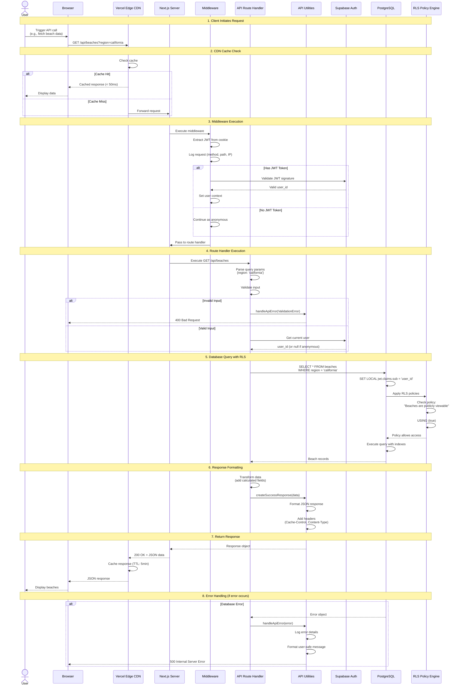
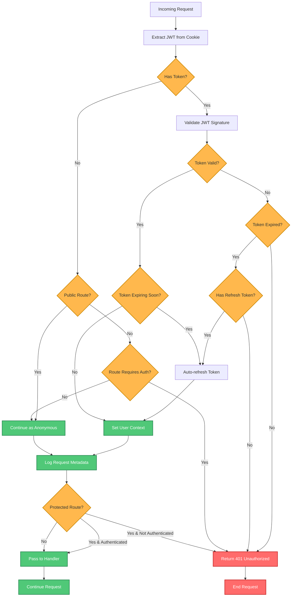
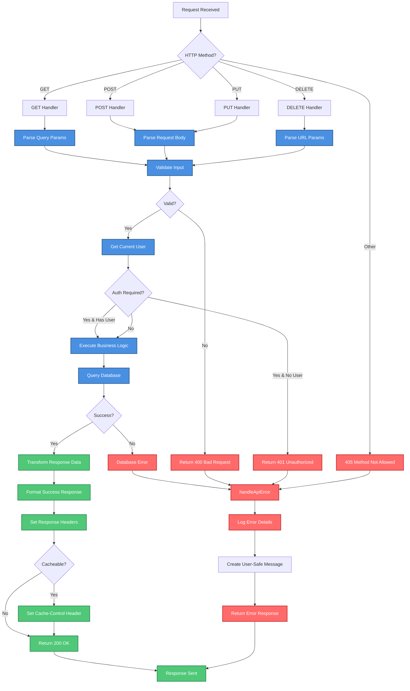
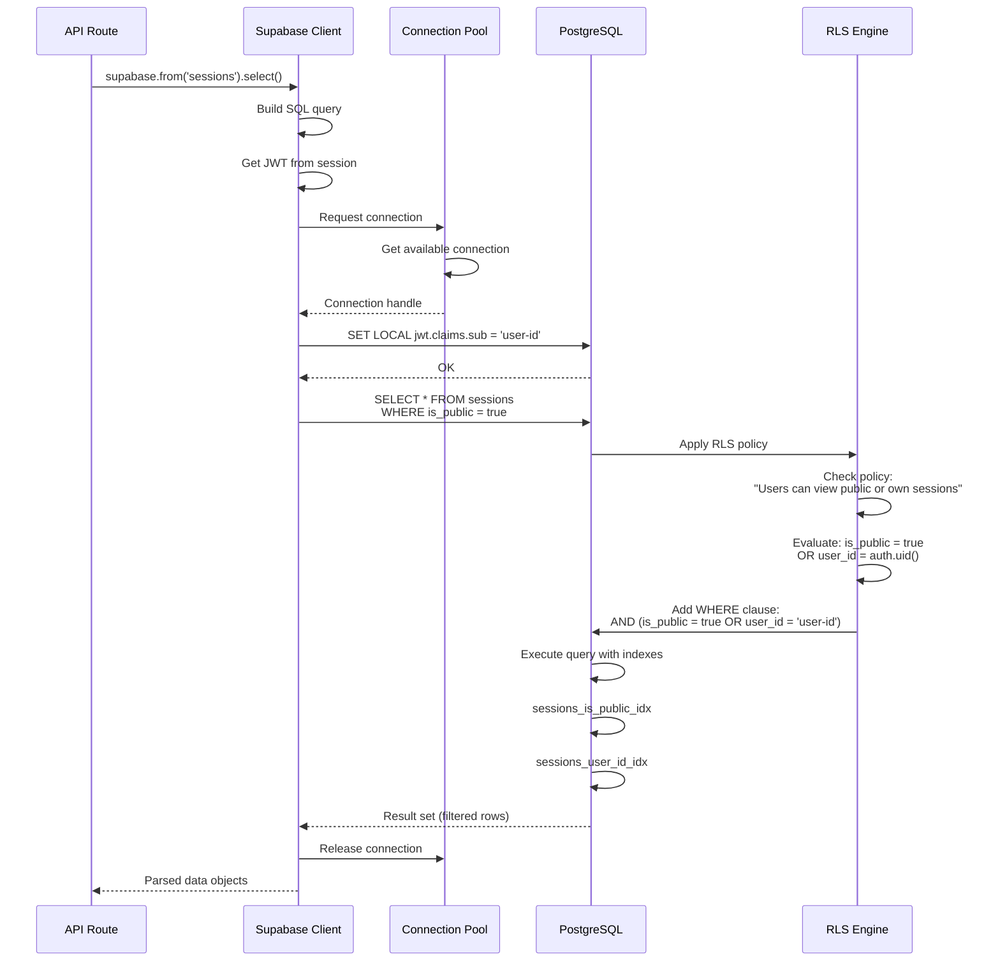
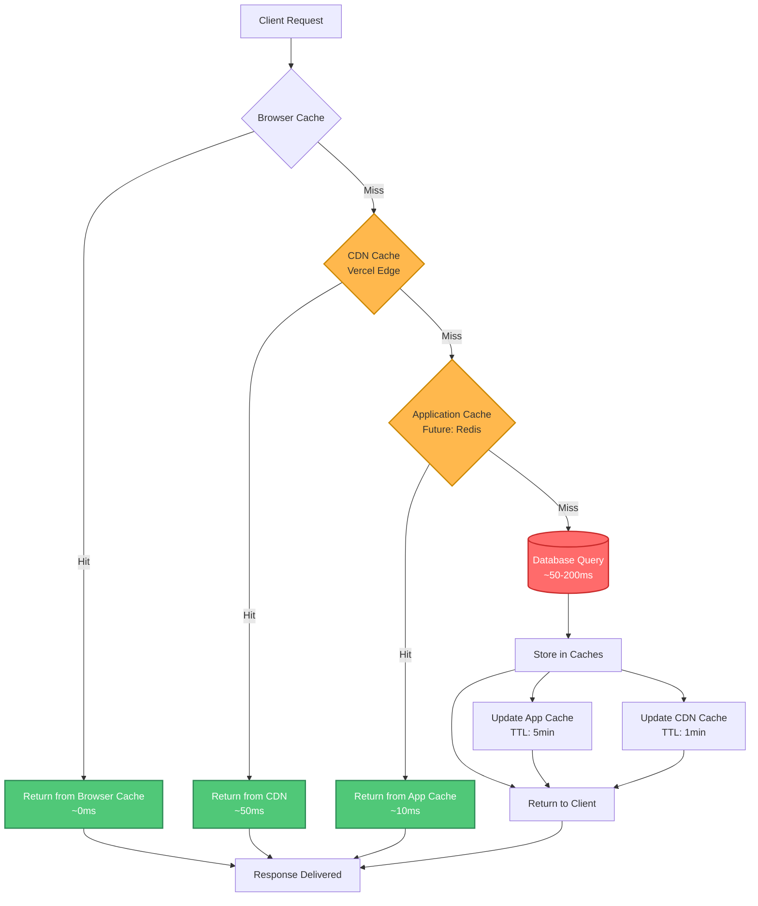
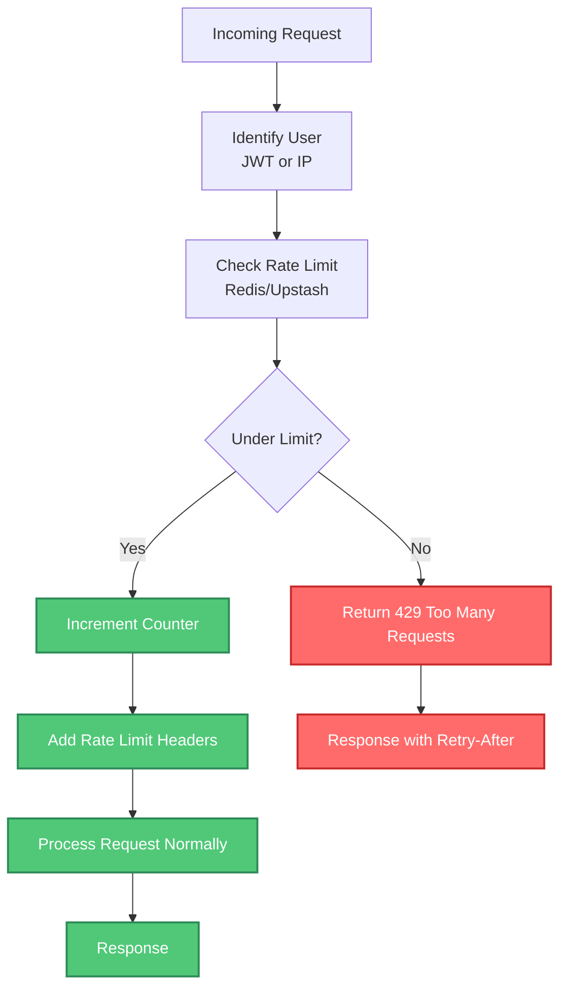

# API Request Lifecycle

**Purpose**: Detailed flow of API request processing from client to server and back, including middleware, authentication, database queries, and response formatting.

**Audience**: Backend developers, API developers, full-stack engineers

**Created**: October 28, 2025
**Last Updated**: October 28, 2025

---

## Overview

Quiver's API architecture uses Next.js API Routes and Server Actions to handle requests. The request lifecycle includes:

1. Client initiates request
2. CDN cache check (if applicable)
3. Middleware execution (authentication, logging)
4. Route handler execution
5. Database query with RLS
6. Response formatting
7. Error handling
8. Response to client

---

## Complete API Request Lifecycle



---

## Middleware Layer

### Middleware Execution Flow



### Middleware Implementation

**File**: `middleware.ts`

```typescript
import { createServerClient } from '@supabase/ssr'
import { NextResponse } from 'next/server'
import type { NextRequest } from 'next/server'

export async function middleware(request: NextRequest) {
  let response = NextResponse.next()

  // 1. Create Supabase client
  const supabase = createServerClient(
    process.env.NEXT_PUBLIC_SUPABASE_URL!,
    process.env.NEXT_PUBLIC_SUPABASE_ANON_KEY!,
    {
      cookies: {
        get: (name) => request.cookies.get(name)?.value,
        set: (name, value, options) => response.cookies.set({name, value, ...options}),
        remove: (name, options) => response.cookies.delete({name, ...options})
      }
    }
  )

  // 2. Refresh session if needed
  const { data: { session } } = await supabase.auth.getSession()

  // 3. Check protected routes
  const path = request.nextUrl.pathname
  const isProtectedRoute = path.startsWith('/profile') || path.startsWith('/settings')

  if (isProtectedRoute && !session) {
    const redirectUrl = new URL('/login', request.url)
    redirectUrl.searchParams.set('redirect', path)
    return NextResponse.redirect(redirectUrl)
  }

  // 4. Log request
  console.log(`[${request.method}] ${path}`, {
    user: session?.user?.id || 'anonymous',
    ip: request.ip
  })

  return response
}
```

---

## API Route Handler

### Handler Execution Flow



### API Route Implementation

**File**: `app/api/beaches/route.ts`

```typescript
import { createClient } from '@/lib/supabase/server'
import {
  authenticateRequest,
  createSuccessResponse,
  handleApiError
} from '@/lib/api-utils'

export async function GET(request: Request) {
  try {
    // 1. Parse query parameters
    const { searchParams } = new URL(request.url)
    const region = searchParams.get('region')
    const limit = parseInt(searchParams.get('limit') || '50')

    // 2. Validate input
    if (limit > 100) {
      return new Response(
        JSON.stringify({ error: 'Limit cannot exceed 100' }),
        { status: 400 }
      )
    }

    // 3. Get current user (optional for public endpoints)
    const { user } = await authenticateRequest(request)

    // 4. Query database
    const supabase = createClient()

    let query = supabase
      .from('beaches')
      .select('id, name, region, location_point, surf_break_info')
      .eq('is_active', true)
      .limit(limit)

    if (region) {
      query = query.eq('region', region)
    }

    const { data: beaches, error } = await query

    if (error) throw error

    // 5. Transform data (add calculated fields)
    const enrichedBeaches = beaches.map(beach => ({
      ...beach,
      favorite: user ? checkIfFavorite(user.id, beach.id) : false
    }))

    // 6. Return success response
    return createSuccessResponse(enrichedBeaches, {
      'Cache-Control': 'public, s-maxage=300, stale-while-revalidate=600'
    })

  } catch (error) {
    // 7. Handle errors
    return handleApiError(error)
  }
}

export async function POST(request: Request) {
  try {
    // 1. Parse request body
    const body = await request.json()

    // 2. Validate input
    const validated = beachSchema.parse(body)

    // 3. Require authentication
    const { user } = await authenticateRequest(request)
    if (!user) {
      return new Response(
        JSON.stringify({ error: 'Unauthorized' }),
        { status: 401 }
      )
    }

    // 4. Insert into database
    const supabase = createClient()

    const { data: beach, error } = await supabase
      .from('beaches')
      .insert({
        ...validated,
        created_by: user.id
      })
      .select()
      .single()

    if (error) throw error

    // 5. Return created resource
    return createSuccessResponse(beach, {}, 201)

  } catch (error) {
    return handleApiError(error)
  }
}
```

---

## API Utility Functions

### Success Response

**File**: `lib/api-utils.ts`

```typescript
export function createSuccessResponse<T>(
  data: T,
  headers: Record<string, string> = {},
  status: number = 200
): Response {
  return new Response(
    JSON.stringify({
      success: true,
      data,
      timestamp: new Date().toISOString()
    }),
    {
      status,
      headers: {
        'Content-Type': 'application/json',
        'X-Content-Type-Options': 'nosniff',
        ...headers
      }
    }
  )
}
```

### Error Handling

```typescript
export function handleApiError(error: unknown): Response {
  console.error('API Error:', error)

  // Determine error type and status code
  let status = 500
  let message = 'An unexpected error occurred'

  if (error instanceof z.ZodError) {
    status = 400
    message = 'Invalid request data'
  } else if (error instanceof PostgrestError) {
    // Supabase database error
    if (error.code === '23505') {
      status = 409
      message = 'Resource already exists'
    } else if (error.code === '23503') {
      status = 400
      message = 'Referenced resource not found'
    } else if (error.code === 'PGRST116') {
      status = 404
      message = 'Resource not found'
    }
  } else if (error instanceof Error) {
    if (error.message.includes('JWT')) {
      status = 401
      message = 'Invalid or expired authentication'
    }
  }

  return new Response(
    JSON.stringify({
      success: false,
      error: message,
      timestamp: new Date().toISOString()
    }),
    {
      status,
      headers: {
        'Content-Type': 'application/json',
        'X-Content-Type-Options': 'nosniff'
      }
    }
  )
}
```

### Authentication Helper

```typescript
export async function authenticateRequest(
  request: Request
): Promise<{ user: User | null; error: string | null }> {
  const supabase = createClient()

  const { data: { user }, error } = await supabase.auth.getUser()

  if (error) {
    return { user: null, error: error.message }
  }

  return { user, error: null }
}
```

---

## Database Query Execution

### Query with RLS



### Query Optimization

```sql
-- Ensure proper indexes exist
CREATE INDEX sessions_user_id_session_date_idx
  ON sessions(user_id, session_date DESC);

CREATE INDEX sessions_is_public_idx
  ON sessions(is_public)
  WHERE is_public = true;  -- Partial index

-- RLS policy optimization (avoid InitPlan overhead)
CREATE POLICY "Users can view public or own sessions"
  ON sessions FOR SELECT
  USING (
    is_public = true
    OR user_id = auth.uid()
  );
```

---

## Response Caching Strategy

### Cache Layers



### Cache Headers

```typescript
// Public, cacheable data (beaches, forecasts)
{
  'Cache-Control': 'public, s-maxage=300, stale-while-revalidate=600'
  // CDN caches for 5 minutes
  // Serves stale content while revalidating for 10 minutes
}

// Private user data (sessions, profile)
{
  'Cache-Control': 'private, no-cache, must-revalidate'
  // Not cached by CDN
  // Browser must revalidate every time
}

// Real-time data (no cache)
{
  'Cache-Control': 'no-store'
  // Never cached anywhere
}
```

---

## Rate Limiting (Future Enhancement)

### Rate Limit Flow



**Implementation** (future):

```typescript
import rateLimit from '@/lib/rate-limit'

export async function POST(request: Request) {
  // Apply rate limiting
  const limiter = rateLimit({
    interval: 60 * 1000, // 1 minute
    uniqueTokenPerInterval: 500,
    limit: 10 // 10 requests per minute per user
  })

  const { success, limit, remaining, reset } = await limiter.check(request)

  if (!success) {
    return new Response(
      JSON.stringify({ error: 'Rate limit exceeded' }),
      {
        status: 429,
        headers: {
          'X-RateLimit-Limit': limit.toString(),
          'X-RateLimit-Remaining': '0',
          'X-RateLimit-Reset': reset.toString(),
          'Retry-After': Math.ceil((reset - Date.now()) / 1000).toString()
        }
      }
    )
  }

  // Continue with request...
}
```

---

## Error Response Format

### Standard Error Response

```json
{
  "success": false,
  "error": "User-friendly error message",
  "code": "VALIDATION_ERROR",
  "timestamp": "2025-10-28T12:00:00.000Z",
  "details": {
    "field": "email",
    "message": "Invalid email format"
  }
}
```

### HTTP Status Codes

| Status | Meaning | Usage |
|--------|---------|-------|
| **200** | OK | Successful GET, PUT, DELETE |
| **201** | Created | Successful POST (resource created) |
| **204** | No Content | Successful DELETE (no response body) |
| **400** | Bad Request | Invalid input, validation errors |
| **401** | Unauthorized | Missing or invalid authentication |
| **403** | Forbidden | Authenticated but not authorized |
| **404** | Not Found | Resource doesn't exist |
| **409** | Conflict | Duplicate resource (unique constraint) |
| **429** | Too Many Requests | Rate limit exceeded |
| **500** | Internal Server Error | Unexpected server error |
| **503** | Service Unavailable | Temporary service outage |

---

## Performance Metrics

### Typical Response Times

| Endpoint Type | Cold Start | Warm Function | With DB Query |
|--------------|-----------|---------------|---------------|
| **Static Data (CDN)** | - | <50ms | - |
| **Public Read (beaches)** | 200-500ms | 50-100ms | 100-200ms |
| **Authenticated Read (sessions)** | 200-500ms | 80-150ms | 150-250ms |
| **Write (create session)** | 300-600ms | 100-200ms | 200-400ms |
| **Complex Query (analytics)** | 400-800ms | 200-400ms | 500-1000ms |

### Optimization Targets

- **p50**: <150ms (median response time)
- **p95**: <500ms (95th percentile)
- **p99**: <1000ms (99th percentile)
- **Error Rate**: <0.1% (99.9% success rate)

---

## Related Diagrams

- [System Context](./system-context.md) - API in system context
- [Container Architecture](./container-architecture.md) - API containers
- [Authentication Flow](./auth-flow.md) - Auth in API requests
- [Session Creation Flow](./session-creation-flow.md) - Complex API flow example
- [Database Schema](./database-schema.md) - Database structure

---

## Related Documentation

- [API Documentation](../architecture/API_DOCUMENTATION.md) - Complete API reference
- [System Architecture Guide](../architecture/SYSTEM_ARCHITECTURE.md)
- [Security Guide](../architecture/SECURITY_GUIDE.md)

---

**Key Takeaways**:
- Request lifecycle involves 8 distinct stages
- Middleware handles authentication and routing
- RLS provides database-level authorization
- Caching happens at multiple layers (browser, CDN, application)
- Error handling is centralized and user-friendly
- Performance is optimized through indexes and connection pooling
- Rate limiting (future) will prevent abuse
