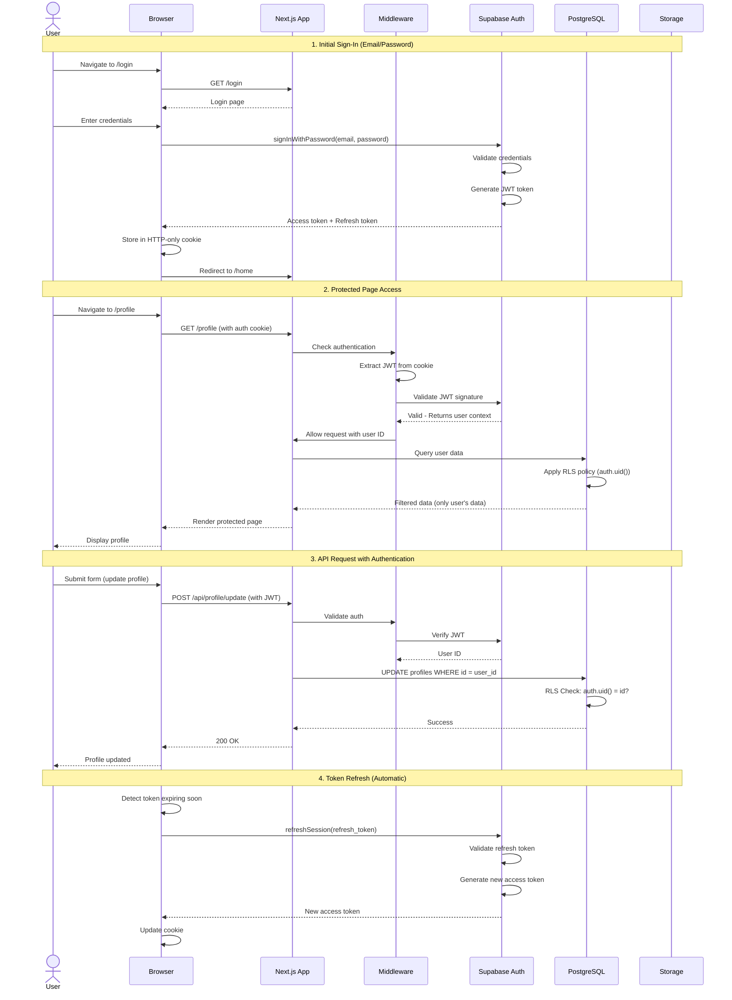
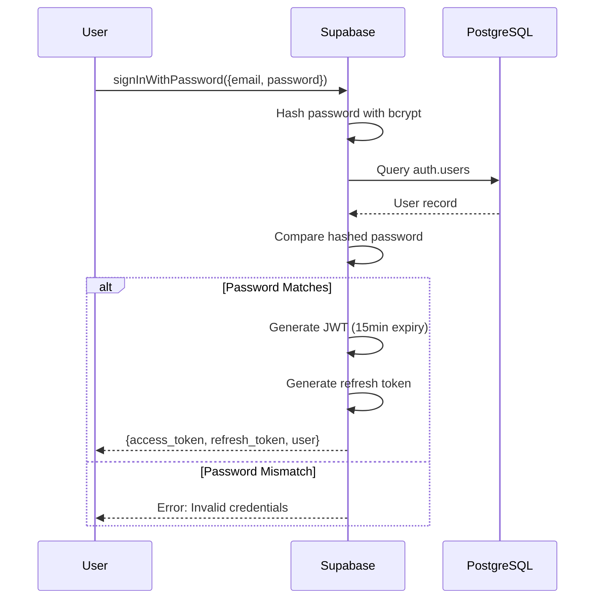
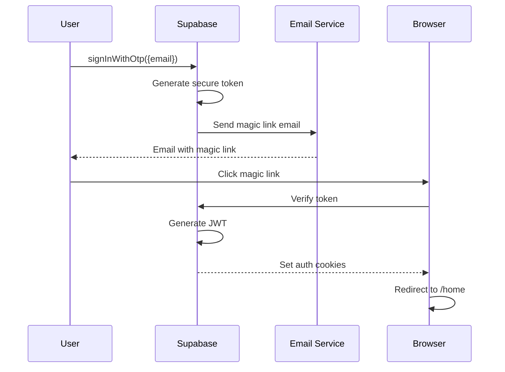
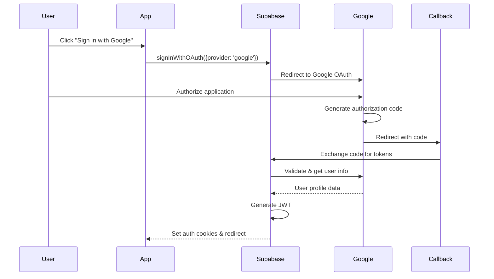
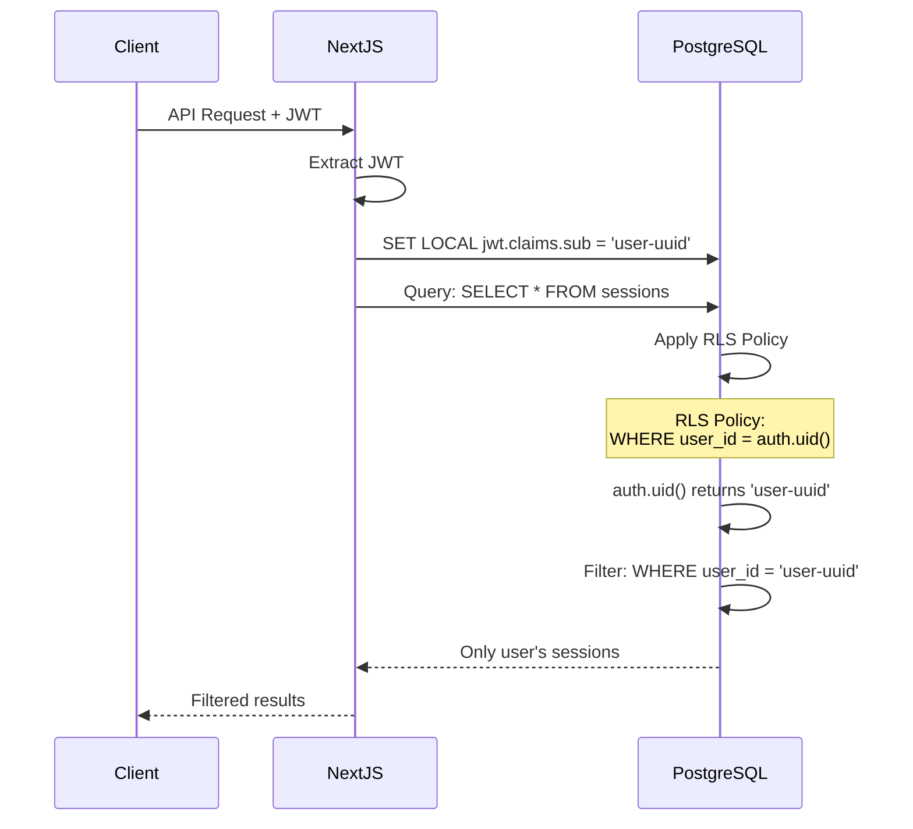
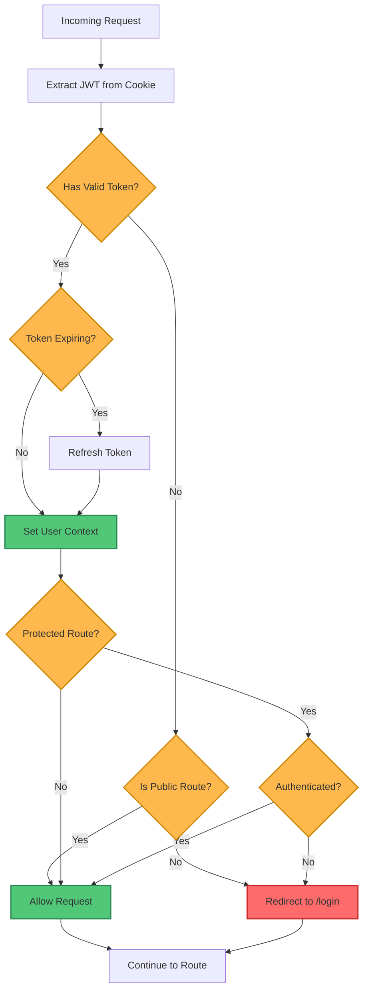

# Authentication & Authorization Flow

**Purpose**: Detailed documentation of user authentication, session management, and authorization flows in the Quiver platform.

**Audience**: Security team, backend developers, architects

**Created**: October 28, 2025
**Last Updated**: October 28, 2025

---

## Overview

Quiver uses a comprehensive authentication and authorization system built on Supabase Auth with the following components:

- **Authentication**: JWT-based token authentication via Supabase Auth
- **Authorization**: Row-Level Security (RLS) policies in PostgreSQL
- **Session Management**: Automatic token refresh and HTTP-only cookies
- **Protected Routes**: Middleware-based route protection
- **API Security**: Authentication wrappers for Server Actions and API Routes

---

## Complete Authentication Flow



---

## Authentication Methods

### 1. Email & Password



**Implementation**: `lib/supabase/client.ts`
```typescript
const { data, error } = await supabase.auth.signInWithPassword({
  email: 'user@example.com',
  password: 'password123'
})
```

### 2. Magic Link (Passwordless)



**Implementation**:
```typescript
const { error } = await supabase.auth.signInWithOtp({
  email: 'user@example.com',
  options: {
    emailRedirectTo: 'https://quiversurf.app/auth/callback'
  }
})
```

### 3. OAuth (Google)



**Implementation**:
```typescript
const { error } = await supabase.auth.signInWithOAuth({
  provider: 'google',
  options: {
    redirectTo: 'https://quiversurf.app/auth/callback'
  }
})
```

---

## JWT Token Structure

### Access Token

```json
{
  "aud": "authenticated",
  "exp": 1730000000,
  "iat": 1729999100,
  "iss": "https://[project-ref].supabase.co/auth/v1",
  "sub": "user-uuid-here",
  "email": "user@example.com",
  "phone": "",
  "app_metadata": {
    "provider": "email",
    "providers": ["email"]
  },
  "user_metadata": {
    "full_name": "John Surfer",
    "avatar_url": "https://..."
  },
  "role": "authenticated",
  "aal": "aal1",
  "amr": [{"method": "password", "timestamp": 1729999100}],
  "session_id": "session-uuid-here"
}
```

**Token Characteristics**:
- **Type**: JWT (JSON Web Token)
- **Algorithm**: HS256 (HMAC SHA-256)
- **Expiry**: 1 hour (3600 seconds)
- **Size**: ~1-2 KB
- **Storage**: HTTP-only cookie (browser)

### Refresh Token

- **Purpose**: Obtain new access tokens without re-authentication
- **Expiry**: 30 days (configurable)
- **Storage**: HTTP-only cookie, not accessible to JavaScript
- **One-time use**: Each refresh invalidates previous token

---

## Session Management

```mermaid
graph TB
    subgraph "Browser"
        Cookie[HTTP-only Cookie<br/>access_token<br/>refresh_token]
        JS[JavaScript App]
    end

    subgraph "Supabase Client"
        Storage[Session Storage]
        Refresh[Auto-refresh Logic]
    end

    subgraph "Supabase Auth"
        Validate[Token Validation]
        Generate[Token Generation]
    end

    Cookie -->|Read cookie| Storage
    Storage -->|Detect expiry| Refresh
    Refresh -->|refresh_token| Validate
    Validate -->|Valid| Generate
    Generate -->|new access_token| Cookie
    JS -->|getSession()| Storage
    Storage -.->|session data| JS

    classDef browserClass fill:#4A90E2,stroke:#2E5C8A,stroke-width:2px,color:#fff
    classDef supabaseClass fill:#50C878,stroke:#2E8B57,stroke-width:2px,color:#fff

    class Cookie,JS browserClass
    class Storage,Refresh,Validate,Generate supabaseClass
```

### Session Lifecycle

1. **Initial Authentication**: User signs in → JWT generated → Stored in HTTP-only cookie
2. **Active Session**: Token valid → Requests include JWT automatically
3. **Token Expiry Check**: Client checks expiry before each request
4. **Auto-refresh**: <5 minutes until expiry → Auto-refresh triggered
5. **Logout**: User signs out → Tokens revoked → Cookie cleared

**Implementation**: `lib/supabase/client.ts`
```typescript
export const createClient = () => {
  return createBrowserClient(
    process.env.NEXT_PUBLIC_SUPABASE_URL!,
    process.env.NEXT_PUBLIC_SUPABASE_ANON_KEY!,
    {
      cookies: {
        get(name: string) {
          return getCookie(name)
        },
        set(name: string, value: string, options: CookieOptions) {
          setCookie(name, value, options)
        },
        remove(name: string, options: CookieOptions) {
          deleteCookie(name, options)
        }
      },
      auth: {
        autoRefreshToken: true,  // Auto-refresh when expiring
        persistSession: true,     // Persist across browser sessions
        detectSessionInUrl: true  // Handle OAuth callbacks
      }
    }
  )
}
```

---

## Row-Level Security (RLS) Integration

### How RLS Works with JWT



### Key RLS Helper Functions

```sql
-- Get current user's ID from JWT
CREATE FUNCTION auth.uid() RETURNS uuid AS $$
  SELECT NULLIF(current_setting('request.jwt.claims', true)::json->>'sub', '')::uuid;
$$ LANGUAGE SQL STABLE;

-- Get current user's role
CREATE FUNCTION auth.role() RETURNS text AS $$
  SELECT NULLIF(current_setting('request.jwt.claims', true)::json->>'role', '')::text;
$$ LANGUAGE SQL STABLE;

-- Get current user's email
CREATE FUNCTION auth.email() RETURNS text AS $$
  SELECT NULLIF(current_setting('request.jwt.claims', true)::json->>'email', '')::text;
$$ LANGUAGE SQL STABLE;
```

### Example RLS Policies

#### User Data - Own Records Only
```sql
-- Read own profile
CREATE POLICY "Users can view own profile"
  ON profiles FOR SELECT
  USING (auth.uid() = id);

-- Update own profile
CREATE POLICY "Users can update own profile"
  ON profiles FOR UPDATE
  USING (auth.uid() = id)
  WITH CHECK (auth.uid() = id);
```

#### Sessions - Public Read, Owner Write
```sql
-- Read public sessions or own private sessions
CREATE POLICY "Users can view public or own sessions"
  ON sessions FOR SELECT
  USING (is_public = true OR user_id = auth.uid());

-- Insert own sessions only
CREATE POLICY "Users can create own sessions"
  ON sessions FOR INSERT
  WITH CHECK (user_id = auth.uid());

-- Update own sessions only
CREATE POLICY "Users can update own sessions"
  ON sessions FOR UPDATE
  USING (user_id = auth.uid())
  WITH CHECK (user_id = auth.uid());

-- Delete own sessions only
CREATE POLICY "Users can delete own sessions"
  ON sessions FOR DELETE
  USING (user_id = auth.uid());
```

#### Public Data - Read-Only
```sql
-- Anyone can read beaches (public data)
CREATE POLICY "Beaches are publicly viewable"
  ON beaches FOR SELECT
  TO authenticated, anon
  USING (true);

-- Only authenticated users can read forecasts
CREATE POLICY "Forecasts for authenticated users"
  ON enhanced_forecasts FOR SELECT
  TO authenticated
  USING (true);
```

#### Admin Access
```sql
-- Admins can do everything
CREATE POLICY "Admins have full access"
  ON admin_audit_log
  FOR ALL
  USING (
    EXISTS (
      SELECT 1 FROM profiles
      WHERE id = auth.uid() AND is_admin = true
    )
  );
```

---

## Protected Routes & Middleware

### Middleware Implementation

**File**: `middleware.ts`



**Code Implementation**:

```typescript
import { createServerClient } from '@supabase/ssr'
import { NextResponse } from 'next/server'
import type { NextRequest } from 'next/server'

const PUBLIC_ROUTES = ['/', '/login', '/signup', '/auth/callback']
const PROTECTED_ROUTES = ['/profile', '/sessions', '/settings']

export async function middleware(request: NextRequest) {
  let response = NextResponse.next()

  // Create Supabase client with cookie handling
  const supabase = createServerClient(
    process.env.NEXT_PUBLIC_SUPABASE_URL!,
    process.env.NEXT_PUBLIC_SUPABASE_ANON_KEY!,
    {
      cookies: {
        get(name: string) {
          return request.cookies.get(name)?.value
        },
        set(name: string, value: string, options: CookieOptions) {
          response.cookies.set({ name, value, ...options })
        },
        remove(name: string, options: CookieOptions) {
          response.cookies.delete({ name, ...options })
        }
      }
    }
  )

  // Refresh session if needed
  const { data: { session } } = await supabase.auth.getSession()

  const path = request.nextUrl.pathname

  // Check if route requires authentication
  const isProtectedRoute = PROTECTED_ROUTES.some(route =>
    path.startsWith(route)
  )

  if (isProtectedRoute && !session) {
    // Redirect to login if not authenticated
    const redirectUrl = new URL('/login', request.url)
    redirectUrl.searchParams.set('redirect', path)
    return NextResponse.redirect(redirectUrl)
  }

  if (session && path === '/login') {
    // Redirect authenticated users away from login
    return NextResponse.redirect(new URL('/home', request.url))
  }

  return response
}

export const config = {
  matcher: [
    '/((?!_next/static|_next/image|favicon.ico|.*\\.(?:svg|png|jpg|jpeg|gif|webp)$).*)'
  ]
}
```

---

## Server Action Authentication

### Authentication Wrapper

**File**: `lib/server-action-utils.ts`

```typescript
import { createClient } from '@/lib/supabase/server'

export async function withAuthenticatedAction<T, Args extends any[]>(
  action: (userId: string, ...args: Args) => Promise<T>
): Promise<(...args: Args) => Promise<T>> {
  return async (...args: Args): Promise<T> => {
    const supabase = createClient()

    // Get current user from session
    const { data: { user }, error } = await supabase.auth.getUser()

    if (error || !user) {
      throw new Error('Unauthorized: You must be logged in')
    }

    // Call action with user ID
    return action(user.id, ...args)
  }
}
```

**Usage**:

```typescript
'use server'

import { withAuthenticatedAction } from '@/lib/server-action-utils'

export const updateProfile = withAuthenticatedAction(
  async (userId: string, data: ProfileUpdate) => {
    // userId is guaranteed to be authenticated
    const supabase = createClient()

    const { error } = await supabase
      .from('profiles')
      .update(data)
      .eq('id', userId)  // RLS ensures user can only update own profile

    if (error) throw error

    return { success: true }
  }
)
```

---

## API Route Authentication

### API Utility Functions

**File**: `lib/api-utils.ts`

```typescript
import { createClient } from '@/lib/supabase/server'

export async function authenticateRequest(request: Request) {
  const supabase = createClient()

  const { data: { user }, error } = await supabase.auth.getUser()

  if (error || !user) {
    return { user: null, error: 'Unauthorized' }
  }

  return { user, error: null }
}

export async function requireAuth(request: Request) {
  const { user, error } = await authenticateRequest(request)

  if (error || !user) {
    return new Response(
      JSON.stringify({ error: 'Unauthorized' }),
      { status: 401, headers: { 'Content-Type': 'application/json' } }
    )
  }

  return user
}
```

**Usage**:

```typescript
import { requireAuth } from '@/lib/api-utils'

export async function POST(request: Request) {
  // Require authentication
  const user = await requireAuth(request)

  // If requireAuth returns Response, user is not authenticated
  if (user instanceof Response) {
    return user  // Return 401 response
  }

  // User is authenticated, proceed with request
  const body = await request.json()

  // ... handle request with user.id

  return Response.json({ success: true })
}
```

---

## Security Best Practices

### 1. Token Storage
✅ **Correct**: HTTP-only cookies (not accessible to JavaScript)
❌ **Avoid**: LocalStorage or SessionStorage (vulnerable to XSS)

### 2. Token Transmission
✅ **Correct**: HTTPS only (TLS 1.3)
❌ **Avoid**: HTTP or insecure connections

### 3. Token Validation
✅ **Correct**: Verify signature and expiry on every request
❌ **Avoid**: Trusting client-provided data

### 4. Session Management
✅ **Correct**: Auto-refresh tokens before expiry
✅ **Correct**: Revoke tokens on logout
❌ **Avoid**: Long-lived access tokens without refresh

### 5. RLS Policies
✅ **Correct**: Enable RLS on ALL tables
✅ **Correct**: Test policies with different user contexts
❌ **Avoid**: Disabling RLS for convenience

### 6. Error Handling
✅ **Correct**: Generic error messages ("Invalid credentials")
❌ **Avoid**: Specific errors ("User not found" vs "Wrong password")

---

## Mobile Authentication (Capacitor)

### Deep Linking for OAuth

```typescript
// capacitor.config.ts
const config: CapacitorConfig = {
  appId: 'com.quiversurf.app',
  appName: 'Quiver',
  plugins: {
    CapacitorCookies: {
      enabled: true
    },
    CapacitorHttp: {
      enabled: true
    }
  }
}
```

### OAuth Callback Handling

```typescript
import { App } from '@capacitor/app'

// Listen for deep link
App.addListener('appUrlOpen', async ({ url }) => {
  // Handle OAuth callback: quiversurf://auth/callback?code=...
  if (url.startsWith('quiversurf://auth/callback')) {
    // Supabase SDK automatically handles the code exchange
    await supabase.auth.getSession()
  }
})
```

---

## Testing Authentication

### Test User Contexts

```typescript
// Test as anonymous user
const { data } = await supabase
  .from('beaches')
  .select('*')
// Should only return public beaches

// Test as authenticated user
const { data } = await supabase.auth.signInWithPassword({
  email: 'test@example.com',
  password: 'password'
})

const { data: sessions } = await supabase
  .from('sessions')
  .select('*')
// Should only return user's own sessions

// Test as admin
const { data: auditLogs } = await supabase
  .from('admin_audit_log')
  .select('*')
// Should return logs if user is admin, error otherwise
```

---

## Related Diagrams

- [System Context](./system-context.md) - Authentication in system context
- [Container Architecture](./container-architecture.md) - Auth service integration
- [Database Schema](./database-schema.md) - RLS policies on tables
- [API Request Lifecycle](./api-request-flow.md) - API authentication flow

---

## Related Documentation

- [Security Guide](../architecture/SECURITY_GUIDE.md) - Complete security architecture
- [API Documentation](../architecture/API_DOCUMENTATION.md) - API authentication details
- [System Architecture Guide](../architecture/SYSTEM_ARCHITECTURE.md)

---

**Security Notes**:
- All authentication uses JWT tokens signed with project secret
- Tokens are validated on every request (server-side)
- RLS policies provide defense-in-depth at database level
- Sessions automatically refresh to maintain user experience
- OAuth uses secure authorization code flow
- All communication over HTTPS/TLS 1.3
