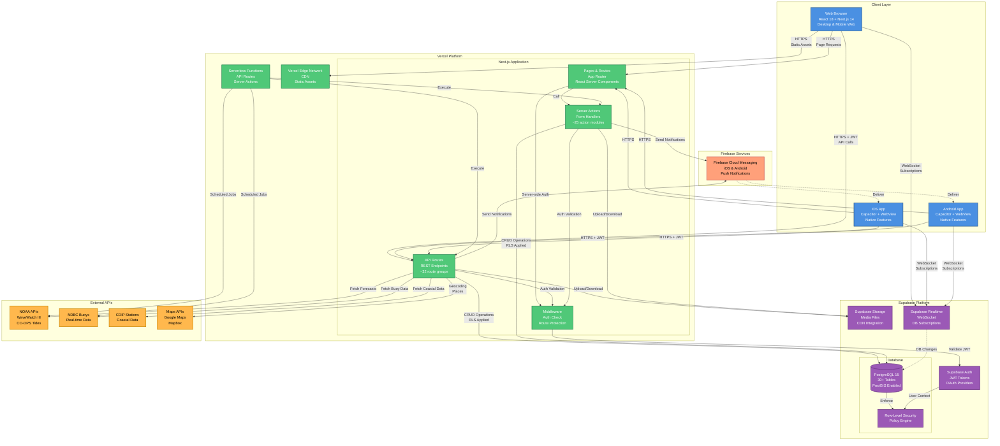
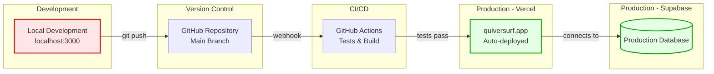
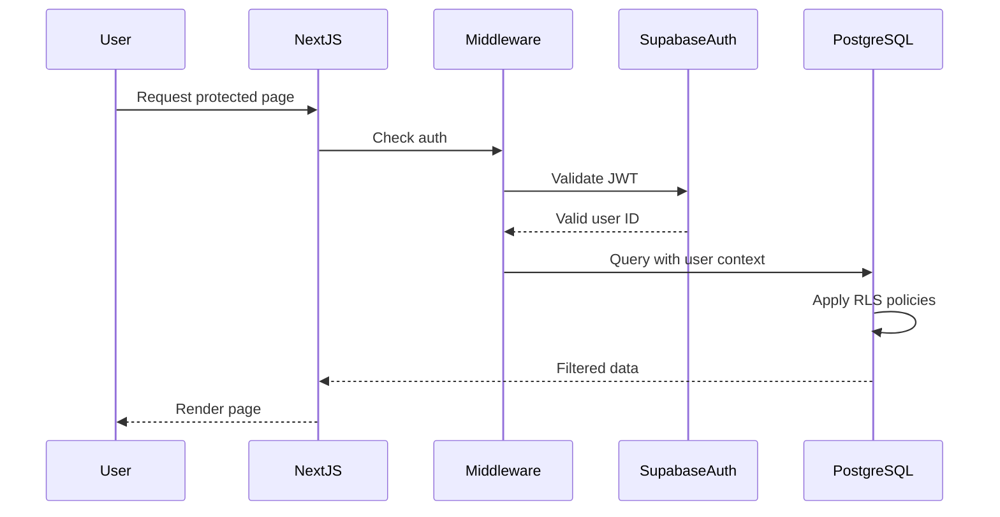

# Container Architecture Diagram

**Purpose**: Detailed view of major technology containers within the Quiver platform and their interactions.

**Audience**: Development team, DevOps engineers, solution architects

**Created**: October 28, 2025
**Last Updated**: October 28, 2025

---

## Diagram



---

## Container Details

### 1. Client Layer

#### Web Browser
- **Technology**: React 18 + Next.js 14
- **Features**:
  - Server-side rendering (SSR)
  - Client-side routing
  - Progressive Web App (PWA) capabilities
  - Service Worker caching
- **Platforms**: Desktop, mobile web browsers

#### iOS App
- **Technology**: Capacitor 7.4.3 + Native iOS
- **Features**:
  - WebView wrapping Next.js web app
  - Native APIs (Camera, Geolocation, Push Notifications)
  - App Store distribution
- **Native Plugins**: Capacitor Camera, Geolocation, Push Notifications

#### Android App
- **Technology**: Capacitor 7.4.3 + Native Android
- **Features**:
  - WebView wrapping Next.js web app
  - Native APIs (Camera, Geolocation, Push Notifications)
  - Google Play distribution
- **Native Plugins**: Capacitor Camera, Geolocation, Push Notifications

---

### 2. Next.js Application (Vercel)

#### Pages & Routes
- **Technology**: Next.js 14 App Router
- **Structure**:
  - Server Components (default)
  - Client Components (interactive UI)
  - Route groups: `(beach)`, `(journal)`, `(landing)`, etc.
- **Rendering**:
  - SSR for dynamic pages
  - Static generation for marketing pages
  - Incremental Static Regeneration (ISR)

#### API Routes
- **Count**: ~32 route groups
- **Key Endpoints**:
  - `/api/beaches/*` - Beach data & search
  - `/api/sessions/*` - Session CRUD
  - `/api/forecasts/*` - Forecast generation
  - `/api/social/*` - Social features
  - `/api/admin/*` - Admin operations
  - `/api/cron/*` - Scheduled jobs
- **Pattern**: REST-like with JSON responses

#### Server Actions
- **Count**: ~25 action modules
- **Purpose**: Form submissions, mutations
- **Features**:
  - Type-safe with TypeScript
  - Authentication wrappers
  - Direct database access
  - Error handling
- **Examples**: `createSession`, `updateProfile`, `followUser`

#### Middleware
- **File**: `middleware.ts`
- **Functions**:
  - Authentication check
  - Protected route enforcement
  - Session refresh
  - Redirect logic
- **Execution**: Edge runtime

#### Vercel Edge Network
- **Purpose**: CDN for static assets
- **Cached Assets**:
  - JavaScript bundles
  - CSS files
  - Images (optimized)
  - Fonts
- **Cache Duration**: Configurable (default 1 year for immutable assets)

#### Serverless Functions
- **Provider**: Vercel Functions
- **Execution**: On-demand + scheduled (cron)
- **Regions**: Auto-deployed to multiple regions
- **Timeout**: Configurable (default 10s, max 300s for Pro)

---

### 3. Supabase Platform

#### PostgreSQL Database
- **Version**: PostgreSQL 15
- **Extensions**:
  - PostGIS (geospatial queries)
  - pg_stat_statements (performance monitoring)
  - pgcrypto (encryption)
- **Tables**: 30+ core tables
  - Core: `profiles`, `sessions`, `beaches`, `boards`
  - Social: `session_likes`, `comments`, `user_follows`
  - Forecasting: `enhanced_forecasts`, `buoys`, `tide_forecasts`
  - Gamification: `user_xp`, `badges`, `user_badges`
- **Indexes**: Foreign key indexes, geospatial indexes, partial indexes

#### Row-Level Security (RLS)
- **Purpose**: Database-level access control
- **Coverage**: ALL tables have RLS policies
- **Policies**:
  - User can read own data
  - User can update own data
  - Public read for beaches, forecasts
  - Admin-only for sensitive operations
- **Enforcement**: Automatic via PostgreSQL

#### Supabase Auth
- **Authentication Methods**:
  - Email + Password
  - Magic Links (passwordless)
  - OAuth (Google)
- **Token Type**: JWT (JSON Web Tokens)
- **Token Refresh**: Automatic with client SDK
- **Session Storage**: HTTP-only cookies

#### Supabase Storage
- **Purpose**: User-uploaded media
- **Buckets**:
  - `session-media` - Session photos/videos
  - `avatars` - User profile pictures
  - `beach-photos` - Community-submitted beach images
- **Features**:
  - CDN integration
  - Automatic image optimization
  - Signed URLs (time-limited access)
  - File size limits

#### Supabase Realtime
- **Technology**: WebSocket connections
- **Subscriptions**:
  - Database changes (INSERT, UPDATE, DELETE)
  - Broadcast channels
  - Presence tracking
- **Use Cases**:
  - Live session updates
  - Real-time social feed
  - Activity notifications
  - Online user presence

---

### 4. External APIs

#### NOAA APIs
- **Services Used**:
  - WaveWatch III (wave forecasts)
  - CO-OPS (tide predictions)
  - NWS (wind/weather forecasts)
- **Rate Limits**: Generous (public API)
- **Cache Strategy**: 6-hour TTL
- **Refresh**: Scheduled cron jobs

#### NDBC Buoys
- **Service**: National Data Buoy Center
- **Data**: Real-time wave measurements
- **Format**: XML, JSON
- **Frequency**: Every 30-60 minutes
- **Coverage**: US coastal waters

#### CDIP Stations
- **Service**: Coastal Data Information Program
- **Data**: Coastal wave measurements
- **Format**: NetCDF, JSON
- **Frequency**: Continuous
- **Coverage**: California coast primarily

#### Maps APIs
- **Google Maps**:
  - Geocoding (address → coordinates)
  - Places API (beach search)
  - Reverse geocoding
- **Mapbox**:
  - GL JS (interactive maps)
  - Beach location markers
  - User location tracking

---

### 5. Firebase Services

#### Firebase Cloud Messaging (FCM)
- **Purpose**: Push notifications for mobile apps
- **Triggers**:
  - New session like
  - New comment
  - New follower
  - Session milestone (XP earned)
- **Platforms**: iOS (APNs) + Android (FCM)
- **Delivery**: Best-effort
- **Features**:
  - Rich notifications (images, actions)
  - Deep linking to app content
  - Notification badges

---

## Communication Protocols

| Source → Destination | Protocol | Data Format | Security |
|---------------------|----------|-------------|----------|
| Client → Next.js Pages | HTTPS | HTML, JSON | TLS 1.3 |
| Client → API Routes | HTTPS | JSON | TLS 1.3 + JWT |
| Client → Supabase Realtime | WSS (WebSocket) | JSON | TLS 1.3 + JWT |
| Next.js → Supabase DB | PostgreSQL Wire Protocol | SQL | TLS + Connection Pooling |
| Next.js → Supabase Auth | HTTPS | JSON | TLS + API Key |
| Next.js → External APIs | HTTPS | JSON/XML | TLS |
| Next.js → Firebase | HTTPS | JSON | TLS + Service Account |

---

## Data Flow Patterns

### 1. Page Request Flow
```
User → CDN (cache check) → Next.js SSR → PostgreSQL (RLS) → Render HTML → User
```

### 2. API Request Flow
```
User → Middleware (auth) → API Route → PostgreSQL (RLS) → JSON Response → User
```

### 3. Real-time Update Flow
```
User Action → Server Action → PostgreSQL → Realtime Trigger → WebSocket → All Subscribers
```

### 4. Scheduled Forecast Update
```
Vercel Cron → API Route → NOAA/NDBC APIs → PostgreSQL → Cache
```

### 5. Push Notification Flow
```
Social Event → Server Action → PostgreSQL → Firebase FCM → User Device
```

---

## Deployment Model



---

## Performance Characteristics

| Container | Response Time | Throughput | Scaling |
|-----------|--------------|------------|---------|
| **CDN (Static Assets)** | <50ms | Very High | Global edge network |
| **Next.js Pages** | 200-500ms | High | Auto-scaling serverless |
| **API Routes** | <150ms | High | Auto-scaling serverless |
| **Server Actions** | <200ms | Medium | Auto-scaling serverless |
| **PostgreSQL** | <50ms (indexed queries) | Medium-High | Connection pooling, read replicas |
| **Supabase Realtime** | <100ms | Medium | Auto-scaling WebSocket |
| **External APIs** | 500-2000ms | Low-Medium | Rate limited, cached |

---

## Security Architecture

### Authentication Flow


### Security Layers

1. **Transport Security**: TLS 1.3 for all communications
2. **Authentication**: JWT-based with Supabase Auth
3. **Authorization**: Row-Level Security (RLS) in PostgreSQL
4. **API Security**: Protected routes via middleware
5. **Storage Security**: Signed URLs for media access
6. **CORS**: Configured for quiversurf.app domain

---

## Technology Versions

| Technology | Version | Purpose |
|-----------|---------|---------|
| **Next.js** | 14.2.32 | Full-stack framework |
| **React** | 18.3.1 | UI library |
| **TypeScript** | 5.6.3 | Type safety |
| **Supabase Client** | 2.75.0 | Backend SDK |
| **PostgreSQL** | 15 | Database |
| **Capacitor** | 7.4.3 | Mobile wrapper |
| **Node.js** | 20 LTS | Runtime |
| **Tailwind CSS** | 3.4.17 | Styling |

---

## Scalability Considerations

### Current Capacity
- **Users**: Ready for 10,000+ concurrent users
- **Database**: 100GB+ storage, 1000+ queries/second
- **API**: Auto-scaling serverless (unlimited)
- **Real-time**: 10,000+ concurrent WebSocket connections

### Scaling Bottlenecks
1. **Database Connection Pool**: Monitor and optimize
2. **External API Rate Limits**: Caching strategy in place
3. **Real-time Subscriptions**: Batch updates when possible

### Future Scaling
- **Database**: Read replicas for analytics queries
- **Caching**: Redis layer for hot data
- **CDN**: Expand to more regions
- **API**: Rate limiting per user

---

## Related Diagrams

- [System Context](./system-context.md) - High-level ecosystem view
- [Database Schema (ERD)](./database-schema.md) - Database structure
- [Authentication Flow](./auth-flow.md) - Detailed auth process
- [Deployment Architecture](./deployment.md) - Infrastructure details
- [API Request Lifecycle](./api-request-flow.md) - API processing

---

## Related Documentation

- [System Architecture Guide](../architecture/SYSTEM_ARCHITECTURE.md)
- [API Documentation](../architecture/API_DOCUMENTATION.md)
- [Database Schema Documentation](../architecture/DATABASE_SCHEMA.md)

---

**Diagram Legend**:
- **Blue (Clients)**: User-facing applications
- **Green (Vercel)**: Next.js application containers
- **Purple (Supabase)**: Backend services and database
- **Orange (External)**: Third-party APIs
- **Salmon (Firebase)**: Push notification service
- **Solid arrows**: Synchronous request/response
- **Dashed arrows**: Asynchronous events/data flows
