# Database Schema - Entity Relationship Diagram

**Purpose**: Complete visual representation of the Quiver database schema showing all tables, relationships, and key constraints.

**Audience**: Backend developers, database administrators, architects

**Created**: October 28, 2025
**Last Updated**: October 28, 2025

---

## Overview

The Quiver database consists of 40+ core tables organized into the following domains:

- **Core**: Users, sessions, beaches, boards
- **Social**: Likes, comments, follows, activities, shares
- **Forecasting**: Forecasts, buoys, tides, marine data
- **Community**: Reviews, intel posts, spot feedback
- **Gamification**: XP, badges, achievements
- **Media**: Photos, session media
- **Admin**: Audit logs, calibration data
- **History**: Change tracking tables

**Database**: PostgreSQL 15 with PostGIS extension

---

## Entity Relationship Diagram

```mermaid
erDiagram
    %% Core Entities
    profiles ||--o{ sessions : creates
    profiles ||--o{ boards : owns
    profiles ||--o{ favorite_beaches : favorites
    profiles ||--o{ user_follows : follows
    profiles ||--o{ user_follows : is_followed
    profiles ||--o{ user_xp : has
    profiles ||--o{ user_badges : earned
    profiles ||--o{ user_activities : generates
    profiles ||--o{ push_devices : registers
    profiles ||--o{ beach_reviews : writes
    profiles ||--o{ intel_posts : creates
    profiles ||--o{ comments : posts
    profiles ||--o{ session_likes : likes
    profiles ||--o{ beach_review_likes : likes_reviews
    profiles ||--o{ forecast_accuracy_votes : votes
    profiles ||--o{ spot_feedback : provides

    beaches ||--o{ sessions : location
    beaches ||--o{ favorite_beaches : favorited_by
    beaches ||--o{ enhanced_forecasts : has_forecasts
    beaches ||--o{ beach_daily_intel : has_intel
    beaches ||--o{ beach_reviews : reviewed
    beaches ||--o{ intel_posts : discussed
    beaches ||--o{ beach_photos : has_photos
    beaches ||--o{ beach_sources : has_sources
    beaches ||--o{ beach_forecast_accuracy : accuracy_tracking
    beaches ||--o{ sun_times : sun_data
    beaches ||--o{ spot_feedback : receives_feedback

    boards ||--o{ sessions : used_in

    sessions ||--o{ session_likes : receives_likes
    sessions ||--o{ session_media : has_media
    sessions ||--o{ session_invitations : invites
    sessions ||--o{ session_shares : shared_as
    sessions ||--o{ comments : has_comments
    sessions ||--o{ session_forecast_snapshots : captured_forecast

    %% Forecasting
    buoys ||--o{ beach_sources : source_for
    buoys ||--o{ beaches : nearest_to

    enhanced_forecasts }o--|| beaches : for_beach
    marine_forecasts }o--|| beaches : for_beach
    tide_forecasts }o--|| beaches : for_beach
    beach_daily_intel }o--|| beaches : for_beach

    %% Social
    session_likes }o--|| sessions : likes
    session_likes }o--|| profiles : liked_by

    comments }o--|| sessions : on_session
    comments }o--|| profiles : by_user
    comments }o--|| comments : replies_to

    user_follows }o--|| profiles : follower
    user_follows }o--|| profiles : following

    session_shares }o--|| sessions : shares
    session_shares }o--|| profiles : shared_by

    session_invitations }o--|| sessions : invites_to
    session_invitations }o--|| profiles : from_user
    session_invitations }o--|| profiles : to_user

    %% Community
    beach_reviews }o--|| beaches : reviews
    beach_reviews }o--|| profiles : by_user

    beach_review_likes }o--|| beach_reviews : likes
    beach_review_likes }o--|| profiles : liked_by

    intel_posts }o--|| beaches : about
    intel_posts }o--|| profiles : by_user

    intel_post_confirmations }o--|| intel_posts : confirms
    intel_post_confirmations }o--|| profiles : confirmed_by

    spot_feedback }o--|| beaches : about
    spot_feedback }o--|| profiles : by_user

    %% Gamification
    user_xp }o--|| profiles : for_user

    user_badges }o--|| profiles : awarded_to
    user_badges }o--|| badge_definitions : badge_type

    xp_events }o--|| profiles : earned_by

    user_activities }o--|| profiles : by_user

    %% Media
    session_media }o--|| sessions : attached_to
    session_media }o--|| profiles : uploaded_by

    beach_photos }o--|| beaches : photo_of
    beach_photos }o--|| profiles : uploaded_by

    %% Admin & System
    admin_audit_log }o--|| profiles : action_by

    beach_forecast_accuracy }o--|| beaches : for_beach

    forecast_accuracy_votes }o--|| profiles : voted_by
    forecast_accuracy_votes }o--|| beaches : for_beach

    push_devices }o--|| profiles : belongs_to

    %% Table Definitions
    profiles {
        uuid id PK
        string email UK
        string username UK
        string full_name
        text bio
        string avatar_url
        string home_beach_id FK
        point home_location
        boolean is_admin
        timestamp created_at
        timestamp updated_at
    }

    sessions {
        uuid id PK
        uuid user_id FK
        uuid beach_id FK
        uuid board_id FK
        date session_date
        time start_time
        time end_time
        decimal rating
        decimal wave_height_ft
        text notes
        boolean is_public
        timestamp created_at
        timestamp updated_at
    }

    beaches {
        uuid id PK
        string name
        text description
        point location_point
        geography location_geography
        decimal latitude
        decimal longitude
        string region
        string country
        jsonb surf_break_info
        jsonb amenities
        boolean is_active
        timestamp created_at
        timestamp updated_at
    }

    boards {
        uuid id PK
        uuid user_id FK
        string name
        string board_type
        decimal length_ft
        decimal volume_l
        string brand
        string model
        boolean is_active
        timestamp created_at
    }

    buoys {
        string buoy_id PK
        string name
        point location
        decimal latitude
        decimal longitude
        string station_type
        boolean is_active
        timestamp last_reading
        jsonb latest_data
        timestamp created_at
    }

    enhanced_forecasts {
        uuid id PK
        uuid beach_id FK
        timestamp forecast_at
        decimal wave_height_ft
        decimal wave_period_s
        decimal wave_direction_deg
        decimal wind_speed_kts
        decimal wind_direction_deg
        decimal tide_height_ft
        integer rating
        text summary
        jsonb detailed_data
        timestamp created_at
    }

    beach_daily_intel {
        uuid id PK
        uuid beach_id FK
        timestamp forecast_at
        text recommendation
        text surf_description
        decimal surf_min_ft
        decimal surf_max_ft
        text best_window_start
        text best_window_end
        decimal conditions_score
        text confidence
        jsonb raw_intel_data
        timestamp created_at
    }

    session_likes {
        uuid id PK
        uuid session_id FK
        uuid user_id FK
        timestamp created_at
        UK "session_id, user_id"
    }

    comments {
        uuid id PK
        uuid session_id FK
        uuid user_id FK
        uuid parent_comment_id FK
        text content
        boolean is_edited
        timestamp created_at
        timestamp updated_at
    }

    user_follows {
        uuid id PK
        uuid follower_id FK
        uuid following_id FK
        timestamp created_at
        UK "follower_id, following_id"
    }

    beach_reviews {
        uuid id PK
        uuid beach_id FK
        uuid user_id FK
        integer rating
        text comment
        jsonb wave_quality
        jsonb crowd_level
        jsonb accessibility
        timestamp created_at
        timestamp updated_at
    }

    beach_review_likes {
        uuid id PK
        uuid review_id FK
        uuid user_id FK
        timestamp created_at
        UK "review_id, user_id"
    }

    intel_posts {
        uuid id PK
        uuid beach_id FK
        uuid user_id FK
        text content
        string intel_type
        timestamp expiry_time
        boolean is_active
        timestamp created_at
    }

    intel_post_confirmations {
        uuid id PK
        uuid intel_post_id FK
        uuid user_id FK
        boolean is_confirmed
        timestamp created_at
        UK "intel_post_id, user_id"
    }

    user_xp {
        uuid id PK
        uuid user_id FK
        integer total_xp
        integer current_level
        integer sessions_logged
        integer beaches_visited
        integer followers_count
        timestamp updated_at
    }

    user_badges {
        uuid id PK
        uuid user_id FK
        string badge_slug FK
        timestamp earned_at
        UK "user_id, badge_slug"
    }

    badge_definitions {
        string badge_slug PK
        string name
        text description
        string icon
        string category
        integer xp_reward
        timestamp created_at
    }

    xp_events {
        uuid id PK
        uuid user_id FK
        string event_type
        integer xp_amount
        uuid entity_id
        string entity_type
        timestamp created_at
    }

    user_activities {
        uuid id PK
        uuid user_id FK
        string activity_type
        uuid entity_id
        string entity_type
        jsonb metadata
        timestamp created_at
    }

    session_media {
        uuid id PK
        uuid session_id FK
        uuid user_id FK
        string file_path
        string media_type
        integer display_order
        timestamp created_at
    }

    beach_photos {
        uuid id PK
        uuid beach_id FK
        uuid user_id FK
        string file_path
        text caption
        boolean is_featured
        timestamp created_at
    }

    favorite_beaches {
        uuid id PK
        uuid user_id FK
        uuid beach_id FK
        timestamp created_at
        UK "user_id, beach_id"
    }

    session_invitations {
        uuid id PK
        uuid session_id FK
        uuid from_user_id FK
        uuid to_user_id FK
        string status
        timestamp created_at
    }

    session_shares {
        uuid id PK
        uuid session_id FK
        uuid shared_by_user_id FK
        string share_token
        integer view_count
        timestamp created_at
    }

    marine_forecasts {
        uuid id PK
        uuid beach_id FK
        timestamp forecast_at
        decimal wave_height_ft
        decimal wave_period_s
        integer wave_direction_deg
        jsonb detailed_data
        timestamp created_at
    }

    tide_forecasts {
        uuid id PK
        uuid beach_id FK
        timestamp tide_time
        string tide_type
        decimal tide_height_ft
        timestamp created_at
    }

    beach_sources {
        uuid id PK
        uuid beach_id FK
        string source_type
        string source_id
        jsonb source_metadata
        boolean is_primary
        timestamp created_at
    }

    beach_forecast_accuracy {
        uuid id PK
        uuid beach_id FK
        timestamp forecast_at
        decimal accuracy_score
        integer total_votes
        timestamp created_at
    }

    forecast_accuracy_votes {
        uuid id PK
        uuid beach_id FK
        uuid user_id FK
        timestamp forecast_at
        integer accuracy_rating
        timestamp created_at
        UK "beach_id, user_id, forecast_at"
    }

    spot_feedback {
        uuid id PK
        uuid beach_id FK
        uuid user_id FK
        string feedback_type
        text description
        timestamp created_at
    }

    push_devices {
        uuid id PK
        uuid user_id FK
        string device_token
        string platform
        boolean is_active
        timestamp created_at
    }

    admin_audit_log {
        uuid id PK
        uuid admin_user_id FK
        string entity_type
        uuid entity_id
        string action
        jsonb payload_summary
        inet ip_address
        timestamp created_at
    }

    sun_times {
        uuid id PK
        uuid beach_id FK
        date sun_date
        time sunrise
        time sunset
        timestamp created_at
    }

    session_forecast_snapshots {
        uuid id PK
        uuid session_id FK
        jsonb forecast_data
        timestamp created_at
    }

    storage_bucket_docs {
        string bucket_name PK
        text description
        jsonb allowed_mime_types
        integer max_file_size_bytes
        timestamp created_at
    }
```



---

## Table Relationships Summary

### One-to-Many Relationships

| Parent Table | Child Table | Relationship | Foreign Key |
|--------------|-------------|--------------|-------------|
| profiles | sessions | User creates sessions | sessions.user_id → profiles.id |
| profiles | boards | User owns boards | boards.user_id → profiles.id |
| profiles | favorite_beaches | User favorites beaches | favorite_beaches.user_id → profiles.id |
| profiles | user_follows (follower) | User follows others | user_follows.follower_id → profiles.id |
| profiles | user_follows (following) | User is followed | user_follows.following_id → profiles.id |
| profiles | beach_reviews | User writes reviews | beach_reviews.user_id → profiles.id |
| profiles | intel_posts | User creates intel | intel_posts.user_id → profiles.id |
| profiles | comments | User posts comments | comments.user_id → profiles.id |
| profiles | session_likes | User likes sessions | session_likes.user_id → profiles.id |
| beaches | sessions | Sessions at beach | sessions.beach_id → beaches.id |
| beaches | enhanced_forecasts | Forecasts for beach | enhanced_forecasts.beach_id → beaches.id |
| beaches | beach_reviews | Reviews of beach | beach_reviews.beach_id → beaches.id |
| beaches | intel_posts | Intel about beach | intel_posts.beach_id → beaches.id |
| boards | sessions | Board used in session | sessions.board_id → boards.id |
| sessions | session_likes | Likes on session | session_likes.session_id → sessions.id |
| sessions | session_media | Media for session | session_media.session_id → sessions.id |
| sessions | comments | Comments on session | comments.session_id → sessions.id |
| badge_definitions | user_badges | Badge awards | user_badges.badge_slug → badge_definitions.badge_slug |

### Many-to-Many Relationships (via junction tables)

| Entity A | Junction Table | Entity B | Description |
|----------|---------------|----------|-------------|
| profiles | favorite_beaches | beaches | Users favorite beaches |
| profiles | user_follows | profiles | Users follow users |
| profiles | session_likes | sessions | Users like sessions |
| profiles | beach_review_likes | beach_reviews | Users like reviews |
| profiles | intel_post_confirmations | intel_posts | Users confirm intel |
| profiles | forecast_accuracy_votes | beaches | Users vote on accuracy |

### Self-Referencing Relationships

| Table | Relationship | Foreign Key |
|-------|--------------|-------------|
| comments | Parent-child (replies) | comments.parent_comment_id → comments.id |
| profiles | Home beach | profiles.home_beach_id → beaches.id |

---

## Indexes & Performance

### Primary Indexes
- All tables have UUID primary keys with B-tree indexes
- Unique indexes on natural keys (username, email, etc.)

### Foreign Key Indexes
All foreign key relationships have indexes for join performance:
- `sessions.user_id` (B-tree)
- `sessions.beach_id` (B-tree)
- `sessions.board_id` (B-tree)
- `beach_reviews.beach_id` (B-tree)
- `enhanced_forecasts.beach_id` (B-tree)
- And 40+ more...

### Geospatial Indexes
Using PostGIS GIST indexes:
- `beaches.location_point` (GIST)
- `beaches.location_geography` (GIST)
- `buoys.location` (GIST)
- `profiles.home_location` (GIST)

### Composite Indexes
Optimized for common query patterns:
- `sessions(user_id, session_date DESC)`
- `enhanced_forecasts(beach_id, forecast_at DESC)`
- `user_activities(user_id, created_at DESC)`
- `session_likes(session_id, user_id)` (unique)
- `user_follows(follower_id, following_id)` (unique)

### Partial Indexes
For active/filtered queries:
- `sessions WHERE is_public = true`
- `beaches WHERE is_active = true`
- `intel_posts WHERE is_active = true AND expiry_time > NOW()`

---

## Row-Level Security (RLS)

All tables have RLS policies enabled. Key patterns:

### User Data Access
```sql
-- Users can read their own data
CREATE POLICY "Users can view own data" ON profiles
  FOR SELECT USING (auth.uid() = id);

-- Users can update their own data
CREATE POLICY "Users can update own data" ON profiles
  FOR UPDATE USING (auth.uid() = id);
```

### Public Read, Owner Write
```sql
-- Anyone can view public sessions
CREATE POLICY "Public sessions are viewable" ON sessions
  FOR SELECT USING (is_public = true OR user_id = auth.uid());

-- Only owner can update
CREATE POLICY "Users can update own sessions" ON sessions
  FOR UPDATE USING (user_id = auth.uid());
```

### Admin Access
```sql
-- Admins have full access
CREATE POLICY "Admins have full access" ON admin_audit_log
  FOR ALL USING (
    EXISTS (
      SELECT 1 FROM profiles
      WHERE id = auth.uid() AND is_admin = true
    )
  );
```

---

## Constraints & Validation

### Check Constraints

```sql
-- Session ratings between 1-5
ALTER TABLE sessions ADD CONSTRAINT sessions_rating_range
  CHECK (rating >= 1 AND rating <= 5);

-- Wave height must be positive
ALTER TABLE sessions ADD CONSTRAINT sessions_wave_height_positive
  CHECK (wave_height_ft >= 0);

-- Beach reviews ratings 1-5
ALTER TABLE beach_reviews ADD CONSTRAINT beach_reviews_rating_range
  CHECK (rating >= 1 AND rating <= 5);

-- Coordinates within valid ranges
ALTER TABLE beaches ADD CONSTRAINT beaches_latitude_range
  CHECK (latitude >= -90 AND latitude <= 90);
ALTER TABLE beaches ADD CONSTRAINT beaches_longitude_range
  CHECK (longitude >= -180 AND longitude <= 180);
```

### Unique Constraints

```sql
-- User can only like a session once
ALTER TABLE session_likes ADD CONSTRAINT session_likes_unique
  UNIQUE (session_id, user_id);

-- User can only follow another user once
ALTER TABLE user_follows ADD CONSTRAINT user_follows_unique
  UNIQUE (follower_id, following_id);

-- User can only favorite a beach once
ALTER TABLE favorite_beaches ADD CONSTRAINT favorite_beaches_unique
  UNIQUE (user_id, beach_id);
```

---

## Triggers & Automation

### Timestamp Automation
```sql
-- Auto-update updated_at on row changes
CREATE TRIGGER set_updated_at
  BEFORE UPDATE ON profiles
  FOR EACH ROW EXECUTE FUNCTION update_updated_at_column();
```

### Activity Tracking
```sql
-- Create activity on session creation
CREATE TRIGGER create_session_activity
  AFTER INSERT ON sessions
  FOR EACH ROW EXECUTE FUNCTION create_activity();
```

### XP Tracking
```sql
-- Award XP on session creation
CREATE TRIGGER award_session_xp
  AFTER INSERT ON sessions
  FOR EACH ROW EXECUTE FUNCTION award_xp_for_session();
```

### Change History
```sql
-- Track changes to sessions
CREATE TRIGGER sessions_history_trigger
  AFTER UPDATE OR DELETE ON sessions
  FOR EACH ROW EXECUTE FUNCTION track_session_history();
```

---

## History Tables

The following tables maintain change history for audit and recovery:

| Main Table | History Table | Tracked Events |
|-----------|---------------|----------------|
| sessions | sessions_history | UPDATE, DELETE |
| beaches | beaches_history | UPDATE, DELETE |
| beach_photos | beach_photos_history | UPDATE, DELETE |
| beach_reviews | beach_reviews_history | UPDATE, DELETE |
| session_media | session_media_history | UPDATE, DELETE |

History tables include:
- `history_id` (PK)
- All columns from original table
- `operation` ('UPDATE' or 'DELETE')
- `changed_at` (timestamp)
- `changed_by` (user ID)

---

## Materialized Views

For performance optimization:

### mv_beach_hourly_scores
Pre-calculated hourly beach scores for quick access
```sql
CREATE MATERIALIZED VIEW mv_beach_hourly_scores AS
  SELECT beach_id, forecast_hour, calculated_score, ...
  FROM enhanced_forecasts
  -- Complex scoring logic pre-computed
  ORDER BY beach_id, forecast_hour;
```

### mv_best_times
Pre-computed best surf times for beaches
```sql
CREATE MATERIALIZED VIEW mv_best_times AS
  SELECT beach_id, day, best_time_start, best_time_end, ...
  FROM beach_daily_intel
  -- Best time calculations pre-computed
  ORDER BY beach_id, day;
```

Refresh strategy:
- Refreshed after forecast updates (cron jobs)
- Manual refresh via admin panel
- Concurrent refresh to avoid blocking reads

---

## Data Retention & Cleanup

### Automatic Cleanup Jobs

Executed via scheduled functions:

1. **cleanup_old_forecasts()** - Remove forecasts older than 30 days
2. **cleanup_stale_enhanced_forecasts()** - Remove future forecasts older than update
3. **cleanup_inactive_buoys()** - Mark buoys inactive if no data for 7 days
4. **cleanup_session_media_storage()** - Remove orphaned storage files

### Soft Delete Pattern

Some tables use soft delete (is_active/deleted_at) rather than hard delete:
- `beaches` (is_active)
- `boards` (is_active)
- `intel_posts` (is_active)
- `buoys` (is_active)

Allows for recovery and maintains referential integrity.

---

## Storage Buckets

Managed via Supabase Storage with documentation in `storage_bucket_docs`:

| Bucket Name | Purpose | Max Size | Allowed Types |
|-------------|---------|----------|---------------|
| session-media | Session photos/videos | 10MB | image/*, video/* |
| avatars | User profile pictures | 2MB | image/* |
| beach-photos | Community beach images | 5MB | image/* |

---

## Database Statistics

### Current Schema Size
- **Total Tables**: 40+ core tables
- **Total Columns**: 500+ columns
- **Total Indexes**: 80+ indexes
- **Total Triggers**: 15+ triggers
- **Total Functions**: 60+ custom functions
- **Total RLS Policies**: 100+ policies

### Relationships
- **One-to-Many**: 40+ relationships
- **Many-to-Many**: 8+ junction tables
- **Self-Referencing**: 2 relationships

---

## Related Diagrams

- [System Context](./system-context.md) - High-level system view
- [Container Architecture](./container-architecture.md) - Application containers
- [Authentication Flow](./auth-flow.md) - Auth and RLS integration
- [API Request Lifecycle](./api-request-flow.md) - API to database flow

---

## Related Documentation

- [Database Schema Documentation](../architecture/DATABASE_SCHEMA.md) - Detailed table descriptions
- [System Architecture Guide](../architecture/SYSTEM_ARCHITECTURE.md)
- [API Documentation](../architecture/API_DOCUMENTATION.md)

---

**Diagram Notes**:
- PK = Primary Key
- FK = Foreign Key
- UK = Unique Key
- All `id` fields are UUID type
- All tables include `created_at` timestamp
- Most tables include `updated_at` timestamp
- Point/Geography types are PostGIS geospatial types
- JSONB used for flexible schema data
