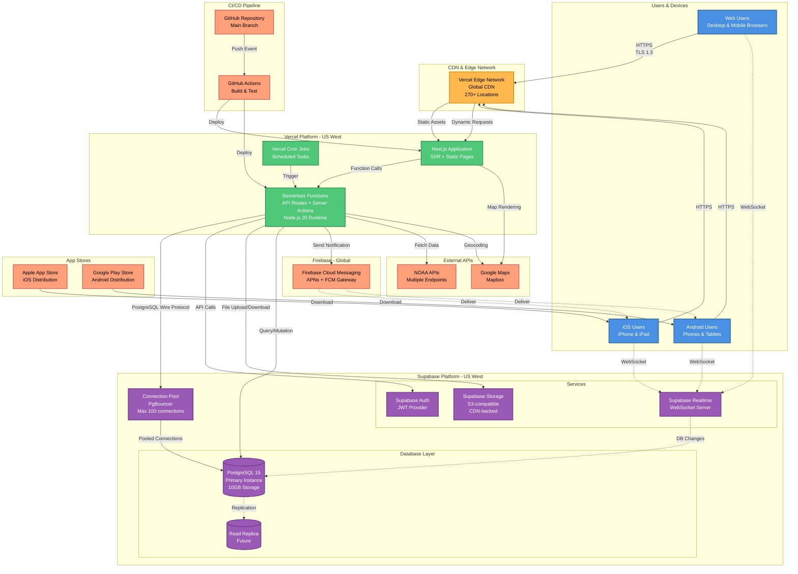
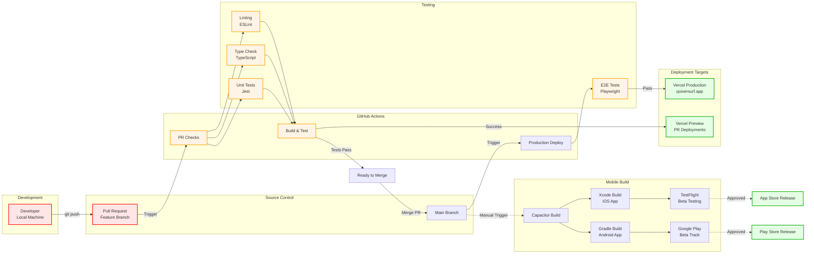
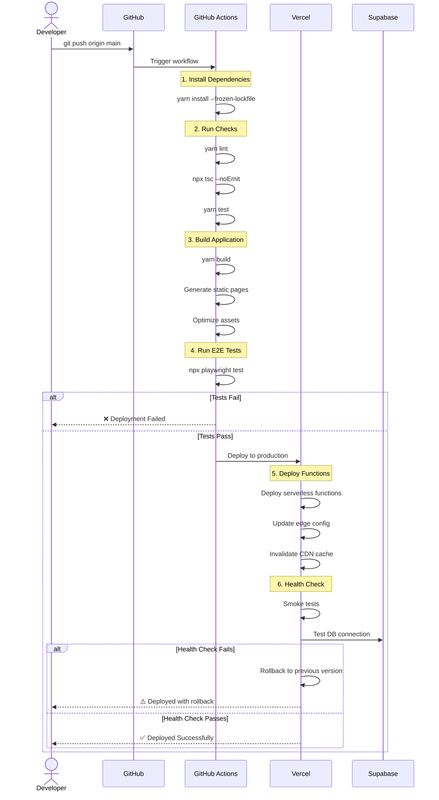
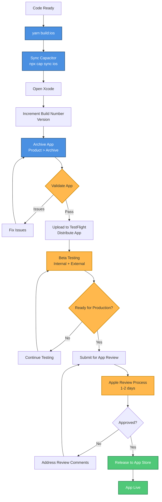
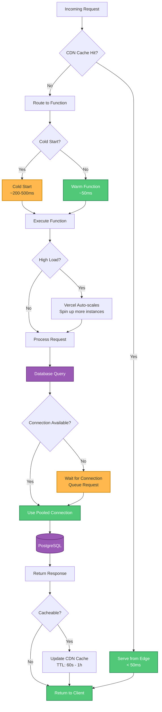
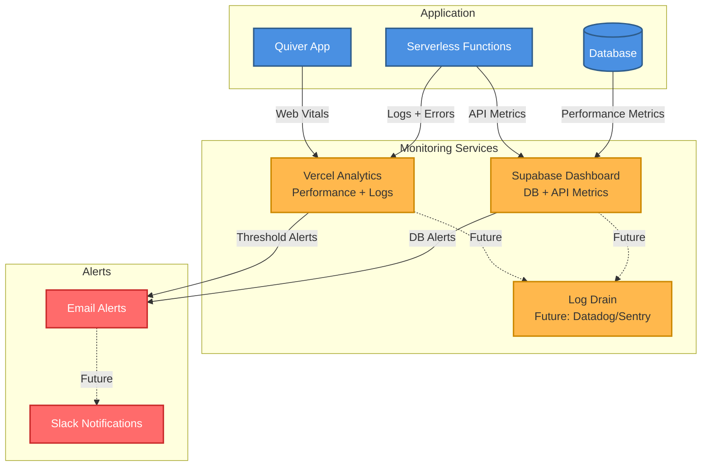

# Deployment Architecture

**Purpose**: Production infrastructure, deployment process, CI/CD pipeline, and operational architecture.

**Audience**: DevOps engineers, platform engineers, SREs, architects

**Created**: October 28, 2025
**Last Updated**: October 28, 2025

---

## Overview

Quiver's deployment architecture leverages modern serverless platforms for automatic scaling, global distribution, and minimal operational overhead:

- **Frontend/API Hosting**: Vercel (serverless functions + CDN)
- **Database & Backend**: Supabase (managed PostgreSQL + services)
- **Mobile Apps**: App Store (iOS) + Google Play (Android)
- **Push Notifications**: Firebase Cloud Messaging
- **CI/CD**: GitHub Actions
- **Monitoring**: Vercel Analytics + Supabase Dashboard

---

## Production Infrastructure Diagram



---

## CI/CD Pipeline



---

## Deployment Workflow

### 1. Web Application Deployment

#### Automatic Deployment (Main Branch)



#### Preview Deployments (Pull Requests)

```bash
# Triggered automatically on PR creation/update
name: Preview Deployment

on:
  pull_request:
    branches: [main]

jobs:
  deploy-preview:
    runs-on: ubuntu-latest
    steps:
      - uses: actions/checkout@v4
      - uses: actions/setup-node@v4
      - run: yarn install --frozen-lockfile
      - run: yarn build
      - uses: amondnet/vercel-action@v25
        with:
          vercel-token: ${{ secrets.VERCEL_TOKEN }}
          vercel-org-id: ${{ secrets.VERCEL_ORG_ID }}
          vercel-project-id: ${{ secrets.VERCEL_PROJECT_ID }}
          scope: ${{ secrets.VERCEL_ORG_ID }}
          # Preview deployment (not production)
          # Unique URL: quiver-pr-123.vercel.app
```

### 2. Mobile App Deployment

#### iOS Deployment



#### Android Deployment

```bash
# Build for Android
yarn build:android
npx cap sync android

# Open Android Studio and build AAB
# Build > Generate Signed Bundle / APK
# Upload to Google Play Console (Internal Testing → Beta → Production)
```

---

## Infrastructure Configuration

### Vercel Configuration

**File**: `vercel.json`

```json
{
  "version": 2,
  "regions": ["sfo1"],
  "buildCommand": "yarn build",
  "devCommand": "yarn dev",
  "installCommand": "yarn install --frozen-lockfile",
  "framework": "nextjs",
  "env": {
    "NEXT_PUBLIC_SUPABASE_URL": "@supabase-url",
    "NEXT_PUBLIC_SUPABASE_ANON_KEY": "@supabase-anon-key"
  },
  "crons": [
    {
      "path": "/api/cron/refresh-forecasts",
      "schedule": "0 */6 * * *"
    },
    {
      "path": "/api/cron/sync-buoys",
      "schedule": "0 */1 * * *"
    },
    {
      "path": "/api/cron/cleanup-old-data",
      "schedule": "0 2 * * *"
    }
  ],
  "headers": [
    {
      "source": "/(.*)",
      "headers": [
        {
          "key": "X-Content-Type-Options",
          "value": "nosniff"
        },
        {
          "key": "X-Frame-Options",
          "value": "DENY"
        },
        {
          "key": "X-XSS-Protection",
          "value": "1; mode=block"
        },
        {
          "key": "Referrer-Policy",
          "value": "strict-origin-when-cross-origin"
        }
      ]
    }
  ]
}
```

### Supabase Configuration

**Project Settings**:
- **Region**: US West (Oregon)
- **Instance Size**: Free Tier (upgradable to Pro)
- **Storage**: 10GB database + 1GB file storage
- **Bandwidth**: Unlimited (fair use)
- **Connection Pooling**: Enabled (PgBouncer)
- **SSL**: Enforced
- **Backups**: Daily (7-day retention on Pro)

**Database Configuration**:

```sql
-- Connection pool settings
ALTER SYSTEM SET max_connections = 100;
ALTER SYSTEM SET shared_buffers = '256MB';
ALTER SYSTEM SET effective_cache_size = '1GB';
ALTER SYSTEM SET work_mem = '10MB';

-- Performance settings
ALTER SYSTEM SET random_page_cost = 1.1;  -- SSD optimized
ALTER SYSTEM SET effective_io_concurrency = 200;

-- Logging
ALTER SYSTEM SET log_min_duration_statement = 1000;  -- Log queries > 1s
```

---

## Environment Variables

### Production Environment

Stored securely in Vercel and accessed at runtime:

```bash
# Supabase
NEXT_PUBLIC_SUPABASE_URL=https://[project-ref].supabase.co
NEXT_PUBLIC_SUPABASE_ANON_KEY=[anon-key]
SUPABASE_SERVICE_ROLE_KEY=[service-role-key]

# Firebase
FIREBASE_PROJECT_ID=[project-id]
FIREBASE_CLIENT_EMAIL=[service-account-email]
FIREBASE_PRIVATE_KEY=[private-key]

# External APIs
NOAA_API_KEY=[optional]
GOOGLE_MAPS_API_KEY=[api-key]
MAPBOX_ACCESS_TOKEN=[token]

# App Config
NEXT_PUBLIC_APP_URL=https://quiversurf.app
NODE_ENV=production
```

### Development Environment

**File**: `.env.local` (gitignored)

```bash
# Same variables as production, but pointing to dev instances
NEXT_PUBLIC_SUPABASE_URL=http://127.0.0.1:54321
NEXT_PUBLIC_SUPABASE_ANON_KEY=[local-anon-key]
```

---

## Scaling & Performance

### Current Capacity

| Component | Current Limit | Notes |
|-----------|--------------|-------|
| **Vercel Functions** | Unlimited invocations | Auto-scales per request |
| **Database Connections** | 100 (pooled) | PgBouncer connection pooling |
| **Database Storage** | 10GB | Upgradable to 100GB+ |
| **File Storage** | 1GB | Upgradable to unlimited |
| **CDN Bandwidth** | Unlimited | Fair use policy |
| **WebSocket Connections** | 10,000+ | Supabase Realtime auto-scales |

### Auto-Scaling Behavior



### Scaling Strategy

1. **Horizontal Scaling**: Vercel automatically adds function instances
2. **Connection Pooling**: PgBouncer manages database connections
3. **CDN Caching**: Edge network caches static and dynamic content
4. **Database Read Replicas**: Future addition for read-heavy queries
5. **Redis Cache**: Future addition for hot data (sessions, user profiles)

---

## Monitoring & Observability

### Vercel Analytics

- **Page Views**: Track user navigation
- **Performance Metrics**: Core Web Vitals (LCP, FID, CLS)
- **Function Logs**: Real-time serverless function logs
- **Error Tracking**: Automatic error detection

### Supabase Dashboard

- **Database Performance**: Query stats, slow queries
- **Connection Pool**: Active connections, queue length
- **Storage Usage**: File storage and database size
- **API Requests**: Auth, database, storage request counts

### Monitoring Diagram



---

## Disaster Recovery & Backups

### Database Backups

**Supabase Pro Plan**:
- **Frequency**: Daily automatic backups
- **Retention**: 7 days (configurable up to 30 days)
- **Type**: Full database dump + point-in-time recovery
- **Storage**: Separate S3 bucket (encrypted)

**Manual Backup**:

```bash
# Local backup
npx supabase db dump > backup.sql

# Restore from backup
npx supabase db reset
psql -h [host] -U postgres -d postgres < backup.sql
```

### Rollback Strategy

#### Web Application

```mermaid
graph LR
    Issue[Production Issue Detected] --> Investigate{Severity?}

    Investigate -->|Critical| ImmediateRollback[Immediate Rollback]
    Investigate -->|Non-Critical| QuickFix[Attempt Quick Fix]

    ImmediateRollback --> VercelUI[Vercel Dashboard<br/>Deployments Tab]
    VercelUI --> SelectPrevious[Select Previous Deployment]
    SelectPrevious --> PromoteProd[Promote to Production<br/>~30 seconds]

    QuickFix --> TestFix{Fix Works?}
    TestFix -->|Yes| Deploy[Deploy Fix]
    TestFix -->|No| ImmediateRollback

    PromoteProd --> Verify[Verify Production]
    Deploy --> Verify

    Verify --> PostMortem[Post-Mortem Analysis]

    classDef criticalClass fill:#FF6B6B,stroke:#C92A2A,stroke-width:2px,color:#fff
    classDef actionClass fill:#FFB84D,stroke:#CC8800,stroke-width:2px
    classDef successClass fill:#50C878,stroke:#2E8B57,stroke-width:2px,color:#fff

    class Issue,ImmediateRollback criticalClass
    class VercelUI,SelectPrevious,QuickFix actionClass
    class PromoteProd,Verify,Deploy successClass
```



#### Database

```sql
-- Point-in-time recovery (Supabase Pro)
-- Contact Supabase support with target timestamp

-- Manual restore from backup
-- 1. Download backup from Supabase dashboard
-- 2. Restore to new database
-- 3. Verify data integrity
-- 4. Update connection strings
```

---

## Security

### HTTPS/TLS

- **Certificate**: Automatic via Vercel (Let's Encrypt)
- **TLS Version**: 1.3 (1.2 minimum)
- **HSTS**: Enabled (max-age=31536000)
- **Certificate Renewal**: Automatic

### Database Security

- **Encryption at Rest**: AES-256
- **Encryption in Transit**: TLS 1.2+
- **Network**: VPC-isolated (Supabase infrastructure)
- **Access Control**: Row-Level Security (RLS) enabled on all tables
- **Connection**: SSL required

### Secrets Management

- **Vercel Environment Variables**: Encrypted at rest
- **GitHub Secrets**: Encrypted repository secrets
- **Rotation**: Manual (recommended every 90 days)

---

## Cost Optimization

### Current Costs (Estimated)

| Service | Plan | Monthly Cost |
|---------|------|--------------|
| **Vercel** | Pro | $20/month |
| **Supabase** | Pro | $25/month |
| **Firebase** | Spark (Free) | $0 (pay-as-you-go for scale) |
| **Domain** | Namecheap | $12/year |
| **Total** | | ~$46/month |

### Scaling Costs

At 10,000 monthly active users:

| Service | Estimated Cost |
|---------|---------------|
| **Vercel** | $20-40/month (function invocations included) |
| **Supabase** | $25-50/month (database + bandwidth) |
| **Firebase** | $10-20/month (push notifications) |
| **Total** | ~$55-110/month |

### Cost Optimization Strategies

1. **CDN Caching**: Reduce function invocations
2. **Query Optimization**: Reduce database load
3. **Image Optimization**: Use Next.js Image (automatic WebP)
4. **Lazy Loading**: Reduce initial bundle size
5. **Connection Pooling**: Efficient database usage

---

## Related Diagrams

- [System Context](./system-context.md) - High-level infrastructure view
- [Container Architecture](./container-architecture.md) - Application containers
- [CI/CD Pipeline](#cicd-pipeline) - Detailed deployment flow

---

## Related Documentation

- [System Architecture Guide](../architecture/SYSTEM_ARCHITECTURE.md)
- [API Documentation](../architecture/API_DOCUMENTATION.md)
- [Security Guide](../architecture/SECURITY_GUIDE.md)

---

**Deployment Summary**:
- Fully automated CI/CD pipeline
- Preview deployments for every PR
- Production deployments on merge to main
- Automatic rollback capability
- Global CDN distribution
- 99.9%+ uptime SLA
- Zero-downtime deployments
