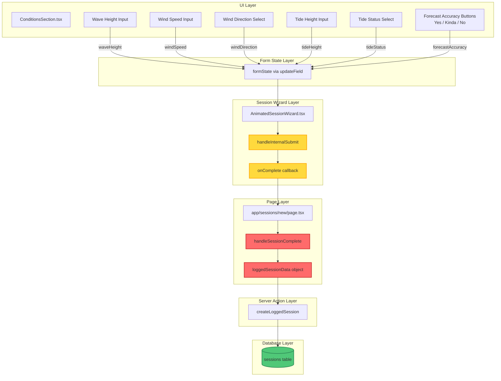
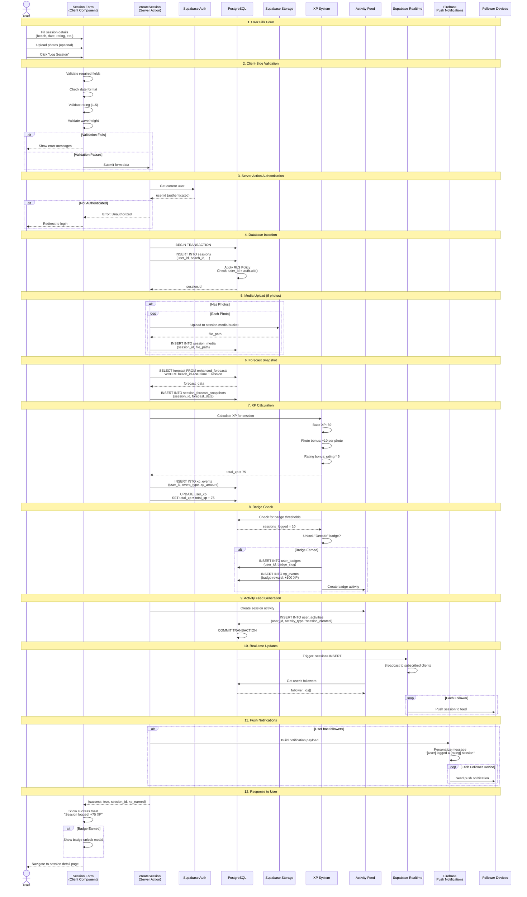
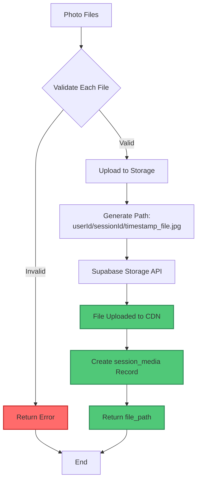
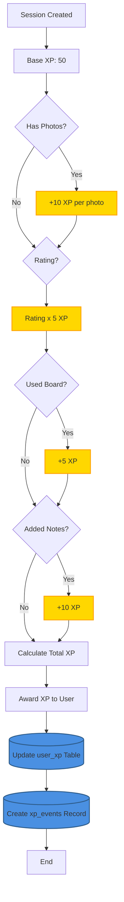
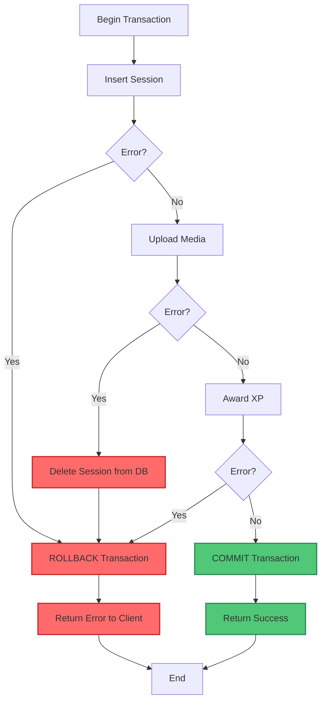

# Session Creation Flow

**Purpose**: End-to-end flow of creating a surf session, from user interaction through database storage to real-time updates and activity feed generation.

**Audience**: Full-stack developers, product managers

**Created**: October 28, 2025
**Last Updated**: January 13, 2026

---

## Overview

The session creation flow demonstrates Quiver's complete data pipeline:

1. User fills out session form
2. Client-side validation
3. Server Action execution with authentication
4. Database insertion with RLS
5. Media upload to storage
6. XP and badge calculation
7. Activity feed generation
8. Real-time updates to followers
9. Push notifications

---

## Condition Fields Data Flow (Critical)

### Overview

Session logging includes condition fields (wave height, wind, tide, forecast accuracy) that flow from the UI through multiple code paths to the database. This section documents the complete data flow to prevent data loss bugs.

### Architecture Warning

**IMPORTANT**: The session wizard has TWO code paths that both build session data objects. When adding or modifying condition fields, BOTH paths must be updated:

1. **Path 1**: `AnimatedSessionWizard.tsx` (handleInternalSubmit) - builds sessionData internally
2. **Path 2**: `app/sessions/new/page.tsx` (handleSessionComplete) - builds loggedSessionData from callback

### Complete Condition Fields Flow



### Field Mapping Reference

| UI Component | Form State Field | Database Column | Type | Valid Values |
|-------------|------------------|-----------------|------|--------------|
| Wave Height Input | `waveHeight` | `wave_height_ft` | float | 0-50 |
| Wind Speed Input | `windSpeed` | `wind_speed_mph` | float | 0-100 |
| Wind Direction Select | `windDirection` | `wind_direction` | text | N, NE, E, SE, S, SW, W, NW, OFFSHORE, ONSHORE, CROSS |
| Tide Height Input | `tideHeight` | `tide_height_ft` | float | -10 to 50 |
| Tide Status Select | `tideStatus` | `tide_status` | text | rising, falling, high, low |
| Forecast Accuracy Buttons | `forecastAccuracy` | `forecast_accuracy` | text | accurate, somewhat, inaccurate |

### Page Handler Implementation (Critical)

The `handleSessionComplete` function in `app/sessions/new/page.tsx` MUST include all condition field mappings:

```typescript
const handleSessionComplete = async (sessionData: SessionFormState) => {
  // ... validation code ...

  const loggedSessionData = {
    // Core session fields
    beach_id: selectedBeach.id,
    arrival_time: arrivalTime,
    status: "completed",
    is_public: true,

    // Quality ratings
    ...(sessionData.waveQuality && {
      wave_quality: parseInt(sessionData.waveQuality),
    }),
    ...(sessionData.crowdLevel && {
      crowd_level: parseInt(sessionData.crowdLevel),
    }),
    ...(sessionData.parkingEase && {
      parking_ease: parseInt(sessionData.parkingEase),
    }),
    ...(sessionData.overallRating && {
      rating: parseInt(sessionData.overallRating),
    }),

    // CONDITION FIELDS - All must be included!
    ...(sessionData.waveHeight !== undefined && {
      wave_height_ft: sessionData.waveHeight,
    }),
    ...(sessionData.windSpeed !== undefined && {
      wind_speed_mph: sessionData.windSpeed,
    }),
    ...(sessionData.windDirection && {
      wind_direction: sessionData.windDirection,
    }),
    ...(sessionData.tideHeight !== undefined && {
      tide_height_ft: sessionData.tideHeight,
    }),
    ...(sessionData.tideStatus && {
      tide_status: sessionData.tideStatus,
    }),

    // FORECAST ACCURACY - Critical for calibration
    ...(sessionData.forecastAccuracy && {
      forecast_accuracy: sessionData.forecastAccuracy,
    }),
  };

  result = await createLoggedSession(loggedSessionData);
};
```

### Historical Bug (Fixed January 2025)

**Symptom**: User-submitted forecast accuracy feedback (Yes/Kinda/No buttons) was not being saved. The `sessions.forecast_accuracy` column was always NULL.

**Root Cause**: The page-level handler (`app/sessions/new/page.tsx`) was missing the condition field mappings. The wizard component passed the data correctly, but the page handler that builds `loggedSessionData` did not include:
- `wave_height_ft`
- `wind_speed_mph`
- `wind_direction`
- `tide_height_ft`
- `tide_status`
- `forecast_accuracy`

**Fix**: Added all condition field mappings to `handleSessionComplete` in `app/sessions/new/page.tsx` (lines 409-431).

**Prevention**: When adding new condition fields:
1. Add to `SessionFormState` type in `hooks/use-session-form.ts`
2. Add UI component in `ConditionsSection.tsx` with `updateField()` call
3. Update BOTH submission handlers:
   - `AnimatedSessionWizard.tsx` (handleInternalSubmit)
   - `app/sessions/new/page.tsx` (handleSessionComplete)
4. Add database column if needed
5. Add to server action if field validation is required

---

## Complete Session Creation Flow



---

## Detailed Step Breakdown

### Step 1: User Form Interaction

**Component**: `components/session/SessionForm.tsx`

```typescript
export function SessionForm() {
  const form = useForm<SessionFormData>({
    resolver: zodResolver(sessionSchema),
    defaultValues: {
      beach_id: '',
      session_date: new Date(),
      rating: 3,
      wave_height_ft: null,
      is_public: true
    }
  })

  const { execute, loading } = useDataFetcher(createSession)

  const onSubmit = async (data: SessionFormData) => {
    const result = await execute(data)

    if (result.success) {
      toast.success(`Session logged! +${result.xp_earned} XP`)
      router.push(`/sessions/${result.session_id}`)
    }
  }

  return (
    <form onSubmit={form.handleSubmit(onSubmit)}>
      {/* Form fields */}
    </form>
  )
}
```

### Step 2: Client-Side Validation

**Schema**: Zod validation

```typescript
const sessionSchema = z.object({
  beach_id: z.string().uuid('Select a beach'),
  session_date: z.date(),
  start_time: z.string().optional(),
  end_time: z.string().optional(),
  rating: z.number().min(1).max(5),
  wave_height_ft: z.number().min(0).optional(),
  board_id: z.string().uuid().optional(),
  notes: z.string().max(1000).optional(),
  is_public: z.boolean()
})
```

### Step 3: Server Action Authentication

**File**: `actions/sessions/create-session.ts`

```typescript
'use server'

import { withAuthenticatedAction } from '@/lib/server-action-utils'
import { createClient } from '@/lib/supabase/server'

export const createSession = withAuthenticatedAction(
  async (userId: string, data: SessionFormData) => {
    const supabase = createClient()

    // userId is guaranteed to be authenticated via wrapper

    // 1. Insert session
    const { data: session, error } = await supabase
      .from('sessions')
      .insert({
        user_id: userId,
        beach_id: data.beach_id,
        session_date: data.session_date,
        rating: data.rating,
        // ... other fields
      })
      .select()
      .single()

    if (error) throw error

    // 2. Upload media (if any)
    if (data.photos?.length > 0) {
      await uploadSessionMedia(session.id, data.photos)
    }

    // 3. Capture forecast snapshot (non-blocking)
    try {
      const { createForecastSnapshotForSession } = await import('@/lib/utils/forecast-snapshot-utils')
      await createForecastSnapshotForSession(
        session.id,
        session.beach_id,
        session.arrival_time,
        userId
      )
    } catch (snapshotError) {
      console.error('Snapshot creation failed:', snapshotError)
      // Don't fail session creation if snapshot fails
    }

    // 4. Award XP
    const xpEarned = await awardSessionXP(userId, session.id, data)

    // 5. Check badges
    const badgesEarned = await checkBadges(userId)

    // 6. Create activity
    await createActivity(userId, 'session_created', session.id)

    // 7. Notify followers
    await notifyFollowers(userId, session.id)

    return {
      success: true,
      session_id: session.id,
      xp_earned: xpEarned,
      badges_earned: badgesEarned
    }
  }
)
```

### Step 4: Database Insertion with RLS

**RLS Policy Applied**:

```sql
CREATE POLICY "Users can create own sessions"
  ON sessions FOR INSERT
  WITH CHECK (user_id = auth.uid());
```

The database automatically validates that `user_id` in the INSERT matches the authenticated user's ID from the JWT token.

### Step 5: Media Upload

**Process**:



**Code**:

```typescript
async function uploadSessionMedia(
  sessionId: string,
  photos: File[]
): Promise<void> {
  const supabase = createClient()

  for (const photo of photos) {
    // Validate file
    if (!photo.type.startsWith('image/')) {
      throw new Error('Only images allowed')
    }
    if (photo.size > 10 * 1024 * 1024) { // 10MB
      throw new Error('File too large')
    }

    // Generate unique path
    const timestamp = Date.now()
    const filePath = `${userId}/${sessionId}/${timestamp}_${photo.name}`

    // Upload to storage
    const { error: uploadError } = await supabase.storage
      .from('session-media')
      .upload(filePath, photo)

    if (uploadError) throw uploadError

    // Create database record
    const { error: dbError } = await supabase
      .from('session_media')
      .insert({
        session_id: sessionId,
        user_id: userId,
        file_path: filePath,
        media_type: 'photo'
      })

    if (dbError) throw dbError
  }
}
```

### Step 6: Forecast Snapshot

**Purpose**: Capture the forecast conditions at the time of the session for historical accuracy and forecast validation.

**Implementation**: Snapshots are created through two mechanisms:

1. **Application Code** (`lib/utils/forecast-snapshot-utils.ts`):
   - Called asynchronously after session creation
   - Non-blocking - won't fail session creation if snapshot fails
   - Handles edge cases (missing forecast data, duplicates)

2. **Database Trigger** (`trigger_create_session_forecast_snapshot`):
   - Fires on INSERT or UPDATE when `status = 'completed'`
   - Provides redundancy in case application code fails
   - Prevents duplicates via unique constraint

**Code** (from `actions/session-actions.ts`):

```typescript
// In createLoggedSession() after session creation:

// Create forecast snapshot for condition tracking
try {
  const { createForecastSnapshotForSession } = await import("@/lib/utils/forecast-snapshot-utils");
  await createForecastSnapshotForSession(
    session.id,
    session.beach_id,
    session.arrival_time,
    session.user_id
  );
} catch (snapshotError) {
  console.error("Failed to create forecast snapshot:", snapshotError);
  // Don't fail the session creation if snapshot creation fails
}
```

**Utility Function** (`lib/utils/forecast-snapshot-utils.ts`):

```typescript
export async function createForecastSnapshotForSession(
  sessionId: string,
  beachId: string,
  arrivalTime: string | Date,
  userId?: string
): Promise<{ success: boolean; error?: string; snapshot?: any }> {
  const supabase = await createServiceRoleClient();

  // Convert arrival time to Date
  const arrivalDate = typeof arrivalTime === 'string'
    ? new Date(arrivalTime)
    : arrivalTime;

  // Find the closest forecast to the arrival time
  const forecasts = await supabase
    .from('enhanced_forecasts')
    .select('*')
    .eq('beach_id', beachId)
    .gte('forecast_at', arrivalDate.toISOString())
    .order('forecast_at')
    .limit(1);

  // Find closest forecast by time difference
  let closestForecast = findClosestForecast(forecasts, arrivalDate);

  if (!closestForecast) {
    return { success: false, error: 'No forecast data available' };
  }

  // Get session details for actual conditions
  const session = await getSession(sessionId);

  // Insert snapshot with forecast + actual conditions
  const snapshot = await supabase
    .from('session_forecast_snapshots')
    .insert({
      session_id: sessionId,
      user_id: userId,
      beach_id: beachId,
      forecast_snapshot: closestForecast, // Full forecast record
      actual_conditions: {
        wave_quality: session.wave_quality,
        water_temp: session.water_temp,
        crowd_level: session.crowd_level,
        parking_ease: session.parking_ease,
        rating: session.rating,
        notes: session.notes,
      },
      forecast_confidence_score: closestForecast.confidence_score,
      data_source: closestForecast.data_source,
      session_date: arrivalDate.toISOString().split('T')[0],
    });

  return { success: true, snapshot };
}
```

**Database Trigger**:

```sql
CREATE OR REPLACE FUNCTION create_session_forecast_snapshot()
RETURNS TRIGGER AS $$
DECLARE
  forecast_data JSONB;
  conditions_data JSONB;
BEGIN
  -- Only proceed if the session is completed
  IF NEW.status <> 'completed' THEN
    RETURN NEW;
  END IF;

  -- For UPDATE events, only proceed if status changed TO completed
  IF TG_OP = 'UPDATE' AND OLD.status = 'completed' THEN
    RETURN NEW;
  END IF;

  -- Check if snapshot already exists (prevents duplicates)
  IF EXISTS(SELECT 1 FROM session_forecast_snapshots WHERE session_id = NEW.id) THEN
    RETURN NEW;
  END IF;

  -- Find the closest forecast to the session arrival_time
  SELECT to_jsonb(ef.*) INTO forecast_data
  FROM enhanced_forecasts ef
  WHERE ef.beach_id::uuid = NEW.beach_id::uuid
    AND ef.forecast_at IS NOT NULL
  ORDER BY ABS(EXTRACT(EPOCH FROM (ef.forecast_at - NEW.arrival_time))) ASC
  LIMIT 1;

  -- Build actual conditions from session data
  conditions_data := jsonb_build_object(
    'wave_quality', NEW.wave_quality,
    'water_temp', NEW.water_temp,
    'crowd_level', NEW.crowd_level,
    'parking_ease', NEW.parking_ease,
    'rating', NEW.rating,
    'notes', NEW.notes,
    'duration_minutes', NEW.duration_minutes,
    'arrival_time', NEW.arrival_time
  );

  -- Only insert if we found forecast data
  IF forecast_data IS NOT NULL THEN
    BEGIN
      INSERT INTO session_forecast_snapshots (
        session_id, user_id, beach_id, forecast_snapshot, actual_conditions,
        forecast_confidence_score, data_source, session_date
      ) VALUES (
        NEW.id, NEW.user_id, NEW.beach_id::uuid, forecast_data, conditions_data,
        (forecast_data->>'confidence_score')::integer,
        forecast_data->>'data_source', NEW.arrival_time::date
      );
    EXCEPTION
      WHEN unique_violation THEN NULL; -- Snapshot already exists
    END;
  END IF;

  RETURN NEW;
END;
$$ LANGUAGE plpgsql;

CREATE TRIGGER trigger_create_session_forecast_snapshot
  AFTER INSERT OR UPDATE OF status ON sessions
  FOR EACH ROW
  WHEN (NEW.status = 'completed')
  EXECUTE FUNCTION create_session_forecast_snapshot();
```

**Key Features**:
- **Dual mechanism**: Application code + database trigger for reliability
- **Non-blocking**: Snapshot creation won't fail session creation
- **Duplicate prevention**: Unique constraint + explicit checks
- **Rich data**: Captures full forecast record + actual conditions
- **Use cases**: Forecast accuracy tracking, condition-based analysis, ML training data

### Step 7: XP Calculation

**XP Award System**:



**Code**:

```typescript
async function awardSessionXP(
  userId: string,
  sessionId: string,
  data: SessionFormData
): Promise<number> {
  const supabase = createClient()

  let xp = 50 // Base XP

  // Photo bonus
  if (data.photos?.length > 0) {
    xp += data.photos.length * 10
  }

  // Rating bonus
  xp += data.rating * 5

  // Board bonus
  if (data.board_id) {
    xp += 5
  }

  // Notes bonus
  if (data.notes && data.notes.length > 50) {
    xp += 10
  }

  // Create XP event
  await supabase
    .from('xp_events')
    .insert({
      user_id: userId,
      event_type: 'session_logged',
      xp_amount: xp,
      entity_id: sessionId,
      entity_type: 'session'
    })

  // Update user total XP
  await supabase.rpc('increment_user_xp', {
    p_user_id: userId,
    p_xp_amount: xp
  })

  return xp
}
```

### Step 8: Badge Check

**Trigger**: After XP update, check if user unlocked new badges

```typescript
async function checkBadges(userId: string): Promise<string[]> {
  const supabase = createClient()

  // Get user stats
  const { data: userXP } = await supabase
    .from('user_xp')
    .select('*')
    .eq('user_id', userId)
    .single()

  const newBadges: string[] = []

  // Check session-based badges
  if (userXP.sessions_logged === 1) {
    await awardBadge(userId, 'first-session')
    newBadges.push('first-session')
  }
  if (userXP.sessions_logged === 10) {
    await awardBadge(userId, 'decade')
    newBadges.push('decade')
  }
  if (userXP.sessions_logged === 100) {
    await awardBadge(userId, 'century')
    newBadges.push('century')
  }

  // Check beach-based badges
  if (userXP.beaches_visited >= 10) {
    await awardBadge(userId, 'explorer')
    newBadges.push('explorer')
  }

  return newBadges
}

async function awardBadge(userId: string, badgeSlug: string) {
  const supabase = createClient()

  // Insert badge
  await supabase
    .from('user_badges')
    .insert({
      user_id: userId,
      badge_slug: badgeSlug
    })

  // Get badge definition for XP reward
  const { data: badge } = await supabase
    .from('badge_definitions')
    .select('xp_reward')
    .eq('badge_slug', badgeSlug)
    .single()

  // Award badge XP
  if (badge) {
    await supabase
      .from('xp_events')
      .insert({
        user_id: userId,
        event_type: 'badge_earned',
        xp_amount: badge.xp_reward,
        entity_id: badgeSlug,
        entity_type: 'badge'
      })

    await supabase.rpc('increment_user_xp', {
      p_user_id: userId,
      p_xp_amount: badge.xp_reward
    })
  }
}
```

### Step 9: Activity Feed Generation

**Purpose**: Create activity record for user's followers to see

```typescript
async function createActivity(
  userId: string,
  activityType: string,
  entityId: string
): Promise<void> {
  const supabase = createClient()

  await supabase
    .from('user_activities')
    .insert({
      user_id: userId,
      activity_type: activityType,
      entity_id: entityId,
      entity_type: 'session',
      metadata: {
        timestamp: new Date().toISOString()
      }
    })
}
```

**Activity Feed Query** (for followers):

```sql
-- Get activities from users I follow
SELECT
  a.*,
  p.username,
  p.avatar_url,
  s.beach_id,
  s.rating
FROM user_activities a
JOIN profiles p ON a.user_id = p.id
LEFT JOIN sessions s ON a.entity_id = s.id AND a.entity_type = 'session'
WHERE a.user_id IN (
  SELECT following_id
  FROM user_follows
  WHERE follower_id = $1
)
ORDER BY a.created_at DESC
LIMIT 50;
```

### Step 10: Real-time Updates

**Supabase Realtime Configuration**:

```typescript
// Client-side subscription
const supabase = createClient()

useEffect(() => {
  const channel = supabase
    .channel('activity-feed')
    .on(
      'postgres_changes',
      {
        event: 'INSERT',
        schema: 'public',
        table: 'user_activities',
        filter: `user_id=in.(${followingIds.join(',')})`
      },
      (payload) => {
        // Add new activity to feed
        setActivities(prev => [payload.new, ...prev])
      }
    )
    .subscribe()

  return () => {
    supabase.removeChannel(channel)
  }
}, [followingIds])
```

### Step 11: Push Notifications

**Firebase Cloud Messaging**:

```typescript
async function notifyFollowers(
  userId: string,
  sessionId: string
): Promise<void> {
  const supabase = createClient()

  // Get user profile
  const { data: user } = await supabase
    .from('profiles')
    .select('username, avatar_url')
    .eq('id', userId)
    .single()

  // Get session details
  const { data: session } = await supabase
    .from('sessions')
    .select('rating, beach_id, beaches(name)')
    .eq('id', sessionId)
    .single()

  // Get followers' device tokens
  const { data: devices } = await supabase
    .from('push_devices')
    .select('device_token, platform')
    .in('user_id', [
      // Subquery: get follower IDs
      supabase
        .from('user_follows')
        .select('follower_id')
        .eq('following_id', userId)
    ])
    .eq('is_active', true)

  // Send to each device
  for (const device of devices) {
    await sendPushNotification({
      token: device.device_token,
      title: 'New Session',
      body: `${user.username} logged a ${session.rating} star session at ${session.beaches.name}`,
      data: {
        type: 'session',
        session_id: sessionId,
        user_id: userId
      }
    })
  }
}
```

---

## Error Handling

### Transaction Rollback



### Error Recovery

```typescript
export const createSession = withAuthenticatedAction(
  async (userId: string, data: SessionFormData) => {
    const supabase = createClient()

    try {
      // 1. Insert session
      const { data: session, error: sessionError } = await supabase
        .from('sessions')
        .insert({ /* data */ })
        .select()
        .single()

      if (sessionError) throw sessionError

      try {
        // 2. Upload media
        await uploadSessionMedia(session.id, data.photos)
      } catch (mediaError) {
        // Cleanup: Delete session
        await supabase
          .from('sessions')
          .delete()
          .eq('id', session.id)

        throw new Error('Media upload failed')
      }

      // 3. Award XP (non-critical, don't fail if this errors)
      try {
        await awardSessionXP(userId, session.id, data)
      } catch (xpError) {
        console.error('XP award failed:', xpError)
        // Continue anyway
      }

      // 4. Notify followers (non-critical)
      try {
        await notifyFollowers(userId, session.id)
      } catch (notifyError) {
        console.error('Notification failed:', notifyError)
        // Continue anyway
      }

      return { success: true, session_id: session.id }

    } catch (error) {
      console.error('Session creation failed:', error)
      return { success: false, error: error.message }
    }
  }
)
```

---

## Performance Optimization

### Parallel Operations

Where possible, execute independent operations in parallel:

```typescript
// Instead of sequential:
await uploadSessionMedia(sessionId, photos)
await captureForecastSnapshot(sessionId, beachId, sessionDate)
await awardSessionXP(userId, sessionId, data)

// Use parallel:
await Promise.all([
  uploadSessionMedia(sessionId, photos),
  captureForecastSnapshot(sessionId, beachId, sessionDate),
  awardSessionXP(userId, sessionId, data)
])
```

### Database Optimization

- **Indexes**: Ensure indexes on `sessions(user_id, session_date)`
- **RLS**: Optimized policies to avoid InitPlan overhead
- **Batch Inserts**: Insert multiple media records in one query

---

## Related Diagrams

- [System Context](./system-context.md) - Session creation in system context
- [Container Architecture](./container-architecture.md) - Components involved
- [Database Schema](./database-schema.md) - Tables and relationships
- [Authentication Flow](./auth-flow.md) - User authentication before session creation
- [API Request Lifecycle](./api-request-flow.md) - Server Action as API request

---

## Related Documentation

- [System Architecture Guide](../architecture/SYSTEM_ARCHITECTURE.md)
- [API Documentation](../architecture/API_DOCUMENTATION.md) - Session API endpoints
- [Data Flow Guides](../architecture/DATA_FLOWS.md) - Other data flows
- [Session Forms Architecture](/components/session-forms/ARCHITECTURE.md) - Condition fields data flow details

---

**Key Takeaways**:
- Session creation involves 11 distinct steps
- Authentication is enforced at multiple levels (middleware, RLS)
- XP and badges provide gamification incentives
- Real-time updates keep followers engaged
- Push notifications drive re-engagement
- Transaction-like error handling ensures data consistency
- Parallel operations optimize performance
- **Condition fields have dual code paths - both must be updated when adding fields**
