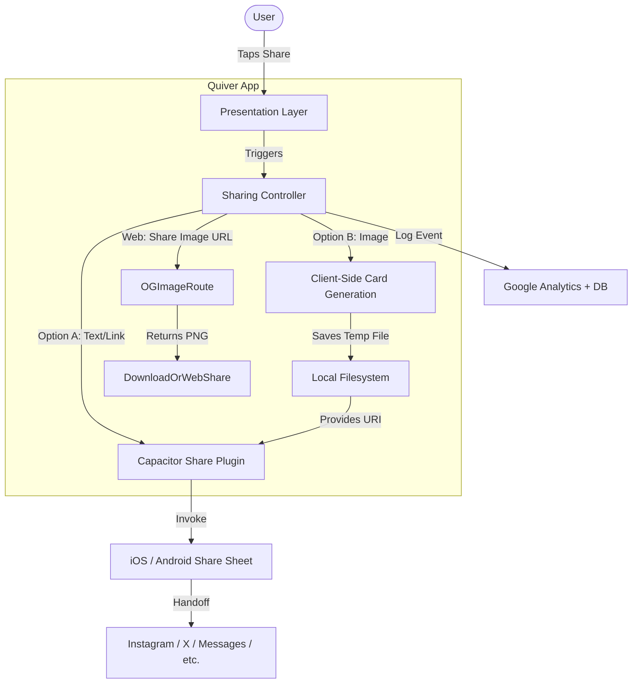
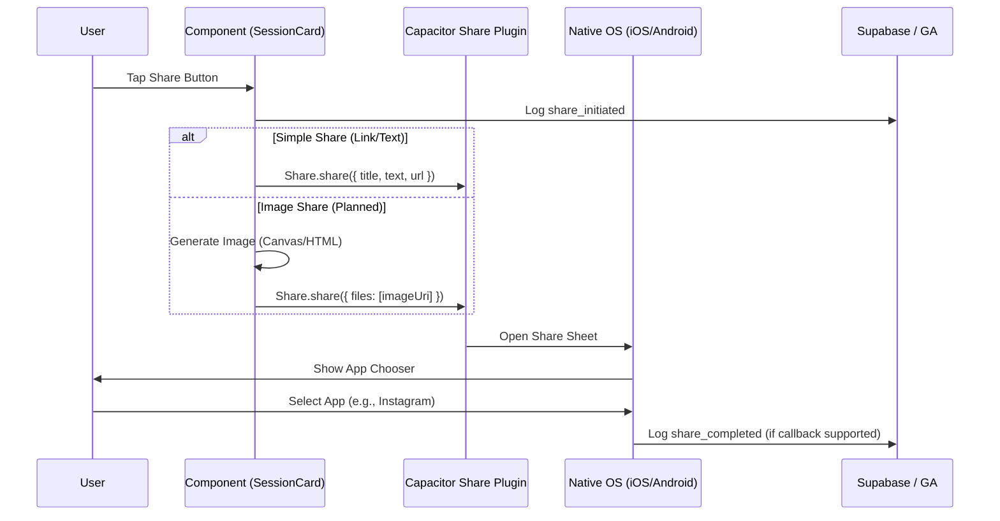
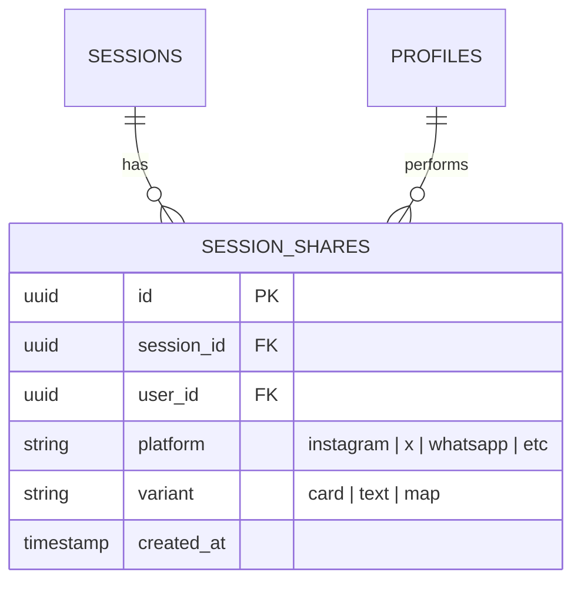

# Social Sharing Architecture Diagrams

**Date**: December 22, 2025
**Feature**: QuiverSurf Session Sharing (Native-First)
**Status**: In-Development / Redesign

---

## System Overview

The sharing system leverages the device's native capabilities to provide a seamless multi-platform experience.

---

## User Flow Sequence

The following diagram shows the sequence of events from user trigger to social platform handoff.

---

## Data Schema (Tracking)

Shares are tracked for growth analytics and user attribution.

---

## Technology Stack

### Mobile
- **Capacitor Core**: Native bridge.
- **@capacitor/share**: Official plugin for system share sheet.
- **cordova-plugin-x-socialsharing**: Advanced sharing & gallery saving (iOS).
- **Capacitor Filesystem**: Temporary image storage (Android).

### Web
- **Web Share API**: Native sharing in supported browsers.
- **OG image routes**: `/api/og/session`, `/api/og/wave` for downloadable share images (current implementation).
- **Download fallback**: Desktop browsers download the generated image when Web Share is unavailable.

### Backend
- **Supabase**: Real-time share count tracking and persistence.
- **Google Analytics 4**: Behavioral funnel tracking.

---

**Last Updated**: December 22, 2025
**Status**: Redesign complete; implementing native-first logic.
