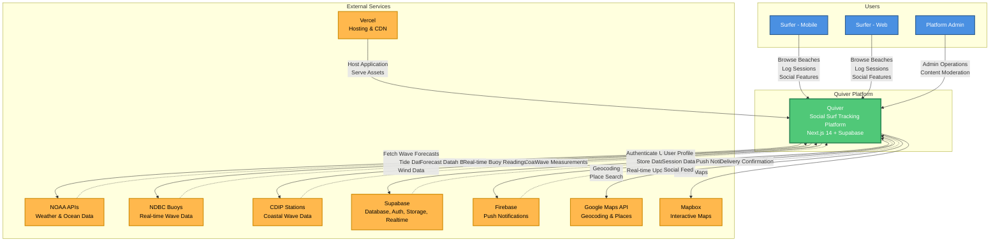
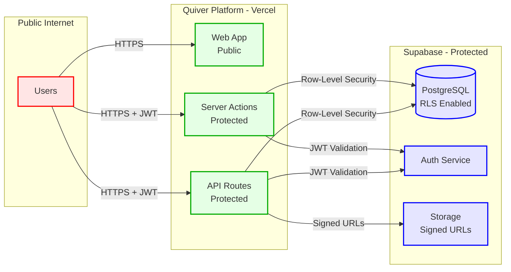

# System Context Diagram

**Purpose**: High-level view of the Quiver platform within its ecosystem, showing users, external systems, and major data flows.

**Audience**: All stakeholders, new developers, product managers, executives

**Created**: October 28, 2025
**Last Updated**: October 28, 2025

---

## Diagram

---

## Key Components

### Users

| Actor | Description | Primary Activities |
|-------|-------------|-------------------|
| **Surfer (Mobile)** | Mobile app users on iOS/Android via Capacitor | Browse beaches, log sessions, track conditions, social interactions |
| **Surfer (Web)** | Web application users | Browse beaches, log sessions, view forecasts, community features |
| **Platform Admin** | System administrators | Content moderation, buoy sync, data management |

### Quiver Platform

The central system built on:
- **Frontend**: Next.js 14 with App Router, React 18, TypeScript
- **Backend**: Next.js API Routes + Server Actions
- **Database**: Supabase PostgreSQL with Row-Level Security
- **Authentication**: Supabase Auth (JWT-based)
- **Real-time**: Supabase Realtime (WebSocket subscriptions)

### External Services

| Service | Purpose | Integration Type |
|---------|---------|-----------------|
| **NOAA APIs** | Wave forecasts, tide predictions, wind data | REST API (public) |
| **NDBC Buoys** | Real-time buoy readings (wave height, period, direction) | REST API (public) |
| **CDIP Stations** | Coastal wave measurement data | REST API (public) |
| **Supabase** | PostgreSQL database, authentication, storage, real-time subscriptions | SDK + REST API |
| **Firebase** | iOS/Android push notifications | Admin SDK |
| **Vercel** | Application hosting, serverless functions, CDN | Platform hosting |
| **Google Maps** | Geocoding, place search, address validation | JavaScript API |
| **Mapbox** | Interactive map rendering and beach locations | JavaScript GL JS |

---

## Data Flows

### Primary Data Flows

1. **User → Quiver**: User interactions (browsing, session logging, social features)
2. **Quiver ↔ Supabase**: Data persistence, user authentication, real-time subscriptions
3. **Quiver → NOAA/NDBC/CDIP**: Fetch forecast and observation data (scheduled + on-demand)
4. **Quiver → Firebase**: Send push notifications for social interactions
5. **Quiver → Maps APIs**: Geocoding and map rendering
6. **Vercel → Quiver**: Host and deliver application globally via CDN

### Data Flow Characteristics

| Flow | Pattern | Frequency | Volume |
|------|---------|-----------|--------|
| User ↔ Quiver | Request/Response | Real-time | Medium |
| Quiver ↔ Supabase | CRUD + Subscriptions | Real-time | High |
| Quiver → NOAA | Pull (scheduled cron) | Hourly/Daily | Medium |
| Quiver → Firebase | Push (event-driven) | On social events | Low-Medium |
| Quiver → Maps | Pull (on-demand) | Per user action | Low |

---

## Key Architectural Decisions

1. **Next.js Monolith**: Single application serving both web and API (via Capacitor for mobile)
   - **Rationale**: Simplifies deployment, enables code sharing, fast iteration
   - **Trade-off**: Tighter coupling vs microservices

2. **Supabase as Backend**: All-in-one backend platform
   - **Rationale**: Rapid development, built-in auth/real-time/storage
   - **Trade-off**: Vendor lock-in vs custom backend

3. **Multi-Source Forecasting**: Aggregate data from NOAA, NDBC, CDIP
   - **Rationale**: More comprehensive forecast coverage
   - **Trade-off**: Complexity vs single data source

4. **Capacitor for Mobile**: Web-first with native wrapper
   - **Rationale**: Code reuse (95%), faster development
   - **Trade-off**: Performance vs fully native apps

---

## Security Boundaries

### Security Layers

1. **HTTPS Only**: All communication encrypted in transit
2. **JWT Authentication**: User identity via Supabase Auth
3. **Row-Level Security (RLS)**: Database-level access control
4. **API Route Protection**: Middleware validates authentication
5. **Server Action Wrappers**: `withAuthenticatedAction` ensures auth
6. **Signed URLs**: Time-limited access to storage objects

---

## Scalability Considerations

| Component | Current Capacity | Scaling Strategy |
|-----------|-----------------|------------------|
| **Vercel (Frontend/API)** | Auto-scales | Serverless functions scale automatically |
| **Supabase Database** | 10,000+ concurrent users | Connection pooling, read replicas |
| **Supabase Realtime** | 10,000+ concurrent connections | Auto-scales with usage |
| **External APIs** | Rate limited | Caching (6hr TTL), smart refresh |
| **CDN (Vercel Edge)** | Global | Automatic edge caching |

---

## Related Diagrams

- [Container Architecture](./container-architecture.md) - Detailed view of technology containers
- [Deployment Architecture](./deployment.md) - Production infrastructure
- [Authentication Flow](./auth-flow.md) - User authentication details
- [API Request Lifecycle](./api-request-flow.md) - API processing flow

---

## Related Documentation

- [System Architecture Guide](../architecture/SYSTEM_ARCHITECTURE.md)
- [API Documentation](../architecture/API_DOCUMENTATION.md)
- [Security Guide](../architecture/SECURITY_GUIDE.md)

---

**Diagram Legend**:
- **Blue (Users)**: Human actors interacting with the system
- **Green (Quiver)**: The Quiver platform itself
- **Orange (External Services)**: Third-party services and APIs
- **Solid arrows**: Request/command flows
- **Dashed arrows**: Response/data flows
