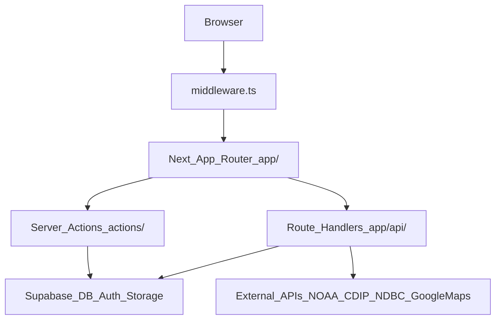
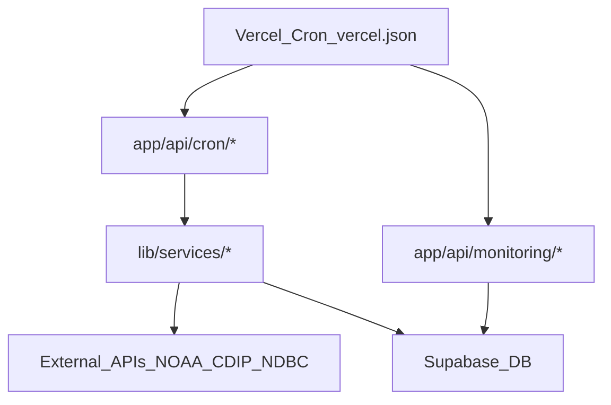

# Quiver Architecture Review (Full Repo)

**Date:** 2025-12-28  
**Scope:** Full repository (Next.js web app, API routes, server actions, Supabase, mobile shell, testing & ops)  
**Method:** Read existing architecture docs and verify key behaviors in code/config (middleware, Next config, API utils, actions, mobile configs).

---

## Executive Summary

Quiver is a **monolithic-first Next.js 14** app (App Router) deployed serverlessly on Vercel, backed by **Supabase** (Auth + Postgres + Storage + RLS). The repo also contains a **Capacitor** mobile shell (iOS/Android) that primarily wraps the web app.

The architecture is generally strong: clear separation between **server actions** (web mutations/auth reads) and **API routes** (public/mobile/cron/high-perf), a robust middleware layer for auth + SEO routing, and deep documentation for routing, caching, and testing. The main risks are **cache correctness/security pitfalls**, **doc drift**, and **build-time safety gaps** (lint/typecheck ignored during `next build`).

---

## Current Architecture (as implemented)

### Runtime boundaries

- **Web UI (Next.js App Router)**: `app/` (server components by default + client islands)
- **Edge/Node middleware**: `middleware.ts` (route protection + canonical redirects/rewrites + attribution + IP-location cookie)
- **REST API (Next.js route handlers)**: `app/api/*` using `lib/api-utils.ts` envelope/caching helpers
- **Server actions (Next.js Server Actions)**: `actions/*` using `lib/server-action-utils.ts`
- **Supabase**: `lib/supabase/*` (client/server/api-specific clients), DB schema/migrations in `supabase/`
- **Mobile shell**: Capacitor config in `capacitor.config*.ts`, native projects in `ios/` and `android/`
- **Ops / schedules**: Vercel Cron defined in `vercel.json` calling `/api/cron/*` and `/api/monitoring/*`
- **Testing**: Playwright in `e2e/`, Jest unit/integration under `__tests__/`

### Key request/data flows

---

## Strengths (what’s working well)

- **Clear layering + shared patterns**

  - API route envelope + caching helpers in `lib/api-utils.ts` (`createSuccessResponse`, `createCachedResponse`, `checkNotModified`, `DEFAULT_SECURITY_HEADERS`).
  - Server action response envelope in `lib/server-action-utils.ts` (`withServerAction`, `withAuthenticatedAction`, `makeAuthenticatedAction`).
  - Middleware split into dedicated classes (see `docs/architecture/MIDDLEWARE.md` + `lib/middleware/*`) keeps complexity low.

- **SEO-forward routing with canonicalization**

  - `middleware.ts` performs canonical redirects and rewrites for location URLs and state/city patterns while preserving route group implementations.

- **Ops discipline around forecasting**

  - Cron schedules are explicit in `vercel.json`, separating enhanced-forecast sync, marine/tide refresh, alerts, and monitoring.

- **Testing maturity**

  - Playwright is set up with guest/auth projects and global auth state (`playwright.config.ts`, `e2e/global-setup.ts`), plus Jest for unit/integration (`jest.config.js`).

- **Mobile strategy is pragmatic**
  - Capacitor shell supports local development via tunnel (`capacitor.config.ts` / `capacitor.config.dev.ts`) and production points to `https://www.quiversurf.app` (`capacitor.config.prod.ts`).

---

## Top Risks (ranked)

### 1) Cache correctness / privacy footguns (High)

- **Global API caching header is `public` for all `/api/*`** via `next.config.mjs` headers.
  - Any authenticated/personalized API route that forgets to override headers risks unintended caching behavior.
- **Service worker caching rules are safer than before**, but still require continuous vigilance:
  - `next.config.mjs` Workbox config includes a whitelist for public beach endpoints (good), but other endpoints must stay explicitly excluded.
- **`checkNotModified()` returns 304 with only `DEFAULT_SECURITY_HEADERS`** (no cache headers/ETag on the 304 response), which can produce confusing CDN/browser behavior and makes cache debugging harder (`lib/api-utils.ts`).

### 2) Build-time safety gaps (High)

- `next.config.mjs` sets:
  - `eslint.ignoreDuringBuilds: true`
  - `typescript.ignoreBuildErrors: true`
- This materially increases the chance of shipping broken routes/components and makes CI less trustworthy unless there is a separate enforced `yarn lint` + `yarn typecheck` pipeline.

### 3) Documentation drift / conflicting sources of truth (Medium)

- `app/api/ARCHITECTURE.md` documents `/api/cache/status`, but **no `app/api/cache/` routes exist** (verified by searching `app/api/**/cache/**`).
- Repo guidance references a top-level `docs/ARCHITECTURE_REVIEW.md`, but the current structure uses `docs/ARCHITECTURE.md` + `docs/architecture/*` + reports in `docs/research/`.
- API response helpers can drift when multiple “envelope” utilities exist.
  - At time of writing, the repo had both `lib/api-utils.ts` and an older `lib/api-response-utils.ts`.
  - **Recommended direction**: standardize on `lib/api-utils.ts` for envelopes + security headers + cron request validation, to avoid inconsistent response shapes and duplicated logic.

### 4) Admin authorization consistency (Medium)

- Admin validation exists in multiple places:
  - Middleware path: `lib/middleware/admin-checker.ts` → canonical IDs + metadata flags
  - Library path: `lib/auth/admin.ts` → canonical IDs + metadata flags
- This is mostly aligned today, but it’s easy for drift to emerge if one evolves (e.g., canonical ID list vs metadata-only).

### 5) Mobile WebView security posture (Medium)

- Capacitor config uses `allowNavigation: ["*"]` (seen in `capacitor.config.ts` and generated `ios/App/App/capacitor.config.json`).
  - This is convenient for development but broad navigation allowances in a WebView increase risk if deep links or external navigation aren’t carefully constrained at runtime.

---

## Recommendations (prioritized)

### Quick wins (high impact / low-to-medium effort)

1. **Make API caching opt-in instead of opt-out**

   - Remove or narrow the global `/api/(.*)` `Cache-Control: public...` in `next.config.mjs`.
   - Require each API route to explicitly declare one of: `public+SWR`, `private`, or `no-store`.

2. **Consolidate API response helpers**

   - Prefer one canonical module for envelopes + security headers + caching.
   - Prefer consolidating on `lib/api-utils.ts` (or clearly scope any legacy helper as deprecated and route-specific).

3. **Fix `304 Not Modified` response semantics**

   - Ensure 304 responses include the relevant cache headers and validators (ETag / Cache-Control), not just security headers.

4. **Re-enable build enforcement in CI**

   - Keep local dev forgiving if needed, but CI should fail on lint/type errors (run `yarn lint` and `yarn typecheck` as required checks).
   - Consider removing `ignoreBuildErrors` / `ignoreDuringBuilds` once CI is stable.

5. **Doc drift cleanup**
   - Remove/repair `/api/cache/status` references in `app/api/ARCHITECTURE.md` (or implement the route if it is desired).
   - Update references to “`docs/ARCHITECTURE_REVIEW.md`” to point to the current canonical docs structure.

### Medium-term (bigger changes, strong payoff)

6. **Cache observability**

   - Standardize small debug headers on cacheable endpoints (e.g., `X-Quiver-Cache-Policy`, rely on `ETag`, include age info when available).

7. **Harden Capacitor navigation**
   - Replace `allowNavigation: ["*"]` with an explicit allowlist for known Quiver domains and local tunnel patterns.

### Long-term (scale preparation)

8. **Define “source of truth” for staleness**
   - For each resource (forecast, beaches, personalized), document which cache layer owns freshness and how other layers align (React Query, in-memory TTL maps, HTTP/CDN, SW).

---

## Follow-ups (actionable backlog candidates)

- Add a lightweight “Architecture review index” in `docs/research/` (optional) so these system-level reviews remain discoverable.
- Add a small CI doc section describing which checks are authoritative (build vs lint vs typecheck vs tests).

---

## Primary references

- `docs/ARCHITECTURE.md`
- `docs/ARCHITECTURE.md`
- `docs/architecture/MIDDLEWARE.md`
- `docs/architecture/CACHE_STRATEGY.md`
- `docs/architecture/URL_ROUTING.md`
- `app/ARCHITECTURE.md`, `actions/ARCHITECTURE.md`, `app/api/ARCHITECTURE.md`
- `lib/api-utils.ts`, `lib/server-action-utils.ts`, `middleware.ts`, `next.config.mjs`, `vercel.json`
- `capacitor.config*.ts`, `ios/`, `android/`
