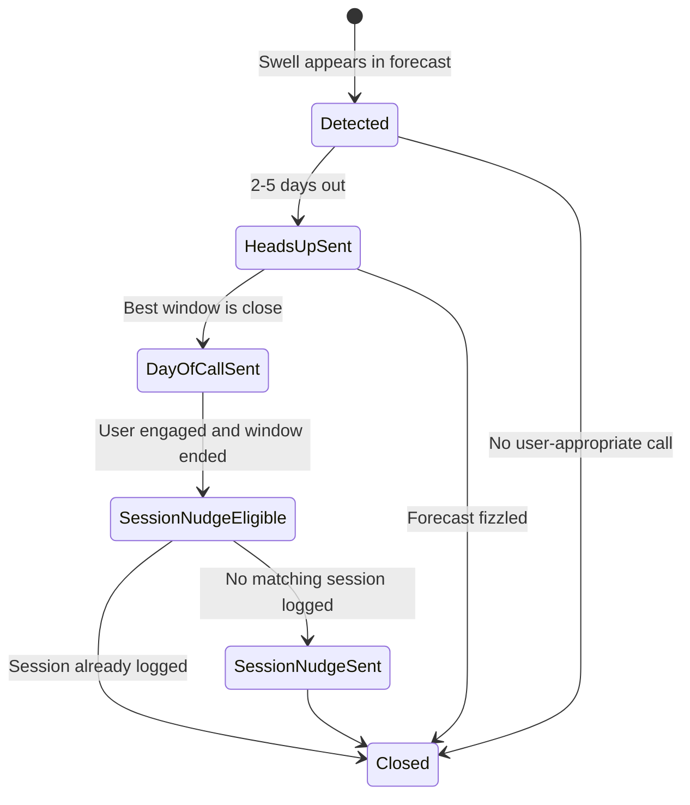
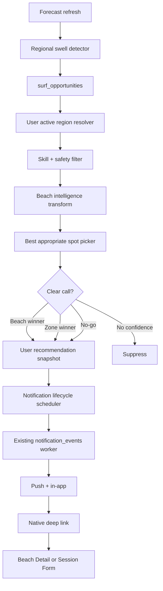

# Swell Opportunity Hype Train - Design Spec

Date: 2026-06-30
Status: design draft, pending user spec review
Scope: Quiver web backend, notification pipeline, native push routing/session log handoff. No implementation in this spec.

## Problem

Quiver currently has forecast, discovery, scoring, and notification pieces, but they do not combine into the product promise: tell a surfer when a meaningful swell is coming, tell them where to go for their ability and current region, then close the loop by asking whether they actually surfed.

The missed San Diego swell exposed three concrete gaps:

- Alert producers are home/rule-centric or too narrow, while in-app discovery can rank nearby spots.
- Stored forecast rows expire too quickly to audit missed calls after the fact.
- The best spot cannot be chosen with generic wave height alone. Oceanside, Del Mar, Scripps, La Jolla Shores, OB, and similar breaks transform the same swell differently because of exposure, bathymetry, tide, structures, and skill suitability.

## Goals

- Detect meaningful regional swell opportunities.
- Send a lifecycle campaign: heads-up, day-of call, post-window session validation.
- Resolve each user's active surf region without any app-wide fallback.
- Pick skill-appropriate spots, not just the biggest waves.
- Require confidence and clear margins before naming one beach.
- Store durable decision snapshots for audit, calibration, and learning.
- Run shadow mode before push delivery in each region.

## Non-Goals

- Do not stretch `similarity_match` into this system.
- Do not use San Diego as a global fallback.
- Do not rely on background location tracking for v1.
- Do not scrape proprietary forecast prose or Surfline-style copyrighted spot descriptions as source of truth.
- Do not send "Did you surf?" nudges to users who did not engage.
- Do not claim a beach is safe. Copy stays advisory.

## Product Model

This is an opportunity campaign engine, not a single alert.

One regional swell opportunity can produce different user-specific calls:

| User context | Heads-up | Day-of call | Post-window |
| --- | --- | --- | --- |
| Advanced in San Diego | Solid swell lining up this weekend. | Del Mar is the call 4-6pm. | Did you surf Del Mar? |
| Beginner in San Diego | Bigger surf is coming. Protected spots may be best. | La Jolla Shores is the friendliest window. | Did you surf Shores? |
| Beginner, unsafe everywhere | Bigger surf is coming. | Not a beginner day. Skip this one. | No session nudge. |
| User in Hawaii | Hawaii swell pulse building Friday. | Best appropriate Hawaii spot today. | Hawaii session log prompt. |

The same swell can be a hype alert for one user, a protected-spot recommendation for another, and a no-go advisory for a beginner.

## Active Region Resolver

Every opportunity is scoped to a user-specific region.

Resolution order:

1. Fresh device location if last seen within 24 hours.
2. Explicit travel/watch region.
3. User's own home region from `home_beach_id` / `home_region`.
4. No alert if none exists.

Rules:

- No app-wide fallback.
- No San Diego default.
- Current location controls day-of alerts.
- Watched/travel regions are additive for heads-up alerts.
- Watched/travel region day-of alerts are a separate follow-up spec.
- If a user's fresh location is Hawaii, scan Hawaii. If stale, fall back to watched/travel regions or that user's home region.

## Drive Area

Default drive area is 60 minutes.

This is a product default, not a precision promise. The server owns the approximation and can evolve it without changing client behavior.

V1 rules:

- Use `drive_minutes_limit = 60` in the recommendation request.
- The server can approximate with straight-line distance, cached routing, or a simple drive-time service.
- Do not model traffic for v1.
- Keep the candidate pool a little generous so the picker does not miss a clear winner just outside the estimate.
- Avoid user-facing copy that over-promises precision. Prefer "nearby," "worth the drive," or "in your area" over "exactly 60 minutes away."

The client should not implement drive-time logic. It only receives the chosen outcome and optional `estimated_drive_minutes`.

## Skill-Aware Suitability

The recommendation pipeline is eligibility first, ranking second.

1. Determine effective skill band:
   - profile `experience_level`
   - session history
   - logged wave sizes and ratings
   - conservative default if unknown
2. Filter unsafe or mismatched candidates:
   - Beginner: protected exposure, lower face height, lower hazard profile, forgiving bottom, manageable period, no heavy shorebreak.
   - Intermediate: more size allowed, but still avoid known heavy/technical breaks beyond the user's history.
   - Advanced: open-exposure and higher-energy spots can qualify.
3. Rank only candidates that pass suitability.

No-go is a first-class outcome. If no beginner-appropriate spot exists, the day-of call should say not to surf rather than force a recommendation.

## Beach Intelligence Backfill

This system depends on spot-specific mechanics. A Beach Intelligence backfill is a prerequisite for enabling push delivery in a region.

Per beach metadata to generate or curate:

- `shore_aspect_deg`
- `optimal_swell_min_deg`
- `optimal_swell_max_deg`
- `swell_exposure_by_direction`
- `bathymetry_slope_profile`
- `structure_effects`: harbor, jetty, breakwater, pier, channel, point
- `bottom_type`: sand, reef, cobble, mixed
- `tide_band_preference`
- `tide_direction_preference`
- `wind_exposure`
- `shelter_score`
- `beginner_suitability`
- `intermediate_suitability`
- `advanced_suitability`
- `metadata_confidence_score`
- `source_metadata`

Open/objective sources:

- NOAA NCEI Coastal Relief Model for U.S. coastal bathymetry and topography.
- NOAA ENC vector chart data for jetties, harbor entrances, depths, and navigation structures.
- GEBCO global bathymetry for broad/global coverage where NOAA detail is unavailable.
- OpenStreetMap / Overpass for breakwaters, harbors, piers, and coastline geometry.
- CDIP/NDBC historical observations.
- Quiver sessions, ratings, and forecast feedback for calibration.

This avoids relying on proprietary surf-report prose and makes the result inspectable.

Metadata acquisition plan:

1. Seed every enabled beach from open geospatial sources.
2. Derive shoreline aspect, swell exposure, nearby structures, depth contours, and tide/wind exposure programmatically.
3. Attach source references and confidence scores per metadata field.
4. Queue low-confidence beaches for manual/operator review.
5. Keep metadata versioned so historical recommendations can be replayed against the exact spot intelligence used at decision time.

Regional rollout order:

1. San Diego validation set.
2. Hawaii.
3. San Francisco / NorCal.
4. Florida.
5. Remaining regions.

Each region must shadow-run before push sends.

## Best Spot Picker

The picker should not claim it knows Oceanside beats Del Mar unless the evidence supports that.

For each candidate spot and window:

1. Forecast fit:
   - swell direction fits the beach
   - period and energy are meaningful
   - expected face height fits the user's skill band
   - wind is favorable or tolerable
   - tide is in preferred range or moving into range
   - hazards are acceptable for the user
2. Spot transformation:
   - apply beach-specific swell exposure, bathymetry, structure effects, tide behavior, and wind exposure
   - encode that Oceanside Harbor and Del Mar can react differently to the same south/southwest pulse
3. Live/near-live confirmation:
   - buoy trend confirms arrival
   - latest forecast refresh does not deteriorate the setup
   - recent session logs or forecast feedback can calibrate confidence
   - cams/crowd reports may be future inputs
4. Winner margin:
   - name one beach only when it beats runner-up and home/saved alternatives by a strong margin
   - if close, name a zone or suppress the day-of call
5. Confidence:
   - high: "Oceanside is the call"
   - medium: "North County looks best; Oceanside has the edge"
   - low: suppress or keep as a softer heads-up

Initial threshold targets for shadow mode:

- best score >= 78
- winner beats home by >= 15 points
- winner beats saved spots by >= 10 points
- winner beats runner-up by >= 8 points to name a specific beach
- confidence >= medium-high for day-of push

These thresholds are starting points, not final truth. They must be calibrated in shadow mode.

## Opportunity Lifecycle

State model:

Notification stages:

1. Heads-up:
   - Trigger 2-5 days out.
   - Sent when regional swell energy is elevated and at least one plausible user-appropriate window exists.
   - Opens regional opportunity / Week Scout style surface.
2. Day-of call:
   - Trigger morning/day-of or a few hours before best window.
   - Sent only when a clear user-specific call exists.
   - Opens Beach Detail at exact forecast window.
3. Session validation:
   - Trigger 60-120 minutes after recommended window ends.
   - Sent only if user engaged and no matching session exists.
   - Opens Session Form with beach and start time prefilled.

Engagement signals for session nudge eligibility:

- tapped heads-up or day-of push
- opened opportunity detail
- opened matching Beach Detail forecast window
- set a surf alarm
- viewed the alert in Alert Center

## Data Model

New durable tables or equivalents:

### `surf_opportunities`

Region-level event.

Core fields:

- `id`
- `region_key`
- `detected_at`
- `forecast_issue_time`
- `swell_signature`
- `state`
- `source_forecast_ids`
- `created_at`
- `updated_at`

### `user_surf_opportunity_recommendations`

User-specific recommendation for the regional event.

Core fields:

- `id`
- `opportunity_id`
- `user_id`
- `active_region_source`: fresh_location, watch_region, home_region
- `active_region_key`
- `location_fresh_until`
- `skill_band`
- `drive_minutes`
- `chosen_outcome`: beach_call, zone_call, no_go, suppressed
- `chosen_beach_id`
- `chosen_zone_key`
- `window_start`
- `window_end`
- `best_score`
- `home_score`
- `runner_up_score`
- `margin_over_home`
- `margin_over_runner_up`
- `confidence`
- `safety_flags`
- `candidate_snapshot`
- `forecast_snapshot`
- `copy_snapshot`
- `decision_reason`
- `created_at`
- `updated_at`

### Notification events

Use existing `notification_events` worker, with new types:

- `regional_swell_heads_up`
- `regional_surf_day_of`
- `regional_session_validation`

Each payload must carry:

- `opportunity_id`
- `recommendation_id`
- `beach_id` / `beach_slug` when applicable
- `forecast_at` / `window_start`
- `window_end`
- `region_key`
- `skill_band`
- `copy`

## Native Routing

Heads-up tap:

- Opens Week Scout / opportunity detail for the active region.

Day-of tap:

- Opens `BeachDetail` with:
  - `beachId`
  - `initialForecastAt`
  - `initialForecastSource = selected-window`
  - alert/opportunity context

Session validation tap:

- Opens `SessionForm` with:
  - `beachId`
  - `beachName`
  - `startedAt = recommended window time`
  - `entrySource = alert`
  - `recommendationContext = opportunity id, recommendation id, score, forecast snapshot`

Existing native routing already supports Beach Detail and Session Form with these shapes. Implementation should extend the push tap dispatcher rather than create a parallel routing system.

## Retention

Current forecast retention is too short.

Recommended retention:

- Opportunity decision snapshots: keep indefinitely, minimum 3 years.
- Normalized hourly forecasts: keep at least 24 months.
- Raw provider payloads: keep 90-180 days hot, then archive/compress if storage is acceptable.
- User-specific recommendation snapshots: keep 24 months unless privacy policy requires shorter.

Rationale:

- Decision snapshots are compact and essential for audits.
- Normalized forecasts support seasonality, calibration, and missed-alert investigations.
- Raw payloads are useful for parser/model debugging but can be expensive.
- User-specific recommendations are needed to understand notification behavior and personalization quality.

## Safety and Copy Rules

- Never say "safe."
- Say "protected," "more manageable," "not a beginner day," or "skip this one."
- Avoid location-creepy copy. Do not say "we saw you near Del Mar."
- Make the comparison explicit when overriding a usual spot: "Del Mar is 24 pts stronger than OB."
- If winner margin is weak, say zone-level copy or suppress.
- No session nudge after a no-go advisory.

## Frequency and Suppression

- Max one active hype train per user/region.
- No repeated heads-up for the same opportunity.
- Day-of call only when the call materially improves or the first call has not been sent.
- Suppress if forecast deteriorates below threshold.
- Suppress if a stronger current-region opportunity conflicts with a watched-region heads-up.
- Cap v1 to one hype train per user per calendar week.
- A hype train can contain heads-up, day-of, and session-validation messages for the same opportunity.
- Do not start a second hype train for the same user in the same week unless a later follow-up spec explicitly enables travel/watch-region tracks.

## Storage Cost Estimate

Measured on production on 2026-06-30:

- Current database size: 2.99 GB.
- Current `enhanced_forecasts` size: 87 MB total, including 52 MB heap and 36 MB indexes.
- Current forecast rows: 48,451 rows across 321 beaches.
- Current forecast span: 19.25 days.
- Current density: 7.84 forecast slots per beach per day.
- Measured total row footprint: 1,893 bytes per row including indexes.
- Average `raw_forecast` JSON footprint: 593 bytes per row.

Supabase Pro currently includes 8 GB database disk per project, then charges $0.125 per GB-month for gp3 database disk overage.

Cost scenarios:

| Retention shape | 24-month rows | Forecast table size | Estimated total DB size | Estimated monthly overage |
| --- | ---: | ---: | ---: | ---: |
| Keep current density for 24 months | 1.84M | 3.24 GB | 6.15 GB | $0 |
| Keep true hourly normalized rows for 24 months | 5.62M | 9.91 GB | 12.90 GB | about $0.61/mo, or about $1/mo if disk must be provisioned to 16 GB |
| Keep true hourly rows without `raw_forecast` JSON | 5.62M | 6.81 GB | 9.80 GB | about $0.23/mo, or about $1/mo if disk must be provisioned to 16 GB |

Recommendation:

- Keep 24 months of normalized forecast rows in Postgres.
- Do not keep full append-only provider issue snapshots in `enhanced_forecasts`.
- Store compact opportunity/recommendation decision snapshots indefinitely.
- Keep raw provider payloads hot for 90-180 days, then archive/compress outside the primary query path if needed.

Non-recommended archive shape:

- Archiving every full forecast refresh at 4 issues/day would be roughly 250 GB over 24 months.
- Archiving every full forecast refresh hourly would be roughly 1.5 TB over 24 months.
- Those costs are still not impossible, but they add query/index risk and are unnecessary for the hype-train product if decision snapshots are durable.

## Shadow Mode

Before any push sends in a region:

1. Run detector and picker silently.
2. Persist opportunities and recommendations.
3. Compare calls against:
   - user sessions and ratings
   - forecast feedback
   - CDIP/NDBC observations
   - operator review for marquee regions
4. Tune thresholds and metadata.
5. Enable push only after the calls are trustworthy.

San Diego is the first shadow region because it has known misses and operator ground truth.

## Architecture

## Testing and Verification

Design acceptance before implementation:

- San Diego shadow replay shows Del Mar/Oceanside/Shores style outcomes differ by skill.
- Beach metadata exists and has confidence scores for all enabled region candidates.
- No alert is generated for unknown-region users.
- Current location older than 24 hours does not override home/watch region.
- Beginner users get protected/no-go outcomes on large swell days.
- Advanced users can get exposed/performance spots.
- Decision snapshots preserve enough context to audit after forecast rows expire.
- Day-of call is suppressed when winner margin is close.
- Session nudge only sends after engagement and no matching session.

Implementation gates later:

- Web unit tests for region resolver, suitability filter, opportunity state transitions, picker thresholds, and retention serializers.
- Native unit tests for notification tap routing to Beach Detail and Session Form.
- E2E or integration coverage for one heads-up, one day-of, one session-validation path.
- Read-only shadow reports for San Diego before push enablement.

## Research References

- Apple Human Interface Guidelines, Notifications: notifications should be useful, timely, and actionable.
- Android notification guidance: notifications should surface relevant time-sensitive information and route users to the right destination.
- Firebase Cloud Messaging docs: payloads should carry enough data for targeted client behavior and deep linking.
- NOAA / NWS rip-current and surf-zone guidance: surf-zone hazards require conservative advisory language.
- NOAA NCEI Coastal Relief Model, NOAA ENC, GEBCO, and OpenStreetMap/Overpass are appropriate open-source inputs for beach intelligence metadata.
- Supabase pricing and disk usage docs, checked 2026-06-30: [pricing](https://supabase.com/pricing), [disk size usage](https://supabase.com/docs/guides/platform/manage-your-usage/disk-size), and [database size](https://supabase.com/docs/guides/platform/database-size). Pro includes 8 GB gp3 database disk, then $0.125 per GB-month of provisioned disk overage.
- Production Postgres measurement, checked 2026-06-30: `pg_database_size(current_database())`, `pg_total_relation_size('public.enhanced_forecasts')`, and row-density estimates from `public.enhanced_forecasts`.

## Open Questions

- None for the current v1 design.
